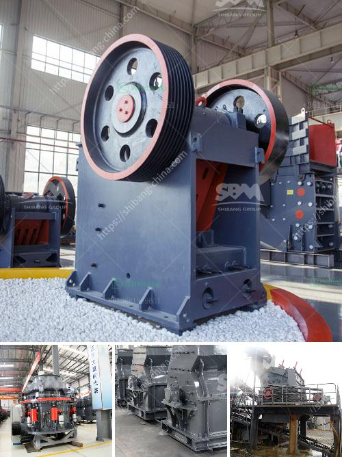

<h3>خط إنتاج مسحوق الحجر الجيري في الهند</h3>
تعد الهند واحدة من أكبر الدول المنتجة للحجر الجيري في العالم، وتتميز بخاماتها ذات الجودة العالية والتوفر الوفير. ويتم إنتاج مسحوق الحجر الجيري في الهند من خلال خطوات وإجراءات متعددة.

أولاً وقبل كل شيء، يتم استخراج الحجارة الجيرية من محاجرها الموجودة في الهند. وتُعد ولاية راجاستان الواقعة في شمال الهند أحد أكبر المناطق المنتجة للحجر الجيري في البلاد. وتعمل الشركات والمناجم على استخراج الصخور بالطرق التقليدية مع استخدام المعدات الثقيلة.

بعد استخراج الحجارة الجيرية، تتم عمليات الطحن والسحق لتحويل الكتل الصخرية إلى صورة حجمية أصغر وتحويلها إلى مسحوق الحجر الجيري. تعتمد عملية الطحن على استخدام مطاحن وكسارات خاصة تهدف إلى تفتيت الحجارة الجيرية وتحويلها إلى مسحوق.

بعد الطحن، يتم نقل المسحوق الناتج إلى الأماكن المخصصة لعمليات التجهيز الأخرى. وتشمل هذه العمليات التحميص والتعبئة والتغليف. يتم وضع المسحوق الجيري في أفران خاصة لإزالة الرطوبة منه وتحويله إلى منتج نهائي عالي الجودة.

بعد ذلك، يتم تغليف المنتج النهائي في أكياس أو حاويات مختلفة حسب الاحتياجات ومتطلبات العملاء. وتتم عملية التعبئة والتغليف بإشراف عالٍ لضمان سلامة المنتج وجودته.

يُستخدم مسحوق الحجر الجيري في العديد من الصناعات المختلفة، مثل صناعة الأسمنت والحديد والصلب والزجاج والأسمدة والكيماويات. وتلعب الهند دورًا هامًا في إمداد هذه الصناعات بالمسحوق الجيري عالي الجودة.

قد يواجه خط إنتاج مسحوق الحجر الجيري في الهند بعض التحديات مثل تلوث البيئة الناتج عن استخراج الحجارة وعمليات الطحن. ولذلك، فإن السلطات الحكومية تبذل جهودًا كبيرة لتنظيم هذه الصناعة وتحسين ظروف العمل والحفاظ على البيئة.

في الختام، يُعتبر إنتاج مسحوق الحجر الجيري في الهند عملية تحتاج إلى معدات وخبرات فنية متقدمة، وتلعب الهند دورًا هامًا في تلبية احتياجات السوق المحلية والعالمية. يُعد هذا القطاع صناعة مهمة تسهم في تطور الاقتصاد المحلي وتوفير فرص عمل للكثير من العمال.
<h3>Contact us</h3><ul><li><strong>Whatsapp:&nbsp;<a href="https://wa.me/8613661969651">+8613661969651</a></strong></li><li><a href="https://swt.shibang-china.com/?git&amp;zhl&amp;خط إنتاج مسحوق الحجر الجيري في الهند"><strong>Online Service(chat now)</strong></a></li></ul><h3>Related</h3><ul><li><a href='علامات الناقل والكسارات في إندونيسيا.md'>علامات الناقل والكسارات في إندونيسيا</a></li><li><a href='مطحنة المطرقة للبيع على إيباي.md'>مطحنة المطرقة للبيع على إيباي</a></li><li><a href='آلات التكسير والفحص.md'>آلات التكسير والفحص</a></li><li><a href='مطحنة الكرة للبيع في سريلانكا.md'>مطحنة الكرة للبيع في سريلانكا</a></li><li><a href='آلات طحن المطاحن للبيع.md'>آلات طحن المطاحن للبيع</a></li></ul>