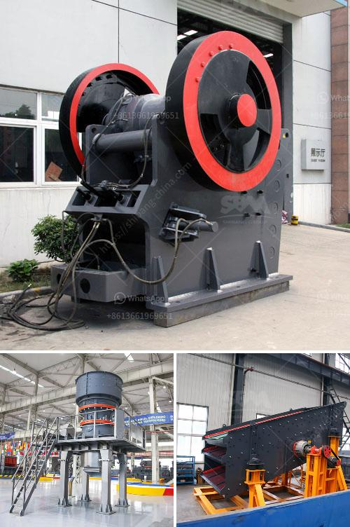

<h3>خط إنتاج مصنع كسارة الحجر في الهند</h3>
يعتبر مصنع كسارة الحجر من أهم المصانع في قطاع البناء والتشييد في الهند. يتم استخدام معدات الكسارة الحجرية لسحق الأحجار الكبيرة إلى حجم أصغر يمكن استخدامه في تصنيع الخرسانة والطرق والهياكل الأخرى.

يتكون خط إنتاج مصنع كسارة الحجر في الهند من عدة مراحل مهمة. في المرحلة الأولى، يتم إزالة الأحجار الكبيرة من المحجر ونقلها إلى المصنع عن طريق شاحنات النقل الثقيلة. يتم فحص وتصنيع الأحجار حسب الحجم المطلوب باستخدام معدات الفحص والفرز المتطورة. تلي ذلك المرحلة الثانية التي تتم فيها سحق الأحجار بواسطة آلات الكسارة للحصول على حجم الجسيم المطلوب.

بعد السحق، يتم نقل المواد المسحوقة إلى مجموعات الفرز حيث يتم فصل الأحجار المكسورة إلى حجم واستخدام محدد. يتم تحميل المواد النهائية في شاحنات التفريغ وتوزيعها للعملاء أو استخدامها في عمليات التصنيع الأخرى إذا كان المصنع أيضًا يقوم بتصنيع منتجات أخرى مثل الخرسانة الجاهزة أو الاسمنت.

من المهم أن يتم تشغيل خط إنتاج مصنع كسارة الحجر بطريقة فعالة ومستدامة. يجب ضبط العمليات بدقة لضمان الحصول على منتجات عالية الجودة وفقًا للمعايير القياسية. يجب توفير الصيانة الدورية للماكينات والمعدات للحفاظ على كفاءتها وتجنب التوقف غير المخطط.

علاوة على ذلك، يجب الاهتمام بسلامة العمال وتوفير المعدات الواقية اللازمة، مثل الخوذ والنظارات الواقية والأقنعة. يجب أيضًا تنفيذ إجراءات السلامة اللازمة للحفاظ على بيئة عمل آمنة وصحية.

في النهاية، يلعب مصنع كسارة الحجر دورًا حاسمًا في صناعة البناء والمشاريع الرأسمالية. يساهم في توفير المواد الأساسية التي تحتاج إليها الصناعة والتشييد. بوجود معدات حديثة وعملية فعالة والالتزام بمعايير الجودة، يمكن لمصنع كسارة الحجر في الهند تلبية الاحتياجات المتزايدة للسوق المحلية والدولية.
<h3>Contact us</h3><ul><li><strong>Whatsapp:&nbsp;<a href="https://wa.me/8613661969651">+8613661969651</a></strong></li><li><a href="https://swt.shibang-china.com/?git&amp;zhl&amp;خط إنتاج مصنع كسارة الحجر في الهند"><strong>Online Service(chat now)</strong></a></li></ul><h3>Related</h3><ul><li><a href='قائمة شركات التعدين على الحجر الجيري في الصين.md'>قائمة شركات التعدين على الحجر الجيري في الصين</a></li><li><a href='تكلفة كسارة الرمل.md'>تكلفة كسارة الرمل</a></li><li><a href='مصنعي كسارات الصدم في ألمانيا.md'>مصنعي كسارات الصدم في ألمانيا</a></li><li><a href='كسارات الحجر الرخيصة.md'>كسارات الحجر الرخيصة</a></li><li><a href='سعر آلة طحن المطحنة.md'>سعر آلة طحن المطحنة</a></li></ul>