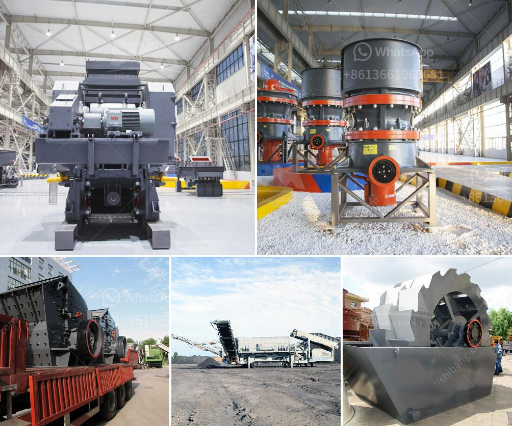

<h3>خط إنتاج مطحنة ريموند</h3>
مطحنة ريموند هي واحدة من أفضل المعدات المتاحة في سوق الطحن. تعمل هذه المطحنة على طحن مواد مختلفة مثل المعادن والمواد الكيميائية والصخور وغيرها. يمكن أن تتنوع المواد المطحونة من المواد الخام التي يمكن استخدامها في صناعة الإسمنت إلى المساحيق الدقيقة التي يمكن استخدامها في صنع مستحضرات التجميل.

تمتاز مطحنة ريموند بعدة ميزات رئيسية تجعلها الاختيار الأمثل لعملية الطحن. أحد هذه الميزات هو الكفاءة العالية في الأداء. تتميز المطحنة بقدرتها على إنتاج نسبة عالية من المنتج النهائي بنسبة خطأ صغيرة للغاية. بالإضافة إلى ذلك ، فإنه يمكن أن يساعد في تحسين الجودة العامة للمنتجات وزيادة قيمتها.

توفر مطحنة ريموند أيضًا مرونة كبيرة في عملية الطحن. يمكن تعديل إعدادات المطحنة بسهولة لتحقيق تجانس الجسيمات المرغوب فيه. بالإضافة إلى ذلك ، يمكن أن تتحمل المطحنة أحجامًا مختلفة من المواد وأنماط تغذية مختلفة. هذا يجعل من المطحنة أداة متعددة الاستخدامات يمكن أن تلبي احتياجات العملاء المتنوعة.

واحدة من الفوائد الأخرى لاستخدام مطحنة ريموند هي السرعة والدقة في تحقيق النتائج. بفضل آلية الطحن الفريدة ، يمكن للمطحنة إجراء عمليات طحن سريعة وفعالة. تتيح هذه السرعة للشركات زيادة إنتاجيتها وتقليل وقت التشغيل. بالإضافة إلى ذلك ، فإن الدقة العالية في عملية الطحن يمكن أن تقلل من فاقد المنتج وتحسن كفاءة العمل.

علاوة على ذلك ، تعد مطحنة ريموند موفرة للطاقة وصديقة للبيئة. تستخدم المطحنة تقنيات حديثة للحفاظ على استهلاك الطاقة منخفضًا وتقليل الانبعاثات الضارة. هذا يكون مناسبًا للشركات التي تهتم بالاستدامة البيئية وتسعى إلى تقليل أثرها البيئي.

باختصار ، مطحنة ريموند هي خيار ممتاز لعملية الطحن بفضل كفاءتها العالية ومرونتها وسرعتها ودقتها. إن استخدام هذه المطحنة قد يساهم بشكل كبير في تحسين عملية الإنتاج وتقليل التكاليف وتحسين جودة المنتجات النهائية. كما أنها تعطي الأولوية للحفاظ على البيئة ، مما يجعلها اختيارًا مثاليًا للشركات التي تهتم بالاستدامة.
<h3>Contact us</h3><ul><li><strong>Whatsapp:&nbsp;<a href="https://wa.me/8613661969651">+8613661969651</a></strong></li><li><a href="https://swt.shibang-china.com/?git&amp;zhl&amp;خط إنتاج مطحنة ريموند"><strong>Online Service(chat now)</strong></a></li></ul><h3>Related</h3><ul><li><a href='معدات غسيل الباريت.md'>معدات غسيل الباريت</a></li><li><a href='مصنع كسارة الصخور بسعة 150 طن.md'>مصنع كسارة الصخور بسعة 150 طن</a></li><li><a href='كسارة تأثير الحجر الجيري.md'>كسارة تأثير الحجر الجيري</a></li><li><a href='معدات جص صنع الجدار الخرساني في ألمانيا.md'>معدات جص صنع الجدار الخرساني في ألمانيا</a></li><li><a href='كيفية صنع مسحوق التلك.md'>كيفية صنع مسحوق التلك</a></li></ul>