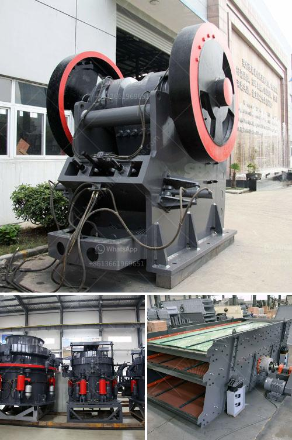

<h3>خط إنتاج مطحنة عمودية LM</h3>
تعتبر مطاحن الأسطوانة العمودية LM واحدة من أحدث التقنيات في صناعة معدات التكسير والطحن في العالم. تتميز هذه المطاحن بالقدرة على طحن مجموعة متنوعة من المواد الخام بكفاءة عالية وجودة ممتازة.

تتكون مطاحن الأسطوانة العمودية LM من جسم رئيسي يحتوي على عدة أسطوانات عمودية تدور حول محورها الخاص. تتم عملية الطحن عن طريق ضغط المواد الخام بين الأسطوانات وسطح الطحن. يتم التحكم في قوة الضغط وسرعة الأسطوانات لتحقيق درجة الطحن المطلوبة.

تم تطوير مطاحن الأسطوانة العمودية LM بناءً على الخبرة الواسعة في مجال تكنولوجيا المعالجة الصناعية واحتياجات سوق الطحن المختلفة. توفر هذه المطاحن كفاءة عالية في استهلاك الطاقة وقدرة على طحن أنواع مختلفة من المواد الخام بشكل مستدام. بفضل نظام التحكم الذكي الذي يتيح التحكم في عملية الطحن بدقة عالية، يتم تحقيق استخدام فعال للموارد وتحقيق أقصى إنتاجية ممكنة.

تستخدم مطاحن الأسطوانة العمودية LM على نطاق واسع في صناعة الأسمنت، وصناعة الحديد والصلب، وصناعة الكهرباء، وصناعة الكيماويات، وصناعة المواد الكاشطة، وصناعة الزجاج، والعديد من الصناعات الأخرى. تعمل هذه المطاحن جنبًا إلى جنب مع أنظمة مساعدة مثل جهاز التجفيف، وجهاز الناقل، وجهاز تصنيع الدقيق؛ لتشكيل خط إنتاج متكامل يستخدم في عمليات التكسير والطحن.

بشكل عام، تعد مطاحن الأسطوانة العمودية LM اختيارًا مثاليًا للشركات والمصانع الراغبة في زيادة إنتاجيتها وتحسين جودة المنتجات المقدمة للسوق. إن استخدام هذه التقنية المتطورة يعزز الكفاءة والدقة في عمليات الطحن، وبالتالي يساهم في رفع التنافسية وزيادة الارباح للشركات.

باختصار، تعتبر مطاحن الأسطوانة العمودية LM خط إنتاج متقدم يجمع بين التقنية الحديثة والكفاءة العالية. تلبي هذه المطاحن احتياجات العديد من الصناعات المختلفة وتساهم في تحسين عمليات التكسير والطحن، وبالتالي تعزز قدرة الشركات في تحقيق أهدافها التجارية.
<h3>Contact us</h3><ul><li><strong>Whatsapp:&nbsp;<a href="https://wa.me/8613661969651">+8613661969651</a></strong></li><li><a href="https://swt.shibang-china.com/?git&amp;zhl&amp;خط إنتاج مطحنة عمودية LM"><strong>Online Service(chat now)</strong></a></li></ul><h3>Related</h3><ul><li><a href='مصنع البنتونيت في الهند.md'>مصنع البنتونيت في الهند</a></li><li><a href='تكلفة وحدة طحن الأسمنت في الهند.md'>تكلفة وحدة طحن الأسمنت في الهند</a></li><li><a href='طواحين الطوابع الذهبية في زيمبابوي.md'>طواحين الطوابع الذهبية في زيمبابوي</a></li><li><a href='كسارة مخروطية أساسية.md'>كسارة مخروطية أساسية</a></li><li><a href='مصنع معالجة أكسيد النحاس.md'>مصنع معالجة أكسيد النحاس</a></li></ul>