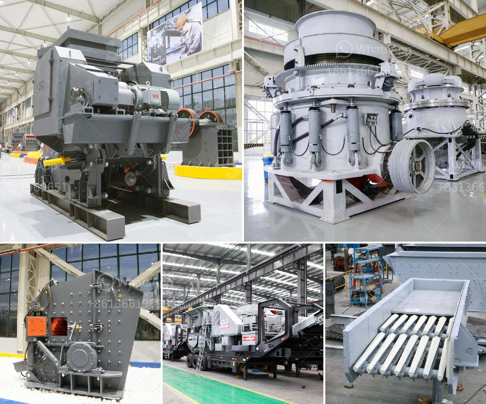

<h3>خط إنتاج مواد الجص الخام مع التعبئة</h3>
يعد خط إنتاج مواد الجص الخام مع التعبئة من الخطوات الرئيسية في عملية إنتاج مواد الجص. يتضمن هذا الخط إجراءات متنوعة لتحويل الجص الخام إلى منتج جاهز للاستخدام في العديد من التطبيقات المختلفة في الصناعات المختلفة.

يبدأ العملية عندما يتم استخراج الجص الخام من المناجم أو المحاجر. يتم طحن الجص الخام إلى مسحوق ناعم باستخدام مطاحن خاصة. يتم تنقية المسحوق من خلال عملية التصفية لإزالة الشوائب الصلبة الأخرى. يتم تخزين المسحوق المنقى في صوامع التخزين.

بعد ذلك، يتم نقل المسحوق إلى الفرن الدوار للتجفيف والتكلس. يتم تسخين المسحوق في درجات حرارة عالية لإزالة أي رطوبة باستخدام الغاز الطبيعي كمصدر للحرارة. يتم تحويل الكبريتات المائية إلى جصهة أو كبريتات الكالسيوم أثناء عملية التكلس.

ثم، تتم معالجة الجص المتكلس في الفرن الصناعي. يتم تحويل الصخور الجيرية وأملاح الكالسيوم المتكلسة إلى جص في درجات حرارة عالية. تتم هذه العملية بواسطة تقنية الكبس، حيث يتم تنشيط الأيونات السالبة والموجبة في الماء المستخدم لتكوين روابط كيميائية قوية وصلبة للحبيبات.

بعد ذلك، يمر الجص المنتج من خلال عملية التصنيع النهائية للتعبئة. يتم تعبئة الجص المنتج في أكياس أو حاويات صالحة للاستخدام. يتم ضمان جودة المنتج من خلال عمليات التفتيش والاختبار المستمرة خلال عملية التصنيع.

يعتبر خط إنتاج مواد الجص الخام مع التعبئة عملية مهمة جداً في صناعة الجص. فهو يسهم في تحويل الجص الخام إلى منتج جاهز للتوزيع والاستخدام. يتطلب هذا الخط معدات وعمليات صارمة لضمان جودة وكفاءة المنتج النهائي. كما يجب أن تتوافر المواد الخام بكميات كافية وبجودة عالية لضمان استدامة إنتاج مواد الجص.

باختصار، خط إنتاج مواد الجص الخام مع التعبئة يعد جزءًا أساسيًا في عملية إنتاج مواد الجص، حيث يجمع بين العديد من العمليات والتقنيات لتحويل الجص الخام إلى منتج جاهز للاستخدام. يتطلب هذا الخط معدات متقدمة وعمليات دقيقة لضمان جودة وكفاءة المنتج النهائي.
<h3>Contact us</h3><ul><li><strong>Whatsapp:&nbsp;<a href="https://wa.me/8613661969651">+8613661969651</a></strong></li><li><a href="https://swt.shibang-china.com/?git&amp;zhl&amp;خط إنتاج مواد الجص الخام مع التعبئة"><strong>Online Service(chat now)</strong></a></li></ul><h3>Related</h3><ul><li><a href='مصنع كسارة الحصى بالقرب من مانيلا.md'>مصنع كسارة الحصى بالقرب من مانيلا</a></li><li><a href='وحدة تكسير الحجر الكوارتز في الهند.md'>وحدة تكسير الحجر الكوارتز في الهند</a></li><li><a href='آلة كسارة محمولة.md'>آلة كسارة محمولة</a></li><li><a href='دراسة الجدوى لإنتاج مسحوق الجبس.md'>دراسة الجدوى لإنتاج مسحوق الجبس</a></li><li><a href='كسارة متنقلة صغيرة الخرسانة.md'>كسارة متنقلة صغيرة الخرسانة</a></li></ul>