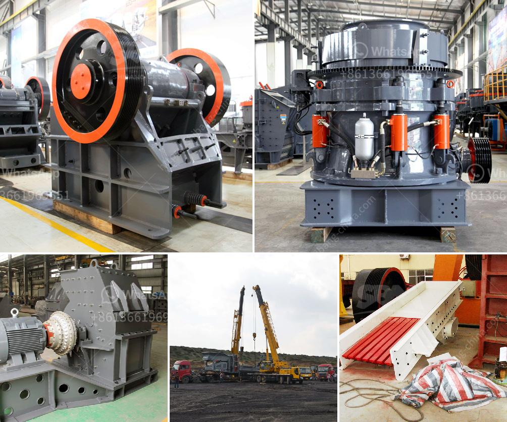

<h3>خط تكسير الحجر الجرانيت</h3>
يعتبر الحجر الجرانيت من أهم وأكثر المواد الطبيعية استخدامًا في صناعة البناء والديكور لمتانته وجماله. ولكن قبل أن يصل الحجر الجرانيت إلى العملاء في شكله النهائي، يتم تكسيره وتهيئته عبر ما يسمى "خط تكسير الحجر الجرانيت".

يتألف خط تكسير الحجر الجرانيت من مجموعة من الآلات والمعدات التي تعمل معًا لتحويل الحجر الجرانيت الخام إلى قطع صغيرة ومتجانسة من مختلف الأحجام. يتم بشكل عام تطبيق ثلاث خطوات رئيسية في عملية التكسير: التكسير الأولي، والفصل المصاحب، والتكسير النهائي.

يتم استخدام الكسارات الفكية في التكسير الأولي للحجارة الجرانيت الكبيرة. تُقدم الكسارة الفكية القدرة على تحويل قطع الجرانيت الكبيرة إلى قطع صغيرة أسهل في التعامل معها. بعد ذلك، يتم نقل الحجارة إلى الكسارات المخروطية التي تقوم بتكسير القطع الكبيرة إلى قطع أصغر ومتجانسة باستخدام الضغط والاحتكاك المستمرين.

بعد أن تم تكسير الحجر الجرانيت، يتم استخدام الفصل المصاحب لفصل الركام المختلف الموجود في الحصمة. يستخدم الفاصل المصاحب أشعة الغربلة لفصل الأحجام المختلفة، مما يساعد في الحصول على ركام متميز الجودة ودقيق التناسب.

أما في التكسير النهائي، يتم استخدام الكسارات الصدمية لتحويل الحصمة الناتجة من العملية السابقة إلى ركام نهائي بجودة عالية. تعمل الكسارات الصدمية عن طريق تطبيق قوة صدمة على الحصمة عبر سلسلة من الصفائح المعدنية، مما ينتج عنه تجانس أكبر في الحصمة وتكسير أعمق للحجارة.

يعتبر خط تكسير الحجر الجرانيت أحد التحديثات التكنولوجية التي ساهمت في تسهيل عملية صناعة الجرانيت وتوفير الوقت والجهد. كما أنه يمكن تعديل الخط حسب احتياجات العميل، مما يتيح المرونة في إنتاج قطع الجرانيت حسب المواصفات المطلوبة.

باستخدام خط تكسير الحجر الجرانيت، يمكن للمصانع الآن تحويل الحجر الجرانيت الخام إلى قطع نهائية صالحة للاستخدام في مجموعة متنوعة من التطبيقات مثل الأرضيات، والجداريات، والأسطح، والمطابخ، وأكثر من ذلك. يساهم ذلك في نمو صناعة البناء والديكور ويوفر فرص عمل للغير.

وفي النهاية، يمكن القول بأن خط تكسير الحجر الجرانيت يشكل مرحلة حاسمة في عملية إنتاج الأحجار الجرانيت، حيث يتيح للشركات تحويل الحجر الخام إلى منتجات نهائية بجودة عالية وفي الأحجام المطلوبة.
<h3>Contact us</h3><ul><li><strong>Whatsapp:&nbsp;<a href="https://wa.me/8613661969651">+8613661969651</a></strong></li><li><a href="https://swt.shibang-china.com/?git&amp;zhl&amp;خط تكسير الحجر الجرانيت"><strong>Online Service(chat now)</strong></a></li></ul><h3>Related</h3><ul><li><a href='كم تكلفة مصنع الكرة؟.md'>كم تكلفة مصنع الكرة؟</a></li><li><a href='سعر كسارة الفك في جنوب أفريقيا.md'>سعر كسارة الفك في جنوب أفريقيا</a></li><li><a href='أريد شراء آلة كسارة في باكستان.md'>أريد شراء آلة كسارة في باكستان</a></li><li><a href='مصنع معالجة الإسمنت.md'>مصنع معالجة الإسمنت</a></li><li><a href='آلة كسارة الخرسانة.md'>آلة كسارة الخرسانة</a></li></ul>