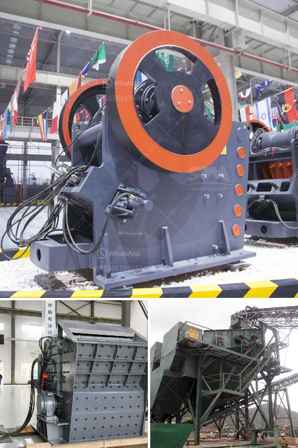

<h3>خط تكسير الحجر</h3>
يُعد خط تكسير الحجر أحد أهم الآلات المستخدمة في صناعة البناء والتشييد، حيث يقوم بتكسير الحجر وتحويله إلى حصمة أصغر الحجم تستخدم في عمليات البناء. تعتبر هذه الآلة ذات أهمية كبيرة نظرًا لتأثيرها على جودة وكفاءة عملية التشييد.

تتكون خطوط تكسير الحجر من عدة أجزاء رئيسية، منها الكسارة الفكية التي تستخدم لتكسير الحجر الخام في البداية. يتم نقل الحجر المكسر من قبل الكسارة إلى الكسارة المخروطية، وهنا تتم عملية تجزئة الحجر إلى قطع أصغر. يلي ذلك استخدام الأجهزة الهزازة والناقلات للانتقال وإعادة توجيه الحجر المكسر إلى الشاشات حيث يتم تصنيفه إلى أحجام مختلفة بناءً على الاحتياجات الخاصة بالبناء.

تتميز خطوط تكسير الحجر بعدة فوائد مهمة. أولاً وقبل كل شيء، تزيد هذه الآلة من كفاءة عملية تكسير الحجر بشكل كبير، حيث يمكنها تكسير الحجر الصلب والوفير بكفاءة عالية. تعني هذه الكفاءة العالية أنه يمكن إعادة استخدام المواد المكسرة بكفاءة، مما يقلل من النفايات ويوفر المزيد من الوقت والمال.

ثانيًا، تساهم خطوط تكسير الحجر في توفير الموارد الطبيعية وحماية البيئة. بفضل تقنيتها الحديثة وكفاءتها، تستخدم هذه الآلات كمية أقل من الماء والكهرباء مقارنة بالآلات التقليدية. بالإضافة إلى ذلك، فإن استخدامها لتكسير الحجر يساهم في الحد من الحاجة إلى استخراج المواد الطبيعية بشكل متكرر من المحاجر ويقلل بالتالي من تأثير التعدين على البيئة.

وأخيرًا، توفر خطوط تكسير الحجر مصادر عمل مهمة، حيث يُعتبر قطاع البناء قطاعًا مهمًا يساهم في توفير فرص العمل للكثير من العمالة. توفر هذه الآلات فرص عمل للعمال في صناعة البناء وتدعم بالتالي النمو الاقتصادي وتحسن مستوى المعيشة في المجتمعات.

باختصار، يعتبر خط تكسير الحجر من أهم الآلات في صناعة البناء والتشييد، حيث يزيد من كفاءة عملية تكسير الحجر وتحويله إلى حصمة صغيرة الحجم. يتميز هذا الخط بالعديد من الفوائد بما في ذلك زيادة الكفاءة، توفير الموارد، حماية البيئة، وتوفير فرص العمل. إن استخدام خط تكسير الحجر يعد استثمارًا جيدًا لصناعة البناء والتشييد وللمجتمعات عمومًا.
<h3>Contact us</h3><ul><li><strong>Whatsapp:&nbsp;<a href="https://wa.me/8613661969651">+8613661969651</a></strong></li><li><a href="https://swt.shibang-china.com/?git&amp;zhl&amp;خط تكسير الحجر"><strong>Online Service(chat now)</strong></a></li></ul><h3>Related</h3><ul><li><a href='كسارة الفك PE 150x250.md'>كسارة الفك PE 150x250</a></li><li><a href='مطحنة الأسطوانة العمودية في تايوان.md'>مطحنة الأسطوانة العمودية في تايوان</a></li><li><a href='مصانع التكسير الكاملة في جيرميستون.md'>مصانع التكسير الكاملة في جيرميستون</a></li><li><a href='موردين كسارات الفك والمخروط في موكوباني.md'>موردين كسارات الفك والمخروط في موكوباني</a></li><li><a href='آلة تكسير الحجر في الصين.md'>آلة تكسير الحجر في الصين</a></li></ul>