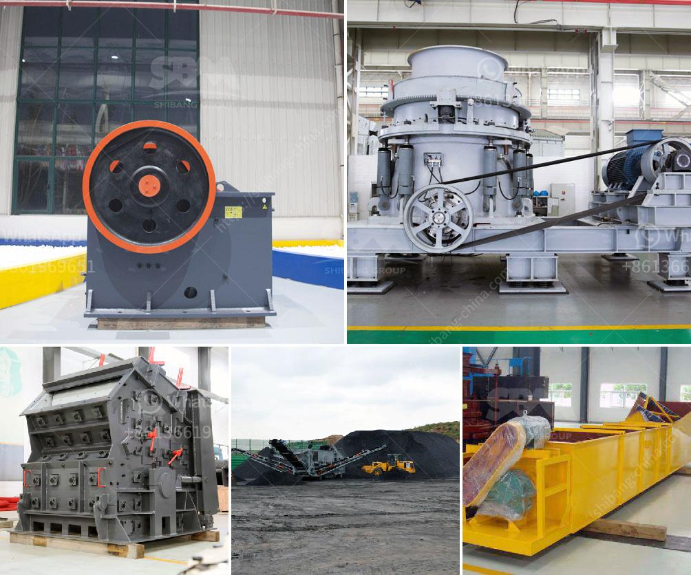

<h3>خط سحق البازلت</h3>
يتعدّد استخدام البازلت في العديد من الصناعات، فهو يعتبر مادة بناء قوية وشائعة الاستخدام في الأعمال الإنشائية. لذا، يجب تجهيز البازلت بأعلى جودة لضمان استخدامه بالشكل الأمثل، وفي هذا السياق نجد ضرورة وجود معدات تكسير البازلت عالية الجودة.

تُعد خطوط سحق البازلت من أهم المعدات المستخدمة في تكسير البازلت، وهي تتكون من مجموعة من المعدات التي تعمل سويًا لتكسير البازلت إلى قطع صغيرة. تتكون الخطوط الحديثة من الكسّارة الفكية الأولية والكسّارة الصدمية والمغذي الاهتزازي والغربال الاهتزازي. تتميز هذه المعدات بأداء عالي وقدرة على تكسير البازلت بكفاءة وسرعة.

تتمتع خطوط سحق البازلت بالعديد من المزايا والفوائد التي تجعلها الخيار الأمثل لتكسير البازلت. فعند تحميل البازلت في الكسّارة الفكية الأولية، يتم سحقه بواسطة حركة متأرجحة للفك المتحرك والثابت، مما يسهم في تكسير البازلت بطريقة فعالة. بعد ذلك، يتم نقل البازلت إلى الكسّارة الصدمية التي تعمل على تكسيره بواسطة ضربات قوية. يتم تحويل البازلت المكسور إلى حجم صغير أكثر من خلال غربال اهتزازي، ويتم تحويل الحصى غير المُكسّر إلى الكسّارة الفكية للحصول على تكسير أكثر فعالية.

تحتوي هذه الخطوط على تقنيات متقدمة تتيح ضبط قوة الكسر وتكوين الحصى، وهو ما يساعد في إنتاج المواد بالمواصفات المطلوبة. تختلف خطوط سحق البازلت حسب الحاجة وطبيعة البازلت المستخدم. هذه المعدات متوفرة بسعات مختلفة، مما يتيح للمشغلين تحقيق الإنتاجية المرجوة وتلبية الاحتياجات الفردية لكل مشروع.

باستخدام خطوط سحق البازلت، يتم تحويل البازلت الخام إلى مادة خام نهائية قابلة للاستخدام في العديد من الصناعات كما يسهم في الحفاظ على البيئة بفضل استخدامها لتقنيات تكسير فعالة ومحسّنة. نظرًا لهذه المزايا، تعتبر خطوط سحق البازلت حلاً فعّالًا وموثوقًا في مجال تجهيز البازلت وتكسيرها.

في النهاية، يجب على الشركات المعنية الاهتمام بتأمين معدات البناء عالية الجودة مثل خطوط سحق البازلت، حيث أن استثمار الوقت والجهود في اختيار المعدات المناسبة يجلب العديد من الفوائد، من بينها تعزيز الإنتاجية والكفاءة والتوفير في التكاليف وإنتاج مواد ذات جودة عالية.
<h3>Contact us</h3><ul><li><strong>Whatsapp:&nbsp;<a href="https://wa.me/8613661969651">+8613661969651</a></strong></li><li><a href="https://swt.shibang-china.com/?git&amp;zhl&amp;خط سحق البازلت"><strong>Online Service(chat now)</strong></a></li></ul><h3>Related</h3><ul><li><a href='كيفية صنع مسحوق التلك الصناعي.md'>كيفية صنع مسحوق التلك الصناعي</a></li><li><a href='عملية تصنيع خام البنتونيت.md'>عملية تصنيع خام البنتونيت</a></li><li><a href='مطاحن الكرة للمواد.md'>مطاحن الكرة للمواد</a></li><li><a href='محطات تكسير للبيع.md'>محطات تكسير للبيع</a></li><li><a href='كسارات مستعملة في نيجيريا.md'>كسارات مستعملة في نيجيريا</a></li></ul>