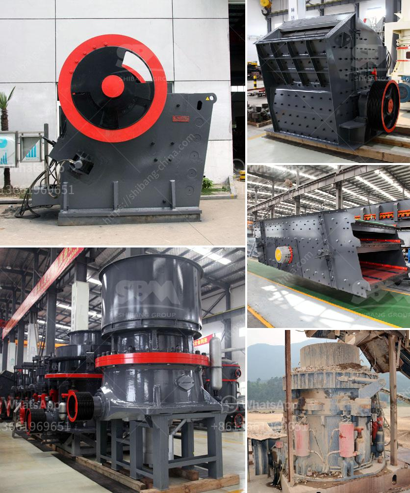

<h3>خطة التحكم في تصنيع مطحنة الكرة</h3>
تعتبر مطحنة الكرة واحدة من أهم الأجهزة المستخدمة في صناعة المواد الخام والمواد الكيميائية والألعاب النارية والزجاج وغيرها من الصناعات. ولذلك، فإن التحكم في عملية تصنيعها يلعب دورًا حاسمًا في تحقيق الجودة والكفاءة والأمان.

تتألف خطة التحكم في تصنيع مطحنة الكرة من مجموعة من الخطوات والإجراءات التي تهدف إلى ضمان تشغيل المعدة بكفاءة وسلامة. وفيما يلي أهم هذه الخطوات:

1- تحديد المواصفات: قبل البدء في تصنيع المطحنة، يجب تحديد المواصفات المطلوبة للمعدة. يشمل ذلك التحقق من القدرة الإنتاجية المطلوبة، وحجم الكرات المستخدمة، وسرعة الدوران، والمتطلبات الأخرى المتعلقة بالمواد المطحونة.

2- التصميم والهندسة: تشمل هذه الخطوة تصميم المطحنة بناءً على المواصفات المحددة. يتم ضبط جميع التفاصيل الهندسية المهمة مثل الأبعاد، والمواد المستخدمة، والتجهيزات اللازمة للتشغيل.

3- اختبار المكونات: يتم اختبار مكونات المطحنة الفردية قبل تجميعها. تشمل هذه المكونات المحركات والأجهزة الكهربائية والسوست والألواح وغيرها. تهدف هذه الخطوة إلى التأكد من أن المكونات تعمل بشكل صحيح وتلبي المواصفات المحددة.

4- التجميع والتفتيش: بعد اجتياز مكونات المطحنة لاختبارها، يتم تجميعها وتركيبها لتشكل المعدة النهائية. يجب أن يتم اختبار جميع الاتصالات والتجهيزات والأجزاء الهيدروليكية والكهربائية وفقًا للمعايير الفنية والتدابير الأمانية.

5- التدريب والصيانة: بمجرد تشغيل المطحنة، يجب تزويد المشغلين بالتدريب اللازم لضمان تشغيلها الآمن والفعال. كما يجب إنشاء جداول صيانة منتظمة للمطحنة وإجراء الفحوص المنتظمة لضمان استمرار تشغيلها بكفاءة عالية وتجنب الأعطال.

باختصار، خطة التحكم في تصنيع مطحنة الكرة تشمل تحديد المواصفات، التصميم والهندسة، اختبار المكونات، التجميع والتفتيش، والتدريب والصيانة. يهدف كل هذا إلى ضمان تشغيل المطحنة بأعلى مستويات الجودة والكفاءة والسلامة.
<h3>Contact us</h3><ul><li><strong>Whatsapp:&nbsp;<a href="https://wa.me/8613661969651">+8613661969651</a></strong></li><li><a href="https://swt.shibang-china.com/?git&amp;zhl&amp;خطة التحكم في تصنيع مطحنة الكرة"><strong>Online Service(chat now)</strong></a></li></ul><h3>Related</h3><ul><li><a href='أكبر كسارة صخور.md'>أكبر كسارة صخور</a></li><li><a href='مطحنة الأسطوانة العمودية في الهند.md'>مطحنة الأسطوانة العمودية في الهند</a></li><li><a href='سعر مطحنة رايموند للكاولين.md'>سعر مطحنة رايموند للكاولين</a></li><li><a href='تكلفة مصنع تكسير الذهب.md'>تكلفة مصنع تكسير الذهب</a></li><li><a href='طاقة إنتاج مسحوق الجبس 80 طن في الساعة.md'>طاقة إنتاج مسحوق الجبس 80 طن في الساعة</a></li></ul>