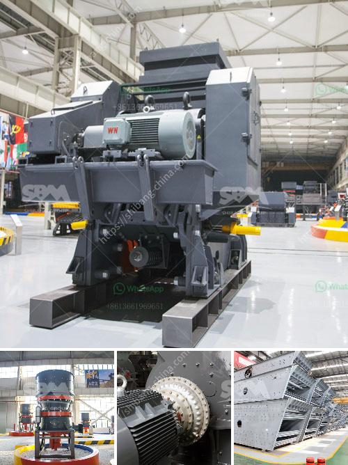

<h3>خطة المشروع حول آلة تحطيم الحجر</h3>
تتعدد الاستخدامات العديدة للحجر في صناعات مختلفة مثل البناء والتشييد، ولكن في بعض الأحيان يتطلب استخراج الحجر من المحاجر وتكسيره إلى أحجام مختلفة. إن آلة تحطيم الحجر تلعب دورًا حاسمًا في هذه العملية، حيث تقوم بتحطيم الحجر الكبير إلى قطع صغيرة يمكن استخدامها في مختلف الصناعات.

خطة المشروع لآلة تحطيم الحجر تتضمن العديد من العناصر الرئيسية التي يجب مراعاتها لتحقيق النجاح والكفاءة في عملية التحطيم. أولاً وقبل كل شيء، يتعين على الفريق المشرف تحديد الأهداف والغايات التي يرغبون في تحقيقها من المشروع. يجب أن تتضمن هذه الأهداف فهم متطلبات السوق والعملاء المحتملين، وتحديد الأداء المطلوب لآلة التحطيم وقدرتها على تلبية احتياجات السوق المحلية والعالمية.

ثانيًا، يجب على الفريق المشرف دراسة الجدوى الفنية والاقتصادية للمشروع. وتشمل هذه الجدوى دراسة تكلفة إنتاج آلة التحطيم، وتحديد تكاليف التشغيل والصيانة، وتقدير حجم الطلب المتوقع على الآلة. يجب أيضًا دراسة تكنولوجيا التحطيم المستخدمة وضمان عملية التحطيم الفعالة والآمنة للحصول على أحجام حجرية مطلوبة.

ثالثًا، يجب على الفريق المشرف تحديد خطة العمل المفصلة لمشروع الآلة. يجب تحديد جميع النشاطات والمهام المطلوبة في عملية التصميم والتصنيع والتجميع والاختبار، بالإضافة إلى الجدول الزمني لكل منها. يجب أيضًا تحديد المهارات والموارد المطلوبة لتنفيذ النشاطات بفعالية، وتحديد المسؤوليات والاختصاصات اللازمة لكل شخص في الفريق.

أخيرًا، يجب تحديد خطة التحكم والمتابعة لمشروع آلة التحطيم. يتضمن ذلك مراقبة تقدم العمل والتأكد من تلبية المواصفات والمعايير المحددة. يجب أيضًا تحديد آلية للتعامل مع أي تحديات أو مشاكل قد تطرأ خلال عملية الإنتاج والتجميع والتجربة. يجب على الفريق المشرف أيضًا وضع خطة للتدقيق والمراجعة الدورية للتأكد من تحقيق الأهداف والمواصفات المطلوبة.

باختصار، خطة المشروع لآلة تحطيم الحجر تكون شاملة ومتكاملة تتضمن جميع العناصر الضرورية لتحقيق النجاح والكفاءة في عملية التحطيم. تحديد الأهداف والغايات، وتقييم الجدوى، ووضع خطة عمل مفصلة، وتحديد خطة التحكم والمتابعة، هي العناصر الرئيسية التي يجب مراعاتها لتحقيق النتائج المرجوة.
<h3>Contact us</h3><ul><li><strong>Whatsapp:&nbsp;<a href="https://wa.me/8613661969651">+8613661969651</a></strong></li><li><a href="https://swt.shibang-china.com/?git&amp;zhl&amp;خطة المشروع حول آلة تحطيم الحجر"><strong>Online Service(chat now)</strong></a></li></ul><h3>Related</h3><ul><li><a href='مصنع غسيل الذهب بسعة ١٠٠ طن في الساعة.md'>مصنع غسيل الذهب بسعة ١٠٠ طن في الساعة</a></li><li><a href='محطة كسارة محمولة من الهند.md'>محطة كسارة محمولة من الهند</a></li><li><a href='حجم طحن البنتونيت.md'>حجم طحن البنتونيت</a></li><li><a href='معدات تكسير خام الكروم المستخدمة.md'>معدات تكسير خام الكروم المستخدمة</a></li><li><a href='أفكار مشروع مصفاة النحاس صغيرة المقياس.md'>أفكار مشروع مصفاة النحاس صغيرة المقياس</a></li></ul>