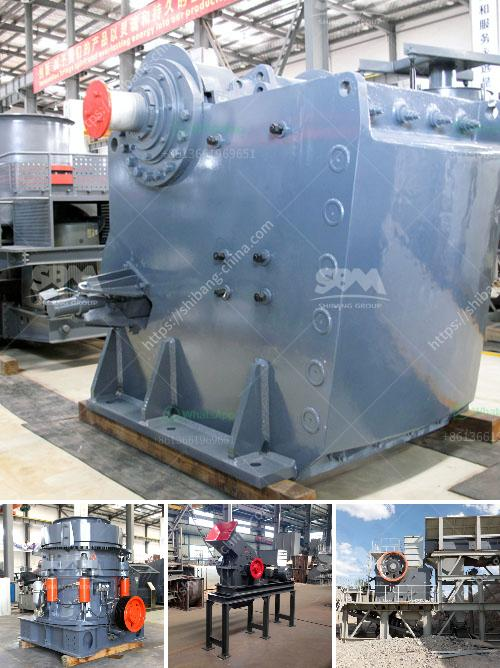

<h3>خطة عمل تعدين الجرانيت</h3>
يهدف تعدين الجرانيت إلى استخراج الجرانيت من الصخور واستخدامه في صناعة البناء والتشييد. تعتبر صناعة التعدين في هذا القطاع ذات أهمية كبيرة للاقتصاد نظرًا لتوافر الجرانيت بكميات هائلة وقيمته العالية. من المهم وضع خطة عمل جيدة لتعدين الجرانيت بهدف تحقيق النجاح وتقليل التأثيرات البيئية السلبية. سنقدم في هذه المقالة خطوات أساسية لخطة عمل تعدين الجرانيت.

أولاً وقبل كل شيء، ينبغي دراسة الموقع والبحث عن المناطق التي يتواجد بها الجرانيت بكميات كافية وجودة عالية. يجب أيضاً الحصول على التراخيص والتصاريح اللازمة من السلطات المحلية قبل بدء عمليات التعدين.

ثانياً، يجب تطوير خطة للحفر والتفجير المتخصصة. من المهم التعاون مع خبراء في هذا المجال لضمان تنفيذ عملية التفجير بأمان وفعالية. يجب أيضاً وضع إجراءات للتعامل مع الشحنات الناتجة عن التفجير ونقلها من الموقع.

ثالثاً، عندما يتم استخراج الجرانيت، يجب نقله إلى موقع التجهيز والتحضير. يجب وضع خطة لأعمال التجهيز وتنظيف الحجر لاستخدامه في صناعة البناء. يمكن استخدام الجرانيت في صناعة الألواح والأدراج والأرضيات والأغراض الأخرى، ويلزم وضع استراتيجية لتسويق المنتجات المصنعة.

رابعاً، يجب وضع خطة لإدارة النشاطات البيئية والحفاظ على البيئة التي يتم التعدين فيها. يجب تطبيق أفضل الممارسات البيئية لتقليل التأثيرات السلبية مثل الحد من انبعاثات الغبار والملوثات وإدارة استهلاك المياه.

أخيراً، يجب وضع خطة للسلامة والصحة المهنية للعمال في موقع التعدين. يجب اتخاذ جميع الإجراءات اللازمة لتجنب وقوع حوادث العمل وتوفير ظروف عمل آمنة. ينبغي تزويد العمال بالتدريبات اللازمة وتوفير معدات الوقاية الشخصية اللازمة.

باختصار، خطة عمل تعدين الجرانيت يجب أن تستند إلى دراسة موقع متقنة، وتنفيذ عمليات حفر وتفجير آمنة وفعالة، وتطوير استراتيجية لتسويق وتجهيز المنتجات، وإدارة النشاطات البيئية والحفاظ على البيئة، وتوفير ظروف عمل آمنة للعمال. باستخدام هذه الخطوات الأساسية، يمكن تنفيذ عملية تعدين الجرانيت بنجاح وبطريقة مستدامة.
<h3>Contact us</h3><ul><li><strong>Whatsapp:&nbsp;<a href="https://wa.me/8613661969651">+8613661969651</a></strong></li><li><a href="https://swt.shibang-china.com/?git&amp;zhl&amp;خطة عمل تعدين الجرانيت"><strong>Online Service(chat now)</strong></a></li></ul><h3>Related</h3><ul><li><a href='شاشة اهتزازية لرمل الكوارتز.md'>شاشة اهتزازية لرمل الكوارتز</a></li><li><a href='مصانع طحن الأحجار في تايلاند.md'>مصانع طحن الأحجار في تايلاند</a></li><li><a href='شركات مصنعي مطاحن الأسطوانات في الهند.md'>شركات مصنعي مطاحن الأسطوانات في الهند</a></li><li><a href='كيفية بدء منجم المحاجر.md'>كيفية بدء منجم المحاجر</a></li><li><a href='كسارة آلية.md'>كسارة آلية</a></li></ul>