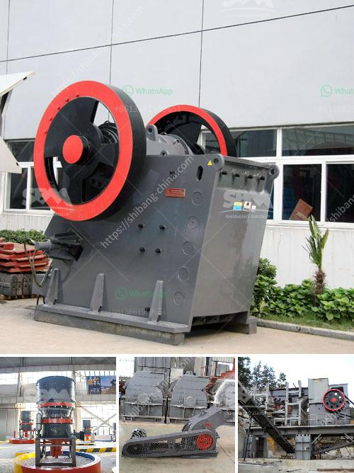

<h3>خطة عمل عينية لكسارة الحجر في بوليفيا</h3>
تعتبر صناعة البناء والإنشاء من الصناعات الحيوية في بوليفيا، وتعمل العديد من الشركات على استخراج وتكسير الحجارة لاستخدامها في إنتاج الخرسانة والأسمنت والطوب ومواد البناء الأخرى. يعد تأسيس وتشغيل كسارة حجر فعالة في بوليفيا خطوة حيوية لتلبية الطلب المتزايد على المواد الخام لصناعة البناء. في هذه المقالة سنقدم خطة عمل عينية لكسارة حجر في بوليفيا.

إنشاء وتشغيل كسارة حجر فعالة تستطيع تلبية الطلب المحلي والدولي على المواد الخام لصناعة البناء في بوليفيا.

1. إجراء دراسة الجدوى: يجب أولاً إجراء دراسة دقيقة لتحديد فرصة السوق والطلب على المواد الخام في بوليفيا. يجب أيضًا تحليل التكاليف المتوقعة لإنشاء وتشغيل الكسارة حجر، بما في ذلك تكاليف الأراضي والمعدات والعمالة والتصاريح اللازمة.

2. اختيار الموقع المناسب: يجب اختيار موقع مناسب لإقامة الكسارة الحجرية، يفضل أن يكون قريبًا من مناطق استخراج الحجر لتقليل تكاليف النقل والوقت. يجب أيضًا أن يتوفر في الموقع الكهرباء والماء والطرق الجيدة لتسهيل عمليات الإنتاج والشحن.

3. شراء المعدات: يجب شراء المعدات اللازمة لعملية التكسير مثل الكسارات والغرابيل والناقلات وغيرها. يجب اختيار المعدات المناسبة وذات الجودة العالية لضمان كفاءة الإنتاج والتشغيل المستدام.

4. التوظيف والتدريب: يجب تشغيل فريق عمل مؤهل ومدرب لتنفيذ عمليات التكسير بكفاءة وفقًا للمعايير الصناعية. يجب توفير التدريب المستمر للموظفين لتحسين مهاراتهم ومعرفتهم بأحدث التقنيات والسلامة في هذا المجال.

5. الامتثال للقوانين واللوائح: يجب الامتثال لجميع القوانين واللوائح المحلية والدولية المتعلقة بأنشطة التعدين والكسارات في بوليفيا. يجب تحديث الرخص والتصاريح والتأكد من اتباع أعلى معايير السلامة والحفاظ على البيئة.

6. التسويق والتوزيع: يجب وضع استراتيجية تسويقية قوية للبحث عن عملاء محليين وعالميين لبيع المواد الخام المنتجة من الكسارة الحجرية. يمكن الترويج للعملاء المحليين من خلال الإعلانات والزيارات الميدانية، ويمكن البحث عن عملاء عالميين من خلال المشاركة في المعارض والمؤتمرات الدولية.

7. مراقبة الجودة: يجب إنشاء نظام مراقبة جودة قوي لضمان جودة المواد الخام المنتجة. يجب إجراء اختبارات منتظمة للتأكد من أن المواد تلبي المعايير المطلوبة من قبل العملاء.

8. توسيع الإنتاج: بمرور الوقت وزيادة الطلب على المواد الخام، يمكن التوسع في الإنتاج بإضافة المزيد من المعدات وتوظيف المزيد من العمال لزيادة الإنتاجية وتلبية الطلب.

تأسيس وتشغيل كسارة حجر في بوليفيا يتطلب خطة عمل متفصلة ومدروسة لضمان النجاح والاستدامة. يجب أن تركز الخطة على عمليات التكسير الفعالة، وضمان الجودة، والامتثال للقوانين واللوائح، والتسويق القوي. من خلال اتباع هذه الخطوات، يمكن تحقيق نجاح كسارة الحجر وتلبية احتياجات السوق المتزايدة في بوليفيا.
<h3>Contact us</h3><ul><li><strong>Whatsapp:&nbsp;<a href="https://wa.me/8613661969651">+8613661969651</a></strong></li><li><a href="https://swt.shibang-china.com/?git&amp;zhl&amp;خطة عمل عينية لكسارة الحجر في بوليفيا"><strong>Online Service(chat now)</strong></a></li></ul><h3>Related</h3><ul><li><a href='كسارة محمولة تريمان.md'>كسارة محمولة تريمان</a></li><li><a href='آلة مسحوق الحجر الجيري.md'>آلة مسحوق الحجر الجيري</a></li><li><a href='مناجم رمل السيليكا في الفلبين.md'>مناجم رمل السيليكا في الفلبين</a></li><li><a href='آلة صنع الرمل VSI.md'>آلة صنع الرمل VSI.</a></li><li><a href='مصنع كسارة متنقلة من نوع الزاحف.md'>مصنع كسارة متنقلة من نوع الزاحف</a></li></ul>