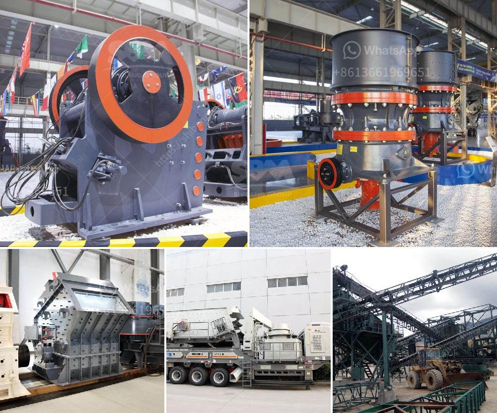

<h3>خطة عمل كاملة لمصنع تكسير الحجارة</h3>
تعد خطة عمل مصنع تكسير الحجارة أمرًا حيويًا للنجاح والنمو في هذه الصناعة المهمة. سأقدم لك هنا نظرة عامة على الخطوات الرئيسية لخطة عمل مصنع تكسير الحجارة.

يجب عليك تحديد غرض وهدف المصنع. قد يهدف المصنع إلى إنتاج الحصى والرمل للبناء أو الأغراض الصناعية الأخرى.

عملية اجراء دراسة جدوى مفصلة للمصنع ضرورية لتقييم الجوانب المالية، وسوق العمل، ورأس المال المطلوب، والعمليات والتجهيزات اللازمة.

تأكد من الالتزام بجميع اللوائح والتشريعات المحلية والحصول على التراخيص والموافقات اللازمة قبل بدء العمل.

اختيار موقع مناسب للمصنع يعتبر أمرًا حاسمًا. يجب أن يتوافر في الموقع المناسب موارد الحجر اللازمة ووسائل النقل الجيدة لتوصيل المنتجات إلى السوق بكفاءة.

احصل على المعدات والآلات اللازمة، مثل الكسارات والغرابيل والناقلات والآلات الفرز. قد تكون من الأفضل استئجار معدات مستعملة في البداية لتقليل التكلفة العامة للمشروع.

قم بتوظيف العمالة المؤهلة والفنية اللازمة، مثل مشرفي الإنتاج والعمال المطلوبين لخط الإنتاج وفنيي الصيانة.

بعد إعداد المصنع وتجهيزه بالكامل، يجب أن تبدأ عملية التكسير الفعلية باستخدام المعدات والآلات المناسبة. يجب أن تعمل عملية التكسير بكفاءة عالية لضمان جودة وجمعية المنتجات.

وضع خطة تسويقية قوية للمنتجات المنتجة يعتبر أمرًا حيويًا لجذب العملاء. حدد الأسواق المحلية والعالمية المستهدفة وحاول توسيع قاعدة العملاء من خلال الترويج الفعال والتواجد القوي في السوق.

يجب تنظيم عمليات التكسير وتحسينها باستمرار لضمان تشغيل فعال ومستدام للمصنع. بالإضافة إلى ذلك، تأكد من وجود نظام صيانة وإصلاح جيد يهتم بصيانة المعدات وتلافي الأعطال.

بمرور الوقت وبناءً على نمو الطلب في السوق، قد تكون هناك حاجة لتوسيع المصنع وزيادة طاقة الإنتاج. قم بتحسين كفاءة العمليات وتوسيع نطاق انتاجك لمواكبة التطورات في السوق وتلبية احتياجات العملاء.

هذه فقط نظرة عامة على الخطوات الرئيسية في خطة عمل مصنع تكسير الحجارة. يجب أن يتم إعداد دراسة مفصلة وشاملة لضمان نجاح المشروع وتحقيق أهدافه المستقبلية.
<h3>Contact us</h3><ul><li><strong>Whatsapp:&nbsp;<a href="https://wa.me/8613661969651">+8613661969651</a></strong></li><li><a href="https://swt.shibang-china.com/?git&amp;zhl&amp;خطة عمل كاملة لمصنع تكسير الحجارة"><strong>Online Service(chat now)</strong></a></li></ul><h3>Related</h3><ul><li><a href='كسارات صخور cec للبيع.md'>كسارات صخور cec للبيع</a></li><li><a href='مطحنة ريموند لمعالجة البازلت الجاف.md'>مطحنة ريموند لمعالجة البازلت الجاف</a></li><li><a href='شركة تصنيع الكسارات في الصين.md'>شركة تصنيع الكسارات في الصين</a></li><li><a href='سعر آلة طاحونة الهامر.md'>سعر آلة طاحونة الهامر</a></li><li><a href='تجهيز مسحوق الكوارتز السيليكا.md'>تجهيز مسحوق الكوارتز السيليكا</a></li></ul>