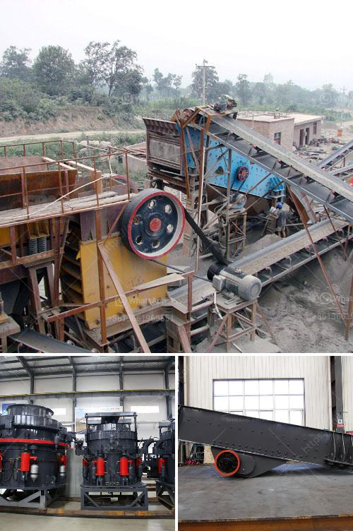

<h3>خطة عمل لإنتاج الجبس</h3>
تعد صناعة الجبس واحدة من الصناعات المتطورة والمهمة في العديد من القطاعات مثل البناء والديكور. يتم استخدام الجبس في صناعة الجص والتزيين الداخلي وأسقف البطانة والتشطيبات المعمارية الأخرى. لذلك، سأقدم خطة عمل للإنتاج الناجح لمحتوى الجبس.

يجب على أي خطة عمل أن تحدد هدفًا واضحًا. هدفنا هنا هو إنتاج الجبس بجودة عالية وكمية مناسبة لتلبية احتياجات السوق.

قبل إنشاء خطة الإنتاج، يجب أن نعرف حجم السوق ومعرفة الطلب المتوقع على المنتج ومنافسينا في السوق. يمكن أن نحقق ذلك من خلال دراسة السوق وإجراء أبحاث السوق المتاحة.

يجب علينا معرفة الموارد اللازمة لإنتاج الجبس. يشمل ذلك المواد الخام مثل الجبس والماء، والمعدات والآلات المطلوبة لعملية الإنتاج، والقوى العاملة المهرة، والمساحة المطلوبة لإقامة المصنع.

يجب تحديد الموقع المناسب لإقامة المصنع، بالإضافة إلى تصميم المصنع وشراء المعدات والآلات اللازمة لعملية الإنتاج. يجب أيضًا مراعاة استيفاء جميع المتطلبات القانونية والبيئية.

يتضمن هذا الجزء مراقبة جودة المواد الخام المستخدمة، ومراقبة عملية الإنتاج بدقة للتأكد من حصولنا على جودة المنتج المطلوبة.

قبل إنتاج الجبس، يجب أن نعرف قنوات التسويق المناسبة لبيع منتجنا. يمكن استهداف شركات البناء وموردي المواد البنائية والمقاولين. بالإضافة إلى ذلك، يجب تحديد وسائل توزيع المنتج ووضع خطة تسويقية فعالة لزيادة حصتنا في السوق.

عندما يتم بدء الإنتاج، يجب أن نقوم بمراقبة الأداء وتقييمه بانتظام للتأكد من تحقيق الأهداف المحددة. يجب اتخاذ التدابير اللازمة لتصحيح أي خلل في الأداء وتحسينه.

باختصار، يمكن لخطة عمل لإنتاج الجبس أن تكون كفيلة بتنظيم وتوجيه نشاط الإنتاج للوصول إلى النجاح والتميز في سوق الجبس. يجب أن تكون الخطة شاملة، تحدد الأهداف وتصف الخطوات المتبعة وتتضمن تحليلاً استراتيجيًا ودراسة جدوى مالية لضمان إنتاجية عالية وعائد مالي جيد.
<h3>Contact us</h3><ul><li><strong>Whatsapp:&nbsp;<a href="https://wa.me/8613661969651">+8613661969651</a></strong></li><li><a href="https://swt.shibang-china.com/?git&amp;zhl&amp;خطة عمل لإنتاج الجبس"><strong>Online Service(chat now)</strong></a></li></ul><h3>Related</h3><ul><li><a href='كسارة الحجر ديربان.md'>كسارة الحجر ديربان</a></li><li><a href='استخدام كسارة فكية صغيرة للخرسانة.md'>استخدام كسارة فكية صغيرة للخرسانة</a></li><li><a href='مصنع كسارة المحاجر في إيطاليا.md'>مصنع كسارة المحاجر في إيطاليا</a></li><li><a href='كسارة الحصى، سعر كسارة الحصى.md'>كسارة الحصى، سعر كسارة الحصى</a></li><li><a href='مصانع مطاحن الأسمنت.md'>مصانع مطاحن الأسمنت</a></li></ul>