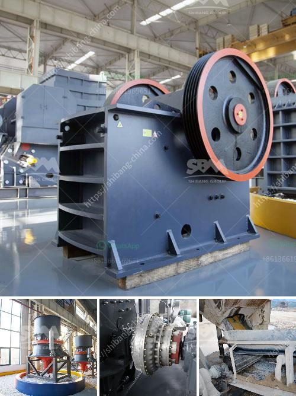

<h3>خطة عمل لإنتاج الطوب</h3>
تعد صناعة إنتاج الطوب من الصناعات الأساسية والحيوية في العديد من القطاعات، مثل قطاع البناء والتشييد والهندسة المعمارية. ومن أجل إبداء مشروع إنتاج الطوب بنجاح، يتطلب الأمر وجود خطة عمل وتنفيذها بشكل فعال. فيما يلي خطة عمل لإنتاج الطوب وتوجيه الإجراءات المطلوبة لتحقيق هدفك:

قبل البدء في أي مشروع، من الضروري دراسة السوق وتحليل الطلب على الطوب في المنطقة المستهدفة. يجب أيضًا تحديد المتوسط الشهري المتوقع للمبيعات وتحديد الأصناف المطلوبة، مثل الطوب العادي والطوب العازل.

تجهيز المعدات اللازمة لإنتاج الطوب يعتبر جزءًا هامًا من العملية. يجب شراء آلات تصنيع الطوب وآلات طحن الطوب ومواد البناء الأساسية المطلوبة، مثل الأسمنت والرمل والماء. كما يجب تأمين موقع لإقامة وتشغيل المصنع.

توظيف العمالة المهرة والمدربة هو أمر حيوي لضمان جودة الإنتاج وسير العمل بشكل فعال. يجب توظيف مهندسين وفنيين ذوي الكفاءة في إدارة عملية الإنتاج وضمان تكامل الجودة. يجب أيضًا توظيف عمالة يدوية لمساعدة في عمليات التصنيع الأساسية.

تحتاج عملية الإنتاج إلى مواد خام عالية الجودة للحصول على نتائج ممتازة. يجب شراء المواد الأساسية مباشرة من موردين موثوقين والتحقق من جودتها بانتظام لضمان تنفيذ الخطة بفاعلية.

من المهم تطوير عملية الإنتاج وتحسينها باستمرار. يجب مراقبة جودة الطوب المنتج واجراء الاختبارات اللازمة للتحقق من استيفاء المعايير القياسية. يجب أيضًا إدارة جدول الإنتاج وتحسينه بما يتوافق مع الطلب والتوقعات.

بعد إنتاج الطوب، يجب وضع خطة للتسويق والترويج للمصنع ومنتجاته. يجب استكشاف قنوات التوزيع المناسبة وإنشاء شبكة توزيع فعالة للوصول إلى العملاء المحتملين. يمكن استخدام التسويق الرقمي والإعلانات والمعارض والعروض التجريبية كأدوات ترويجية.

يجب تقييم أداء عملية الإنتاج ومراقبتها بشكل مستمر لتحديد المجالات التي يمكن تحسينها وتعزيز الجودة. يجب أيضًا الاستماع لآراء العملاء ومعالجة ملاحظاتهم بشكل فوري لضمان رضاهم الكلي.

في الختام، إن إنتاج الطوب يشتمل على العديد من العمليات والأعمال التي يجب تنفيذها بشكل فعال لتحقيق هدفك في إنتاج طوب عالي الجودة. يتطلب الأمر التخطيط والتنظيم والمتابعة المستمرة للجوانب الإدارية والتقنية. باستخدام هذه الخطة العمل، يمكنك تحويل فكرتك إلى مشروع ناجح في إنتاج الطوب.
<h3>Contact us</h3><ul><li><strong>Whatsapp:&nbsp;<a href="https://wa.me/8613661969651">+8613661969651</a></strong></li><li><a href="https://swt.shibang-china.com/?git&amp;zhl&amp;خطة عمل لإنتاج الطوب"><strong>Online Service(chat now)</strong></a></li></ul><h3>Related</h3><ul><li><a href='الحجر الجيري المستخدم لصنع الزجاج.md'>الحجر الجيري المستخدم لصنع الزجاج</a></li><li><a href='المعدات المطلوبة لإنشاء محجر الجرانيت.md'>المعدات المطلوبة لإنشاء محجر الجرانيت</a></li><li><a href='كسارة الحجر للبيع في باكستان.md'>كسارة الحجر للبيع في باكستان</a></li><li><a href='سعر آلة المحجر.md'>سعر آلة المحجر</a></li><li><a href='كسارة VSI لسحق الرمل.md'>كسارة VSI لسحق الرمل</a></li></ul>