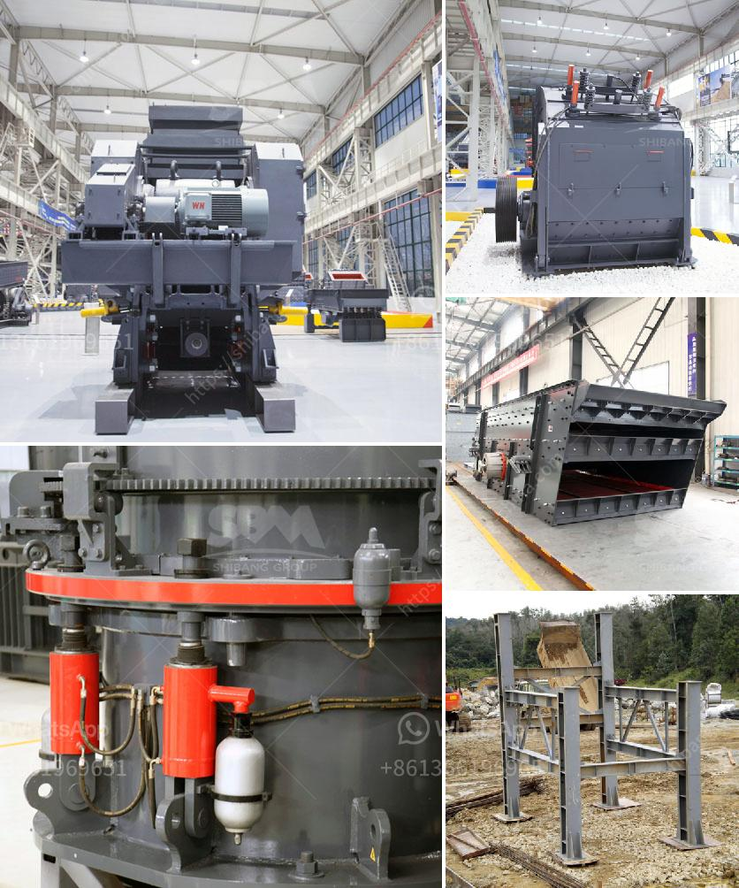

<h3>خطة عمل لتعدين الحجر واستغلاله</h3>
تعدين الحجر هو مجال يهم العديد من الشركات والمشاريع الإنشائية التي تحتاج إلى مواد البناء. وفي هذه المقالة، سنتحدث عن خطة عمل لتعدين الحجر واستغلاله.

أولاً وقبل الشروع في أي خطة عمل، يجب إجراء دراسة جيولوجية متعمقة لمنطقة التعدين المحتملة. ويتم ذلك عن طريق إجراء استكشافات جيولوجية وتحليل عينات المواد الموجودة في المنطقة، بهدف تحديد نوع الحجر الموجود وجودته وكميته المتاحة.

بعد ذلك، يتم وضع خطة لعملية التعدين نفسها. يجب أن تتضمن هذه الخطة التالي:

1. الإعداد والتجهيز: يتطلب التعدين الناجح إعدادًا جيدًا وتجهيزًا للمعدات المطلوبة لعملية التعدين. يجب تأمين المعدات المختلفة مثل الكسارات والحفارات والناقلات والأدوات الأخرى الضرورية لجمع ونقل وكسر الحجر.

2. التخطيط للتعدين: يجب وضع خطة تفصيلية لعملية التعدين بما يشمل المناطق التي ستتم الحفر فيها وكمية الحجر المتوقعة لاستخراجها من كل منطقة. يتم تسجيل جميع هذه المعلومات في خارطة أو تقرير دوري.

3. سلامة العاملين: يجب أن تكون سلامة العاملين أولوية في خطة التعدين. يتطلب ذلك تأمين التدابير اللازمة لحماية العاملين من أي مخاطر محتملة، مثل توفير معدات الوقاية الشخصية، وتقديم تدريبات على مواجهة المخاطر وإعداد إجراءات الطوارئ.

4. خطة التسويق: يجب وضع خطة لتسويق المنتجات المستخرجة من تعدين الحجر. يجب تحديد الأسواق المحتملة وتطوير استراتيجية التسويق والتواصل مع العملاء المحتملين.

5. الاستدامة البيئية: يجب أن تضمن الخطة نهجًا مستدامًا لاستغلال المواد الطبيعية. يتطلب ذلك اتخاذ إجراءات للحفاظ على البيئة المحيطة، مثل إعادة تأهيل المناطق المستخرجة وتقديم مساهمات بيئية للمجتمع المحلي.

عند تنفيذ هذه الخطة بدقة وفعالية، يمكن لشركة التعدين أو المشروع الاستفادة من استغلال المصادر الحجرية بأفضل طريقة ممكنة. فالتعدين الناجح يعتمد على تخطيط جيد وتنفيذ دقيق والالتزام بالمعايير البيئية والسلامة.
<h3>Contact us</h3><ul><li><strong>Whatsapp:&nbsp;<a href="https://wa.me/8613661969651">+8613661969651</a></strong></li><li><a href="https://swt.shibang-china.com/?git&amp;zhl&amp;خطة عمل لتعدين الحجر واستغلاله"><strong>Online Service(chat now)</strong></a></li></ul><h3>Related</h3><ul><li><a href='موردين محمولين لكسارة الحجر.md'>موردين محمولين لكسارة الحجر</a></li><li><a href='كسارة فكية لتكسير الجرانيت.md'>كسارة فكية لتكسير الجرانيت</a></li><li><a href='كل مصانع التكسير المحاجر.md'>كل مصانع التكسير المحاجر</a></li><li><a href='مصنع تكسير صخور متنقل وثابت جديد.md'>مصنع تكسير صخور متنقل وثابت جديد</a></li><li><a href='كسارات مستعملة في نيجيريا.md'>كسارات مستعملة في نيجيريا</a></li></ul>