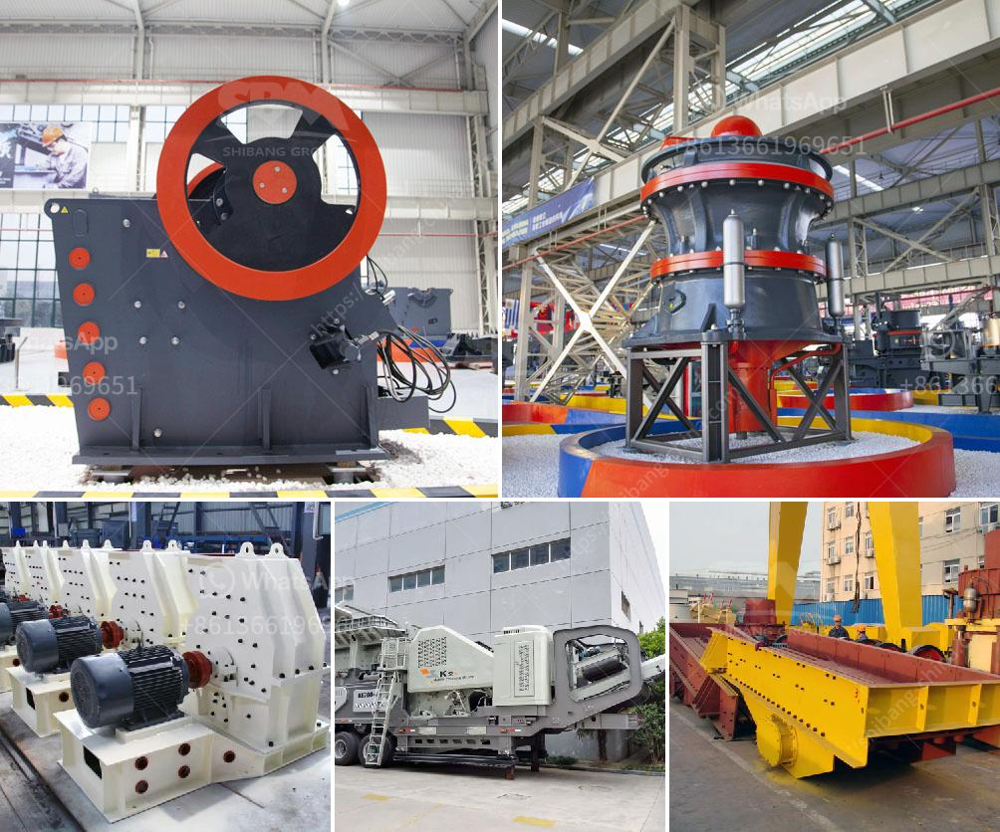

<h3>خطة عمل لكربونات الكالسيوم</h3>
تُعتبر كربونات الكالسيوم واحدة من المواد الرئيسية في العديد من الصناعات مثل صناعة الأسمنت والدهانات ومعالجة المياه والصناعات الزراعية. ولذلك، من المهم وضع خطة عمل دقيقة ومنظمة لإنتاج وتسويق هذه المادة. سنعرض في هذه المقالة خطة عمل لكربونات الكالسيوم تتضمن الخطوات الأساسية التي يجب اتباعها لتحقيق النجاح.

   قم بإجراء دراسة سوق شاملة لتحليل الطلب على كربونات الكالسيوم وتحديد الفرص المتاحة. قم بتحديد الصناعات التي تستخدم هذه المادة وتحليل الطلب المستقبلي في هذه الصناعات لتحديد الاحتياجات المستقبلية للمنتج.

   قم بإعداد خطة لتأسيس وتشغيل المصنع. حدد الموقع المناسب للمصنع وقم بتحديد المعدات والتكنولوجيا المطلوبة لإنتاج كربونات الكالسيوم. قم بحساب التكلفة الإجمالية للمصنع بما في ذلك تكاليف الإنتاج والأيدي العاملة والصيانة.

   قم بتحديد الشركات المنتجة للكالسيوم والكربون المطلوبة لإنتاج كربونات الكالسيوم. ابحث عن شركات توفر مواد خام عالية الجودة وبأسعار تنافسية. قم بإنشاء علاقات تعاونية مع هذه الشركات لضمان توريد استمراري وموثوق به للمواد الخام.

   قم بتحديد العمليات الإنتاجية اللازمة لتصنيع كربونات الكالسيوم بجودة عالية وبأعلى معايير الصناعة. قم بتجريب وضبط هذه العمليات لضمان تحقيق أعلى جودة للمنتج وتلبية متطلبات العملاء.

   قم بتحديد استراتيجية التسويق المناسبة للترويج لمنتجك وزيادة الوعي بالعلامة التجارية. قم بإنشاء قنوات توزيع فعالة لتوصيل المنتج إلى العملاء المحتملين. قم بتقديم خدمة عملاء ممتازة واتبع استراتيجيات التسعير الملائمة للفوز بالعملاء والمحافظة على ثقتهم.

   قم بإنشاء نظام مراقبة الجودة لضمان أعلى مستويات الجودة في إنتاجك. قم بتطبيق معايير الجودة الدولية وقم بإجراء اختبارات متكررة للمنتج للتحقق من جودته. ضمن أعلى مستويات الأداء والتزامًا بمعايير الجودة وتوفير منتج خالٍ من العيوب.

تلك هي خطة عمل عامة لإنتاج وتسويق كربونات الكالسيوم. يجب تنفيذ كل خطوة بعناية لضمان النجاح المستدام وتحقيق الأرباح. يجب أيضًا مراجعة وتحديث الخطة العمل بانتظام لتلبية التحديات والتغيرات في السوق.
<h3>Contact us</h3><ul><li><strong>Whatsapp:&nbsp;<a href="https://wa.me/8613661969651">+8613661969651</a></strong></li><li><a href="https://swt.shibang-china.com/?git&amp;zhl&amp;خطة عمل لكربونات الكالسيوم"><strong>Online Service(chat now)</strong></a></li></ul><h3>Related</h3><ul><li><a href='آلة فحص الرمال المصنعة.md'>آلة فحص الرمال المصنعة</a></li><li><a href='مطحنة أسطوانية ثنائية المرور.md'>مطحنة أسطوانية ثنائية المرور</a></li><li><a href='سعر مطحنة ريموند الفائقة الدقة.md'>سعر مطحنة ريموند الفائقة الدقة</a></li><li><a href='موزعو معدات تكسير extec.md'>موزعو معدات تكسير extec</a></li><li><a href='كسارة خام البوتاش.md'>كسارة خام البوتاش</a></li></ul>