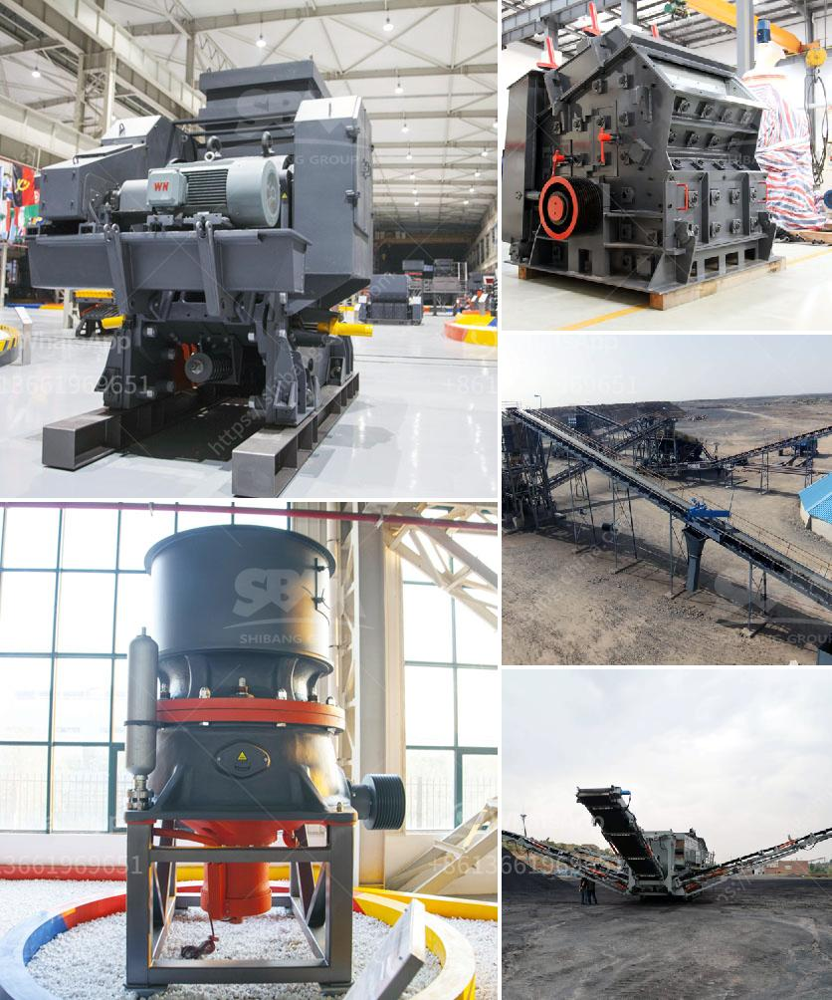

<h3>خطة عمل للرمال</h3>
تعتبر صناعة الرمال من أهم الصناعات في العالم، حيث تستخدم في مختلف القطاعات مثل البناء والتشييد وصناعة الزجاج والسيراميك، ولذلك فإن وجود خطة عمل جيدة لهذه الصناعة يعد أمرًا هامًا. في هذه المقالة، سأقدم خطة عمل لإنتاج الرمال.

1- دراسة السوق: يجب عليك تحليل السوق ودراسة الطلب والعرض على الرمال في منطقتك، ومعرفة المنافسة والأسعار المتداولة. يمكنك القيام بذلك من خلال إجراء بحث تسويقي واستطلاع رأي العملاء المحتملين.

2- الموقع: يجب عليك اختيار موقع مناسب لإقامة مصنع الرمال. يفضل اختيار موقع قريب من التجمعات السكانية ومناطق البناء والتشييد لتوفير الوقت والجهد في النقل.

3- المعدات والتجهيزات: يجب شراء المعدات المناسبة لإنتاج الرمال، مثل الكسارات والغرابيل والحاويات والسيور الناقلة. كما يجب عليك الحصول على المواد الخام اللازمة لإنتاج الرمال بجودة عالية.

4- التراخيص والتصاريح: يجب عليك الحصول على جميع التراخيص والتصاريح اللازمة من الجهات المعنية قبل بدء الإنتاج. قد يشمل ذلك التصاريح البيئية والصحية وتصاريح البناء.

5- توظيف الكوادر البشرية: يجب أن تضم خطتك عملية توظيف العمال المهرة في مجال إنتاج الرمال، مثل المهندسين والفنيين والعمال المدربين على استخدام المعدات.

6- التسويق والترويج: يجب عليك الترويج لمصنعك ومنتجاتك من خلال حملات إعلانية مناسبة. قد تشمل ذلك استخدام وسائل التواصل الاجتماعي والإعلانات في الصحف والمجلات المختلفة.

7- ضمان الجودة: يجب أن تضمن جودة المنتج النهائي للرمال، حيث يمكنك توفير شهادات الجودة والامتثال للمعايير الصناعية المحلية والدولية.

8- التوسع وتطوير الأعمال: بمرور الوقت ونجاح مصنع الرمال الخاص بك، يمكنك التوسع وتطوير الأعمال عن طريق زيادة الإنتاج أو استهداف أسواق جديدة.

عند وضع خطة عمل لإنتاج الرمال، يجب أخذ العديد من العوامل في الاعتبار مثل الطلب، التكلفة، والجودة، والتسويق. يجب أيضًا أن يتم تحديث الخطة لتلبية التحديات المستقبلية والتغيرات في السوق.
<h3>Contact us</h3><ul><li><strong>Whatsapp:&nbsp;<a href="https://wa.me/8613661969651">+8613661969651</a></strong></li><li><a href="https://swt.shibang-china.com/?git&amp;zhl&amp;خطة عمل للرمال"><strong>Online Service(chat now)</strong></a></li></ul><h3>Related</h3><ul><li><a href='مصنع آلات في جنوب أفريقيا لسحق الحجر.md'>مصنع آلات في جنوب أفريقيا لسحق الحجر</a></li><li><a href='آلة صنع الدولوميت.md'>آلة صنع الدولوميت</a></li><li><a href='آلات كسارة الحجر في ماليزيا.md'>آلات كسارة الحجر في ماليزيا</a></li><li><a href='الفرق بين مطاحن الكرة وكسارة الفك.md'>الفرق بين مطاحن الكرة وكسارة الفك</a></li><li><a href='مطحنة الكرة مطرقة مطحنة مطحنة أسطوانية آلة.md'>مطحنة الكرة مطرقة مطحنة مطحنة أسطوانية آلة</a></li></ul>