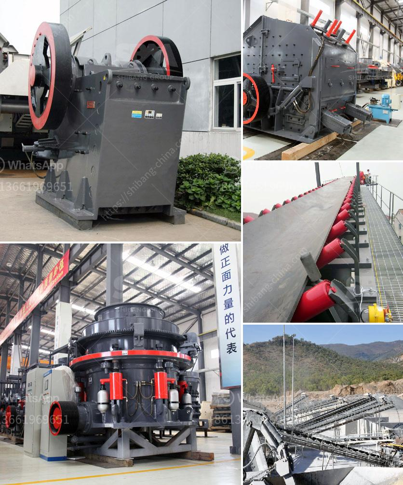

<h3>خطة عمل للمحجر</h3>
يعتبر المحجر واحدًا من الأماكن المهمة في صناعة البناء، فهو المكان الذي يتم فيه استخراج الصخور والحصى اللازمة للإنشاءات المختلفة. ولتحقيق أقصى استفادة من المحجر وضمان التشغيل الفعال والمستدام، يجب وضع خطة عمل محكمة تلبي الاحتياجات والمتطلبات الفنية والاقتصادية والبيئية. فيما يلي نظرة عامة على خطة عمل للمحجر:

1- تحديد الأهداف: يجب تحديد الأهداف الرئيسية للمحجر مثل زيادة الإنتاجية، وتحسين جودة المنتجات، وتقليل التكلفة، وتحقيق الاستدامة البيئية.

2- إدارة الموارد البشرية: يجب توظيف فريق عمل متخصص ومؤهل لإدارة المحجر، بما في ذلك مشرفي إنتاج، ومهندسين، وفنيين. ينبغي تطوير برامج تدريبية للعاملين لرفع مستوى المهارات والوعي البيئي.

3- التخطيط الإنتاجي: يتعين وضع خطة إنتاجية دقيقة تحدد كمية ونوعية المنتجات المطلوبة بناءً على طلبات السوق. يتعين تحديد العمليات والتجهيزات المطلوبة لتحقيق هذه الأهداف.

4- إدارة العتاد والمعدات: يجب شراء وصيانة المعدات والعتاد المطلوبة لتشغيل المحجر بكفاءة عالية. ينبغي خطة الصيانة الدورية لتجنب التوقفات غير المخطط لها وتعطيل العمل.

5- إدارة الموارد المادية: يجب مراقبة الاستخدام الفعال للموارد المادية والبقاء على اتصال مع الموردين لضمان توافر الحصول على المواد اللازمة في الوقت المحدد وبأسعار تنافسية.

6- الاهتمام بالبيئة: يجب وضع إجراءات للمحافظة على البيئة والتقليل من آثار استخراج الصخور على الحياة البحرية وأنظمة الطاقة البيئية. يمكن تخفيف آثار الانبعاثات الضارة عن طريق الاستثمار في أنظمة التحكم في الغبار ومعالجة المياه.

7- التقييم المستمر: يجب إجراء تقييم دوري لأداء المحجر ومراقبة تحقيق الأهداف المحددة. يمكن أجراء التحسينات اللازمة لتحسين العمليات وزيادة الكفاءة.

إن وضع خطة عمل للمحجر يساعد على ضمان الإدارة الفعالة والاستدامة البيئية وتحقيق الربحية. إن تنفيذ هذه الخطة يسهم في استدامة هذه الصناعة الحيوية وتلبية احتياجات السوق المتزايدة.
<h3>Contact us</h3><ul><li><strong>Whatsapp:&nbsp;<a href="https://wa.me/8613661969651">+8613661969651</a></strong></li><li><a href="https://swt.shibang-china.com/?git&amp;zhl&amp;خطة عمل للمحجر"><strong>Online Service(chat now)</strong></a></li></ul><h3>Related</h3><ul><li><a href='تكلفة مصنع تكسير الذهب.md'>تكلفة مصنع تكسير الذهب</a></li><li><a href='آلة طحن الكرة من المنغنيز.md'>آلة طحن الكرة من المنغنيز</a></li><li><a href='كيفية تصحيح كسارة مخروطية.md'>كيفية تصحيح كسارة مخروطية</a></li><li><a href='محطات تكسير الطاقة.md'>محطات تكسير الطاقة</a></li><li><a href='كسارات مستعملة في نيجيريا.md'>كسارات مستعملة في نيجيريا</a></li></ul>