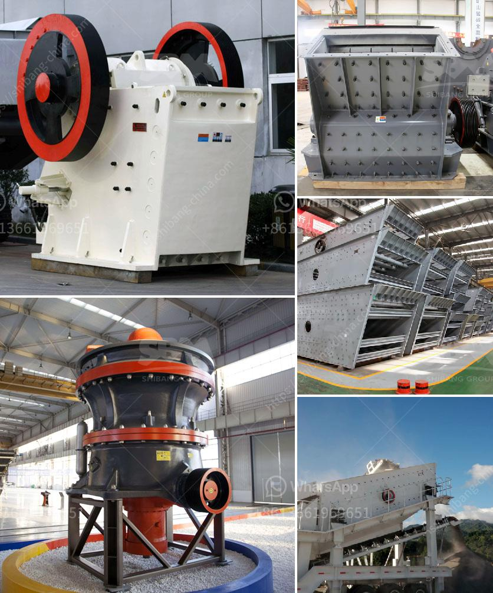

<h3>خطة عمل محجر الجرانيت</h3>
أحجار الجرانيت هي أحد المواد الطبيعية المستخدمة بشكل واسع في العديد من التطبيقات البنائية والديكورية. وبناء محجر لإنتاج الجرانيت يمكن أن يكون استثمارًا ناجحًا ورابحًا في الوقت نفسه. وفيما يلي خطة عمل لإنشاء محجر جرانيت بمساحة تتراوح بين 200 إلى 400 كلم مربع.

تهدف هذه الخطة لإنشاء واستغلال محجر لإنتاج الجرانيت بمساحة تتراوح بين 200 إلى 400 كلم مربع. سيتم استخدام المحجر لاستخراج الجرانيت وتصنيعه وتوريده للعملاء المحليين والدوليين. سيتم تقديم منتجات ذات جودة عالية بأسعار تنافسية لتلبية احتياجات السوق.

يجب اختيار موقع المحجر بعناية مع النظر في موقع البلوكات الجيولوجية المتاحة. يتوجب أن يكون المحجر قريبًا من المصانع لتخفيف تكاليف النقل. يجب أن يتضمن الموقع مساحة كافية للمعدات والآلات والمخازن وغيرها من التسهيلات اللازمة لعمل المحجر.

سيتطلب المحجر الاستثمار في معدات تعدين الجرانيت المناسبة مثل حفارات الجرانيت وآلات التحميل والشاحنات الثقيلة. ينبغي تأمين التكنولوجيا المناسبة لاستخراج وتصنيع الجرانيت بطرق فعالة وآمنة.

يجب الحصول على تصريح لإنشاء وتشغيل المحجر وتوريد المنتجات، وذلك من خلال الجهات الحكومية المعنية. كما يجب النظر في التأشيرات والتراخيص اللازمة لإيواء العمال المؤهلين والخبراء الأجانب الذين سيعملون في المحجر.

يجب أن تكون سلامة العمال واحترام البيئة من أولويات المحجر. يتوجب على الشركة توفير التدريب المناسب للعمال للعمل بأمان وفقًا للمعايير الدولية. يجب الالتزام بتعليمات حماية البيئة واتخاذ التدابير اللازمة للحد من التأثيرات البيئية السلبية لعمل المحجر.

يتوجب على المحجر الترويج لمنتجاته وإنشاء شبكة قوية من العملاء المحليين والدوليين. يجب تطوير استراتيجية تسويقية فعالة لتعزيز وتسويق المنتجات بشكل مستدام وتحقيق عائد مالي مربح.

يجب أن يكون المحجر مستدامًا من الناحية الاقتصادية والاجتماعية والبيئية. يجب توفير استراتيجيات لإدارة المخلفات واستخدام الموارد بكفاءة وتطبيق سياسة تجنب الفساد وتعزيز المسؤولية الاجتماعية للشركة. كما ينبغي دراسة إمكانية التوسع في المستقبل لزيادة الإنتاج وتلبية الطلب المتزايد.

خطة عمل محجر الجرانيت هي استثمار جيد يمكن أن يؤدي إلى عائد مالي جيد مع تلبية الطلب المحلي والعالمي على الجرانيت. يجب الالتزام بجميع الإرشادات واللوائح المحلية والدولية لضمان سلامة العمال وحماية البيئة. يجب أن يكون لديك خطة تسويقية قوية للحصول على عملاء وتعزيز منتجات المحجر. بتنفيذ هذه الخطة بعناية وتركيز، يمكن بالتأكيد تحقيق نجاح محجر الجرانيت المستهدف.
<h3>Contact us</h3><ul><li><strong>Whatsapp:&nbsp;<a href="https://wa.me/8613661969651">+8613661969651</a></strong></li><li><a href="https://swt.shibang-china.com/?git&amp;zhl&amp;خطة عمل محجر الجرانيت"><strong>Online Service(chat now)</strong></a></li></ul><h3>Related</h3><ul><li><a href='كسارة محمولة من Propel.md'>كسارة محمولة من Propel</a></li><li><a href='لمطحنة الكرة الميكرو.md'>لمطحنة الكرة الميكرو</a></li><li><a href='آلات صنع الحصى الكوارتز في الهند.md'>آلات صنع الحصى الكوارتز في الهند</a></li><li><a href='كسارة الحجر بوزولانا للبيع.md'>كسارة الحجر بوزولانا للبيع</a></li><li><a href='صناعة تكسير ومعالجة الرخام على نطاق صغير.md'>صناعة تكسير ومعالجة الرخام على نطاق صغير</a></li></ul>