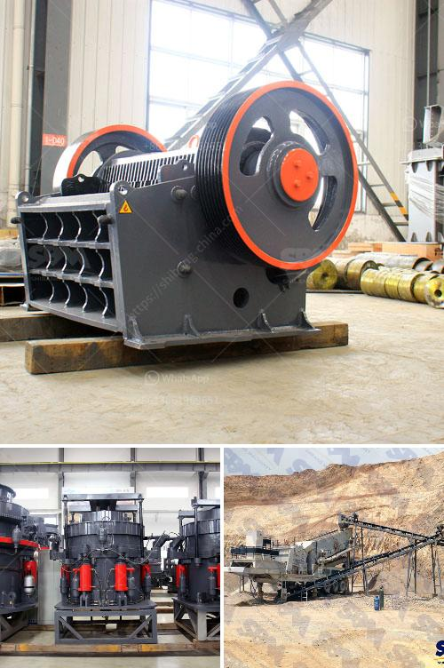

<h3>خطة عمل محجر الحجر</h3>
تعتبر صناعة التعدين من أهم الصناعات التي تساهم في تطوير الاقتصاد وتوفير فرص العمل للكثير من الناس. ومن بين أنواع المحاجر المهمة في هذه الصناعة هو محجر الحجر، الذي يُعتبر من الخامات المستخدمة في بناء المباني والطرق والجسور.

تحتاج إنشاء محجر الحجر إلى خطة عمل مدروسة ومنظمة تسهم في تحقيق الهدف المنشود وتتوافق مع القوانين واللوائح البيئية. سيتم في هذا المقال عرض خطوات الخطة العمل لمحجر الحجر.

أول خطوة تبدأ بتحديد الموقع المناسب لإقامة المحجر، حيث يتم اختيار مكان بعيد عن المناطق السكنية والأراضي الزراعية، للحفاظ على سلامة السكان والبيئة. ويجب أن يتضمن الموقع مساحة كبيرة لتأمين العمليات المختلفة للتعدين.

تشمل الخطة العمل أيضًا خطوات للحصول على التراخيص والتصاريح اللازمة من الجهات المختصة. يجب التعاقد مع مهندسين متخصصين في تحليل التربة والبيئة لتقييم تأثير المحجر على البيئة المحيطة واتخاذ التدابير اللازمة للحد من أي آثار سلبية.

تشمل الخطة العمل أيضًا مراعاة جوانب السلامة والصحة المهنية للعاملين في المحجر. يجب توفير المعدات والأدوات اللازمة للحماية الشخصية وإجراء التدريبات اللازمة للعاملين على استخدامها. بالإضافة إلى ذلك، يجب وضع خطة للتحكم في المخلفات وإعادة تدوير المواد الناتجة عن العمليات والحد من تأثيرها البيئي.

تشمل الخطة العمل أيضًا تحديد عملية استخراج الحجر المناسبة. هنا يتم اختيار أنواع المعدات المناسبة مثل الحفارات والجرافات والشاحنات لتسهيل عملية الاستخراج ونقل الحجر إلى موقع التخزين. يجب أن تكون هناك خطة لتنظيف وصيانة المعدات المستخدمة بشكل منتظم لضمان عملها بكفاءة عالية.

وللتأكد من استمرارية العمل وتحقيق الربحية، يجب تطوير خطة تسويق للمحجر. ستقوم هذه الخطة بتحديد السوق المستهدفة وتوطين المنافسة وتحديد استراتيجيات التسويق المناسبة لجذب العملاء وتحقيق المبيعات.

يجب أن تكون هناك أيضًا خطة استدامة لمحجر الحجر لتحقيق أقصى استفادة من الموارد المتاحة وتحقيق الاستدامة البيئية. سيتطلب ذلك توضيح طرق تخزين واستخدام المياه وتطبيق تقنيات حماية البيئة والمحافظة على التنوع البيولوجي الأرضي.

في الختام، يمكن القول إن خطة عمل محجر الحجر هي عنصر أساسي لضمان نجاح واستمرارية المشروع. تتضمن هذه الخطة تعيين الموقع المناسب، الحصول على التصاريح اللازمة، توفير السلامة والصحة المهنية، استخدام المعدات المناسبة، وتطوير استراتيجيات التسويق، وتحقيق الاستدامة.
<h3>Contact us</h3><ul><li><strong>Whatsapp:&nbsp;<a href="https://wa.me/8613661969651">+8613661969651</a></strong></li><li><a href="https://swt.shibang-china.com/?git&amp;zhl&amp;خطة عمل محجر الحجر"><strong>Online Service(chat now)</strong></a></li></ul><h3>Related</h3><ul><li><a href='كسارة الحجر المحجر.md'>كسارة الحجر المحجر</a></li><li><a href='سعر آلة سحق الحجر في باكستان.md'>سعر آلة سحق الحجر في باكستان</a></li><li><a href='مطحنة المطرقة في نيجيريا.md'>مطحنة المطرقة في نيجيريا</a></li><li><a href='آلة مطحنة المطارق.md'>آلة مطحنة المطارق</a></li><li><a href='سعر كسارة الحجر الأمريكي.md'>سعر كسارة الحجر الأمريكي</a></li></ul>