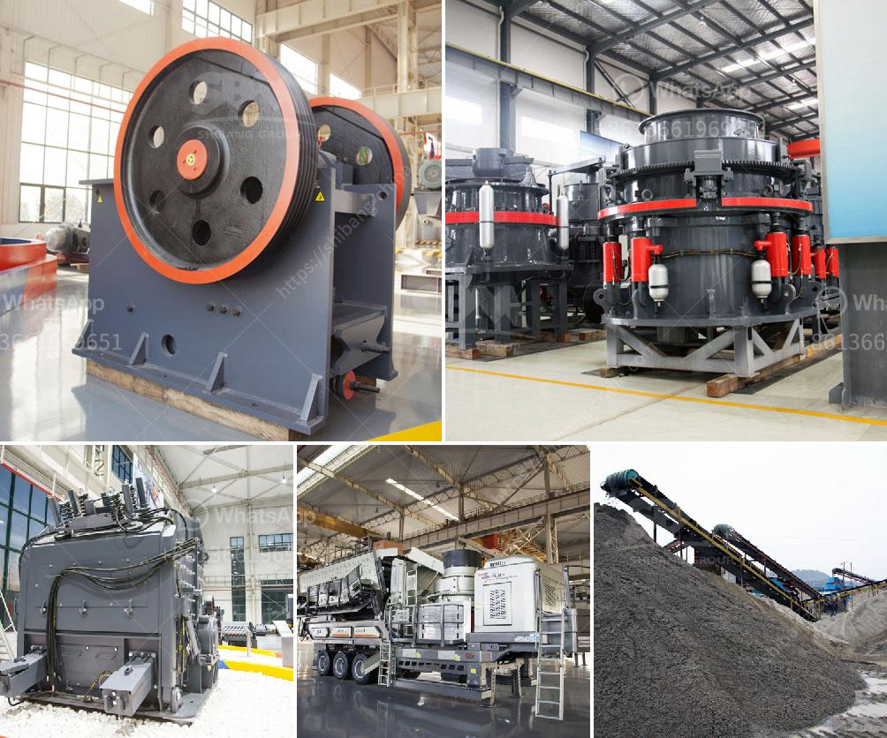

<h3>دراسة الجدوى حول حجر الأبعاد في إثيوبيا</h3>
تعد دراسة الجدوى حول حجر الأبعاد في إثيوبيا مهمة وحاسمة لأي مشروع استثماري في هذا القطاع. حجر الأبعاد هو نوعٌ من الصخور ذات الجودة العالية والصلابة التي تستخدم في العديد من الصناعات مثل البناء والتشييد والتصنيع. وإثيوبيا هي واحدة من الدول التي تعتبر مصدرًا مهمًا لحجر الأبعاد.

تحظى إثيوبيا بموقع جغرافي استراتيجي لاستخراج وتصدير حجر الأبعاد، حيث يوجد بها تشكيلات صخرية ضخمة تحتوي على مناجم هائلة من هذا النوع من الصخور. بالإضافة إلى ذلك، تتمتع إثيوبيا بمقومات طبيعية مثالية لإنتاج وتصدير حجر الأبعاد، مثل التضاريس الجبلية الوعرة والمناخ الصحراوي الجاف الذي يساعد في الحفاظ على جودة الصخور.

تحظى صناعة حجر الأبعاد في إثيوبيا بإمكانات كبيرة للنمو والتطوير. استغلال هذه الإمكانات يمكن أن يوفر فرص عمل جديدة ويعزز الاقتصاد المحلي. يتطلب ذلك إجراء دراسة جدوى جيدة تشمل عدة جوانب مهمة.

أحد أهم جوانب دراسة الجدوى هو تقييم الطلب على حجر الأبعاد على الصعيدين المحلي والعالمي. يجب تحديد أسواق الصخور المستهدفة وتحليل توقعات الطلب والعرض في هذه الأسواق. يجب تقييم المنافسة والمخاطر المحتملة وتحديد أفضل استراتيجية تسويقية وتوزيع.

يتطلب التفتيش الجيولوجي للمنطقة والتحليل الميكانيكي للصخور تقييمًا دقيقًا لجودة الحجر وصلاحيته للاستخدام الصناعي. يجب أيضًا تحديد تكاليف استخراج ومعالجة الصخور والعمالة المطلوبة، وتحليل الجدوى المالية للمشروع. يعتبر تحديد أفضل طرق الاستخراج والنقل والتخزين أيضًا جزءًا مهمًا من دراسة الجدوى.

بالإضافة إلى ذلك، يجب أخذ الاعتبار الأثر البيئي للاستخراج والتعدين على المنطقة المحيطة والسكان المحليين. يجب العمل وفقًا للمعايير البيئية وضمان المحافظة على الطبيعة والتنوع البيولوجي.

في النهاية، يمكن القول بأن دراسة الجدوى حول حجر الأبعاد في إثيوبيا أمر ضروري وحاسم لضمان نجاح المشروع واستدامته. يجب أخذ جميع العوامل الرئيسية في الاعتبار واتخاذ القرارات المناسبة عند تحليل النتائج وتقييم الجدوى الاقتصادية والبيئية للاستثمار.
<h3>Contact us</h3><ul><li><strong>Whatsapp:&nbsp;<a href="https://wa.me/8613661969651">+8613661969651</a></strong></li><li><a href="https://swt.shibang-china.com/?git&amp;zhl&amp;دراسة الجدوى حول حجر الأبعاد في إثيوبيا"><strong>Online Service(chat now)</strong></a></li></ul><h3>Related</h3><ul><li><a href='معالجة الذهب في الفلبين.md'>معالجة الذهب في الفلبين</a></li><li><a href='مطحنة الكرة في الصناعة.md'>مطحنة الكرة في الصناعة</a></li><li><a href='آلة تعدين الذهب في الصين.md'>آلة تعدين الذهب في الصين</a></li><li><a href='آلة غسيل الفحم طن.md'>آلة غسيل الفحم طن</a></li><li><a href='آلة كسارة للبيع.md'>آلة كسارة للبيع</a></li></ul>