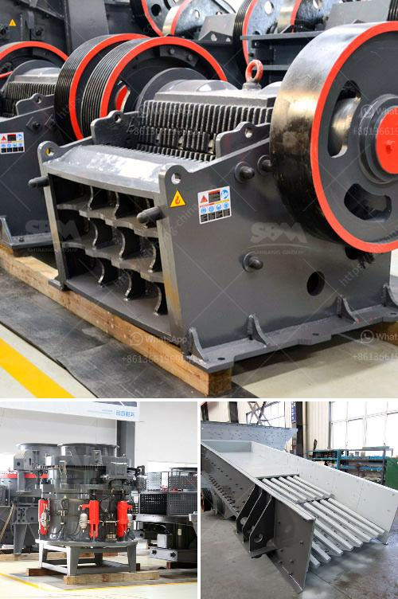

<h3>دراسة الجدوى لإنتاج مسحوق الجبس</h3>
تعد دراسة الجدوى لإنتاج مسحوق الجبس أمرًا ضروريًا قبل الشروع في أي مشروع، وهذا لأنها تساعد على تقييم جوانب الاقتصادية والتجارية والتقنية، وتحديد ما إذا كان الاستثمار في هذه الصناعة يُعَد مربحًا أو غير مربح.

يتم استخدام مسحوق الجبس في العديد من الصناعات مثل صناعة الأسمنت والنظم الجبسية والدهانات والدهانات البازلتية والألواح الجبسية ومواد العزل والطلاء، لذلك يعد ارتفاع الطلب على مسحوق الجبس سببًا رئيسيًا للنظر في الاستثمار في إنتاجه.

تشمل دراسة الجدوى لإنتاج مسحوق الجبس العديد من الجوانب التجارية مثل تحليل السوق وتحديد حجم الطلب والعرض وتحديد المنافسين وموقع المصنع ونوعية المنتجات المطلوبة، بالإضافة إلى تقدير التكاليف اللازمة للمشروع مثل تكاليف العمالة والمواد الخام والطاقة والآلات والمعدات والتكاليف الإدارية والدعاية والتسويق والنقل والتوزيع.

كما يتعين أيضًا النظر في جوانب التقنية والإنتاجية في دراسة الجدوى، حيث يجب تقييم ما إذا كانت التقنيات المستخدمة في إنتاج مسحوق الجبس تتوافق مع المعايير الصحية والمواصفات الفنية، وما إذا كانت الطاقة المستخدمة كفيلة بتلبية الطلب المتوقع.

من المهم أيضًا النظر في الجوانب البيئية والمستدامة في دراسة الجدوى، حيث يتعين تقييم التأثيرات البيئية المحتملة لعمليات إنتاج مسحوق الجبس والتأكد من التزام المشروع بالمعايير البيئية واتخاذ الإجراءات الواجبة للتخفيف من أي تأثير سلبي على البيئة.

وبناءً على نتائج دراسة الجدوى، يتخذ القرار بشأن ما إذا كان يجب المضي قدمًا في تنفيذ مشروع إنتاج مسحوق الجبس أم لا. إذا كانت دراسة الجدوى تشير إلى وجود فرصة عمل مربحة وتوجد الإمكانيات للنجاح، فيمكن البدء في الإعداد اللازم لتنفيذ المشروع، مثل الحصول على التمويل واقتناء المعدات والتوظيف المناسب، ليتحول الاستثمار إلى مشروع ناجح ومربح في نهاية المطاف.
<h3>Contact us</h3><ul><li><strong>Whatsapp:&nbsp;<a href="https://wa.me/8613661969651">+8613661969651</a></strong></li><li><a href="https://swt.shibang-china.com/?git&amp;zhl&amp;دراسة الجدوى لإنتاج مسحوق الجبس"><strong>Online Service(chat now)</strong></a></li></ul><h3>Related</h3><ul><li><a href='الفارق بين الرمل ومسحوق الحجر المكسر.md'>الفارق بين الرمل ومسحوق الحجر المكسر</a></li><li><a href='مصنع تكسير في مالي.md'>مصنع تكسير في مالي</a></li><li><a href='كسارة للبيع في جنوب أفريقيا.md'>كسارة للبيع في جنوب أفريقيا</a></li><li><a href='أسعار كسارات الجيرة.md'>أسعار كسارات الجيرة</a></li><li><a href='كسارة فك محمولة.md'>كسارة فك محمولة</a></li></ul>