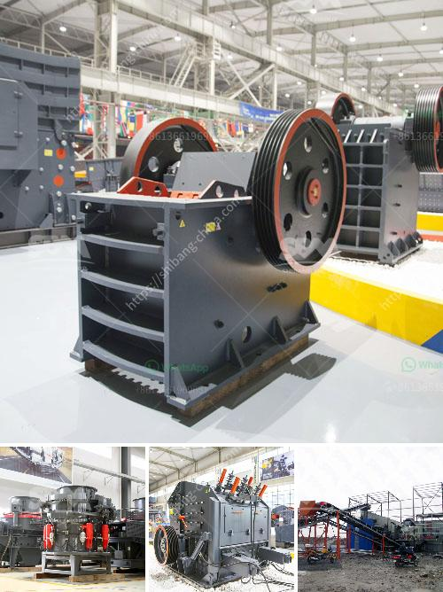

<h3>دراسة جدوى لإنشاء محجر</h3>
تعتبر دراسة جدوى إنشاء محجر من الدراسات الضرورية التي يجب على المستثمرين إجراؤها قبل اتخاذ قرار بالاستثمار في هذا القطاع. فإن تحليل الجدوى يساعد في تقييم الجوانب الفنية والاقتصادية والاجتماعية للمشروع المقترح. سيتم في هذه المقالة مناقشة خطوات إعداد دراسة جدوى لإنشاء محجر.

أول خطوة في إعداد دراسة الجدوى هي دراسة السوق، حيث يتم تحليل الطلب والعرض على المواد الخام المستخدمة في البناء والهندسة المدنية مثل الحصى والرمل. يجب تحديد مستوى الطلب الحالي والمتوقع على هذه المواد في المنطقة المستهدفة لإقامة المحجر. تعتبر معرفة المنافسة في السوق وتحديد نقاط القوة والضعف من الأمور الهامة التي يجب النظر فيها أيضًا.

بعد دراسة السوق، يجب تحديد موقع المحجر المثالي. يجب أن يكون الموقع قريبًا من المشاريع الكبيرة المستقبلية مثل المدن الجديدة والمجمعات السكنية والبناء العمراني الآخر. كما يجب أيضًا النظر في الوصول إلى شبكة النقل الجيدة لضمان الاستدامة والتوزيع الفعال للمواد.

بعد تحديد الموقع، يجب تقدير تكلفة إنشاء المحجر. يجب أخذ في الاعتبار تكلفة الشراء أو الإيجار للأراضي والمعدات اللازمة لعمل المحجر، بما في ذلك الكسارات والحفارات وشاحنات النقل. يجب أيضا أخذ في الاعتبار تكلفة تشغيل المحجر مثل رواتب العمال والصيانة والوقود. سيساعد هذا التقدير في تحديد رأس المال المطلوب للمشروع.

بعد تقدير التكاليف، يجب تحديد الإيرادات المتوقعة. يتم ذلك من خلال حساب حجم الإنتاج الذي يمكن تحقيقه في المحجر ومتوسط الأسعار المتداولة في السوق. يتمكن المستثمر من تحديد الإيرادات المتوقعة بناءً على هذه المعلومات.

بعد إجراء كل خطوات الدراسة، يتم تحليل البيانات وحساب تحليل الجدوى المالي. يجب تقييم التحليل المالي لمعرفة ما إذا كان المشروع مربحًا أو لا. تتضمن تحليل الجدوى المالي المقارنة بين الإيرادات والتكاليف وحساب عوائد الاستثمار وفترة استرداد رأس المال. يتم استخدام بعض المؤشرات المالية مثل نسبة العائد على الاستثمار والنقدية الصافية الحاصلة من الاستثمار لتقييم الجدوى المالية.

في الختام، يمكن القول بأن إعداد دراسة جدوى لإنشاء محجر ضروري لاتخاذ قرار استثماري مناسب. يجب أن تشمل هذه الدراسة تحليل السوق وتحديد الموقع المثالي وتقدير التكلفة وحساب الإيرادات المتوقعة، وأخيرًا تحليل الجدوى المالية. توفر هذه المعلومات للمستثمر الصورة الكاملة للمشروع وتساعده على اتخاذ قرار استثماري مدروس ومستنير.
<h3>Contact us</h3><ul><li><strong>Whatsapp:&nbsp;<a href="https://wa.me/8613661969651">+8613661969651</a></strong></li><li><a href="https://swt.shibang-china.com/?git&amp;zhl&amp;دراسة جدوى لإنشاء محجر"><strong>Online Service(chat now)</strong></a></li></ul><h3>Related</h3><ul><li><a href='جر المحمول في.md'>جر المحمول في</a></li><li><a href='كسارة سلسلة السلسلة ومورديها.md'>كسارة سلسلة السلسلة ومورديها</a></li><li><a href='عملية تصنيع خام البنتونيت.md'>عملية تصنيع خام البنتونيت</a></li><li><a href='موردي مطاحن الأسطوانة في المكسيك.md'>موردي مطاحن الأسطوانة في المكسيك</a></li><li><a href='تقرير الجدوى لاستفادة من خام النحاس.md'>تقرير الجدوى لاستفادة من خام النحاس</a></li></ul>