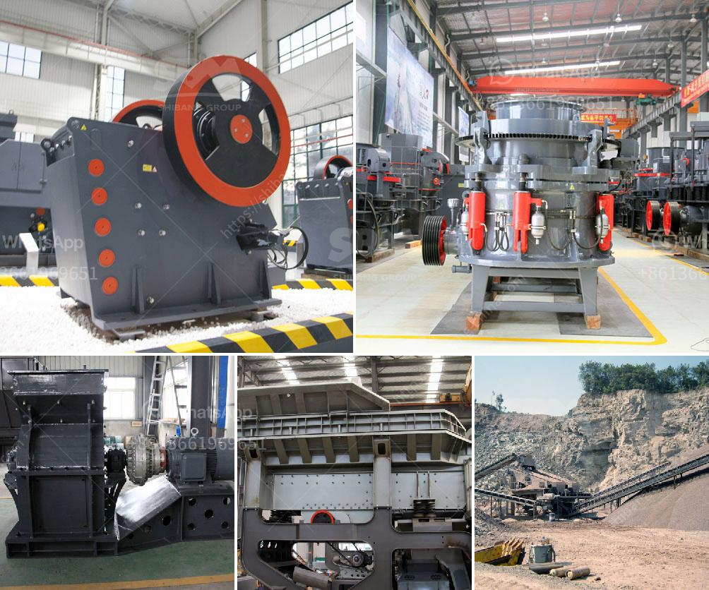

<h3>دراسة جدوى لمصنع تكسير بذور جوز النخيل</h3>
تعد زراعة جوز النخيل من أهم الزراعات في مناطق الشرق الأوسط وشمال أفريقيا، حيث يستخدم الناس النخيل في تلبية احتياجاتهم الغذائية والاقتصادية. وبسبب الزيادة في الإقبال على منتجات جوز النخيل، يعد إنشاء مصنع لتكسير بذور جوز النخيل فكرة مستثمرة وقابلة للنجاح.

تقدم هذه المقالة نظرة عامة حول دراسة جدوى لمصنع تكسير بذور جوز النخيل. تهدف الدراسة إلى تحليل الجوانب المالية والاقتصادية والتسويقية للمشروع لتحديد ما إذا كان يستحق الاستثمار أم لا.

أولاً، يتعين توفير مساحة كافية لإقامة المصنع، وجعلها مراعية للمعايير البيئية والصحية. يتوجب أيضًا تأمين العمالة الماهرة والمعدات اللازمة لتشغيل المصنع، مثل الكسارات والمكابس.

ثانياً، ينبغي تقييم التكلفة المالية المرتبطة بتشغيل المصنع، بما في ذلك تكاليف المواد الخام والطاقة والعمل. يعتمد ذلك على حجم المصنع والإنتاج المتوقع. يجب أيضًا مراعاة تكاليف الصيانة والتشغيل المستمر.

ثالثاً، يتعين تحديد السوق المستهدفة ودراسة طلبها على منتجات جوز النخيل المكسّر. تضم السوق منتجات أخرى محلية وأجنبية، ويتعين تحليل المنافسة وإيجاد فرص تسويقية محتملة لجذب العملاء. يمكن أن تشمل الاستراتيجيات التسويقية الابتكار في التعبئة والتغليف والترويج للمنتج باستخدام وسائل إعلانية مثل وسائل التواصل الاجتماعي.

أخيراً، يجب تقدير العائد المالي المتوقع من المشروع. يعتمد ذلك على حجم وسعر الإنتاج والتكلفة والطلب على المنتج. يجب أيضاً احتساب مخاطر الاستثمار وتقدير فترة الانتعاش لاسترداد الاستثمار المبدئي.

استنادًا إلى التحليل والتقديرات المذكورة أعلاه، يمكن اتخاذ قرار بشأن جدوى المصنع. يجب أن تكون الدراسة المالية إيجابية، حيث تساهم في تحقيق الأرباح المستدامة وتحسين الوضع الاقتصادي للمستثمر.

لذا، فإن إقامة مصنع لتكسير بذور جوز النخيل يعتبر فرصة استثمارية واعدة في العديد من المناطق، والتي تستفيد من الطلب المتزايد على منتجات جوز النخيل. يعزز هذا المشروع النمو الاقتصادي ويسهم في تعزيز القدرة التنافسية في صناعة جوز النخيل.
<h3>Contact us</h3><ul><li><strong>Whatsapp:&nbsp;<a href="https://wa.me/8613661969651">+8613661969651</a></strong></li><li><a href="https://swt.shibang-china.com/?git&amp;zhl&amp;دراسة جدوى لمصنع تكسير بذور جوز النخيل"><strong>Online Service(chat now)</strong></a></li></ul><h3>Related</h3><ul><li><a href='سعر كسارة الفك في نيجيريا.md'>سعر كسارة الفك في نيجيريا</a></li><li><a href='أنواع السيور الناقلة.md'>أنواع السيور الناقلة</a></li><li><a href='معدات تعدين الصغيرة مصنعين في جنوب أفريقيا.md'>معدات تعدين الصغيرة مصنعين في جنوب أفريقيا</a></li><li><a href='كسارة فكية صغيرة في المملكة المتحدة.md'>كسارة فكية صغيرة في المملكة المتحدة</a></li><li><a href='كسارة الحجر غانا.md'>كسارة الحجر غانا</a></li></ul>