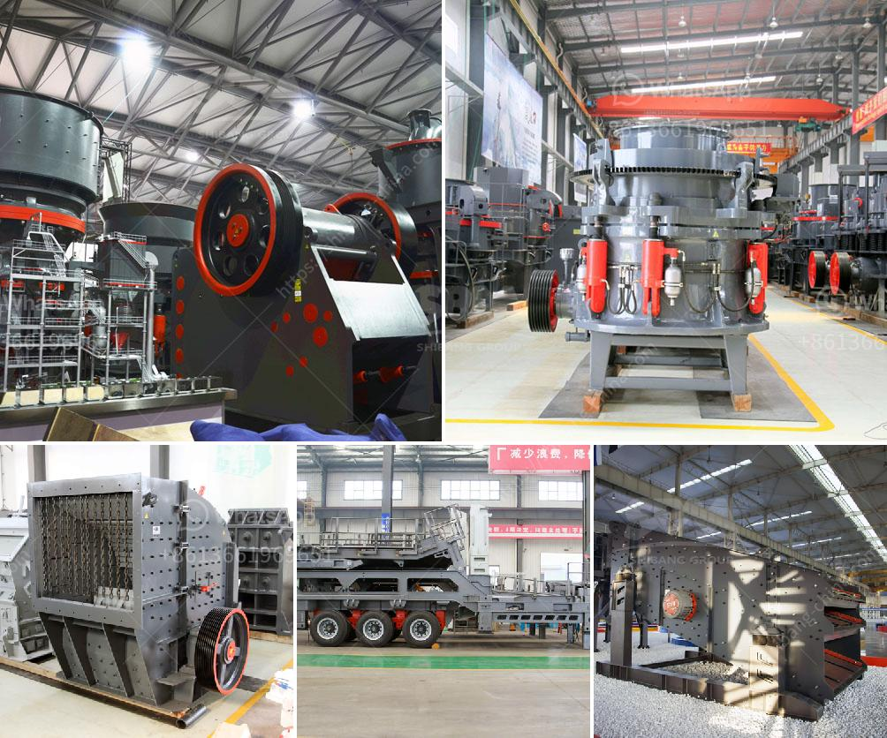

<h3>دراسة جدوى لمصنع سحق الكروم الفير</h3>
تهدف هذه المقالة إلى دراسة جدوى إنشاء مصنع لسحق الكروم الفير. يعتبر الكروم الفير من المواد المعدنية الهامة والمطلوبة في صناعات عديدة، بما في ذلك صناعة الصلب والسبائك. لذا، لهذا المصنع فرصة كبيرة لتحقيق ربحية عالية.

أولاً وقبل الشروع في أي دراسة جدوى، نحتاج إلى تحديد حجم الإنتاج المتوقع واحتياجات السوق المحلية والعالمية للكروم الفير. يجب أن نحصل على بيانات دقيقة حول الطلب والعرض المستقبلي لهذه المادة المعدنية، بالإضافة إلى توقعات الأسعار والعوائد المحتملة على الاستثمار في هذا القطاع.

بعد الحصول على المعلومات الأولية، يمكننا التحقق من توفر الموارد الطبيعية المطلوبة لإنتاج الكروم الفير، مثل وجود مناجم الكروم الفير ومواد أولية أخرى تدخل في عملية الإنتاج. يجب أن نتأكد من وجود تلك الموارد بكميات كافية لضمان استدامة المصنع لفترة طويلة.

من الجوانب الهامة التي يجب مراعاتها في دراسة الجدوى، هو التكلفة الاستثمارية لإقامة المصنع واستكمال جميع المعدات اللازمة وتدريب العمال. يجب أن يتم حساب جميع التكاليف المرتبطة بتأسيس المصنع، بما في ذلك تكاليف المواد الخام والعمالة وتكلفة طاقة الإنتاج وتكنولوجيا المعالجة اللازمة.

علاوة على ذلك، يجب أيضًا أن تتم دراسة التوجهات الاقتصادية والقانونية في منطقة المصنع المحتملة. توجد بعض البلدان التي تفرض رسوماً جمركية عالية على صادرات الكروم الفير، مما يؤثر على تنافسية المصنع في السوق العالمية.

بناءً على الدراسة التنافسية وتوقعات الطلب والعرض والتوجهات القانونية والتكاليف المرتبطة، يمكننا إجراء تقديرات مالية للمشروع وتحديد مدة استرداد الاستثمار. يجب أن تكون الإيرادات المتوقعة من صادرات الكروم الفير أعلى من تكاليف التشغيل للحصول على ربحية مستدامة وجذابة للمستثمرين.

يجب أن نأخذ بعين الاعتبار العوامل البيئية والاجتماعية أيضًا، مثل تأثير المصنع على البيئة المحيطة وتأثيره على سكان المنطقة. يجب أن يتم اتباع جميع القوانين البيئية والحصول على التراخيص اللازمة للتشغيل.

بناءً على النقاط المذكورة أعلاه، يمكن استنتاج أن مصنع سحق الكروم الفير له إمكانات كبيرة لتحقيق ربحية عالية. ومع ذلك، يجب أن تتم هذه الدراسة الجدوى بدقة واتخاذ جميع العوامل في الاعتبار للتأكد من استدامة المشروع ونجاحه في السوق.
<h3>Contact us</h3><ul><li><strong>Whatsapp:&nbsp;<a href="https://wa.me/8613661969651">+8613661969651</a></strong></li><li><a href="https://swt.shibang-china.com/?git&amp;zhl&amp;دراسة جدوى لمصنع سحق الكروم الفير"><strong>Online Service(chat now)</strong></a></li></ul><h3>Related</h3><ul><li><a href='شاشة جريزلي للبيع نيوزيلندا.md'>شاشة جريزلي للبيع نيوزيلندا</a></li><li><a href='مصنع معدات تعدين الرخام.md'>مصنع معدات تعدين الرخام</a></li><li><a href='آلة غسيل الرمال.md'>آلة غسيل الرمال</a></li><li><a href='شركة تصنيع معدات التكسير.md'>شركة تصنيع معدات التكسير</a></li><li><a href='معالجة الذهب في الفلبين.md'>معالجة الذهب في الفلبين</a></li></ul>