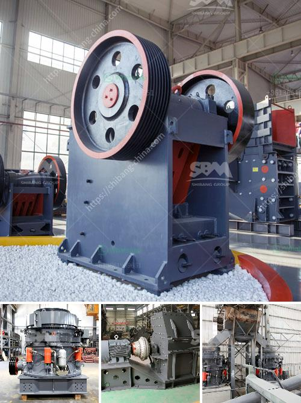

<h3>دراسة جدوى مشروع مصنع الإسمنت pdf</h3>
تُعد دراسة جدوى مشروع مصنع الإسمنت أمرًا ضروريًا لتقييم قابلية تنفيذ المشروع وربحيته المحتملة. يهدف هذا المصنع إلى إنتاج الإسمنت الذي يُستخدم في إنشاء المباني والأعمال الهندسية المختلفة، لذا فإنه يعد قطاعًا حيويًا في صناعة البناء والتشييد.

تشمل دراسة جدوى مشروع مصنع الإسمنت عدة جوانب. أولاً، ينبغي تحديد حجم الإنتاج المطلوب واحتياجات السوق. يُجرى تحليل المنافسة للتأكد من أن هناك سوقًا كافية لاستيعاب المزيد من الأعمال، ويكون من المفيد الوقوف على المشاريع القائمة وقدرتها على التنافس.

ثانيًا، يجب تحديد الموقع المناسب للمصنع. يجب أخذ العديد من العوامل في الاعتبار، مثل الوصول إلى المواد الأولية، والتواجد الجغرافي واحتياجات النقل، وتوافر المياه والطاقة اللازمة للإنتاج. على سبيل المثال، يُعتبر تواجد المواد الخام والمنتج النهائي في مكان واحد ميزة تنافسية قوية.

ثالثًا، يتعين تقدير التكلفة الإجمالية لإقامة المصنع وتشغيله. يشمل ذلك استحصال التراخيص وشراء المعدات والآليات اللازمة وتأمين العمالة والمواد اللازمة للإنتاج. يجب تقدير طول فترة العائد على الاستثمار وتحديد المخاطر المحتملة، مثل تقلبات سعر الخامات واحتمال وقوع حوادث.

رابعًا، يجب تحديد العملاء المستهدفين وتقييم جاذبية السوق. على سبيل المثال، يمكن أن تكون هناك فرص تصدير للربح من الأسواق الدولية، لذلك يجب تحليل الطلب العالمي والأسعار المحلية والعالمية.

أخيرًا، يُنبغي توضيح الأرباح المتوقعة والتقديرية للمشروع بناءً على كافة العوامل المذكورة أعلاه. يُعَد تحقيق الربحية في أي مشروع أمرًا هامًا لضمان استمراريته ونجاحه.

باختصار، تُعد دراسة جدوى مشروع مصنع الإسمنت خطوة حاسمة لاتخاذ قرار ببدء المشروع وتأكيد ربحيته. يجب أخذ جميع العوامل المحتملة في الاعتبار والتشاور مع خبراء في الصناعة للحصول على تقييم شامل وموثوق قبل الشروع في المشروع.
<h3>Contact us</h3><ul><li><strong>Whatsapp:&nbsp;<a href="https://wa.me/8613661969651">+8613661969651</a></strong></li><li><a href="https://swt.shibang-china.com/?git&amp;zhl&amp;دراسة جدوى مشروع مصنع الإسمنت pdf"><strong>Online Service(chat now)</strong></a></li></ul><h3>Related</h3><ul><li><a href='مصنع غسيل الرمل للبيع.md'>مصنع غسيل الرمل للبيع</a></li><li><a href='كسارة صخور الحجر الجيري.md'>كسارة صخور الحجر الجيري</a></li><li><a href='سعر مصنع التكسير.md'>سعر مصنع التكسير</a></li><li><a href='كيفية حساب تكلفة الطحن.md'>كيفية حساب تكلفة الطحن</a></li><li><a href='كسارة فكية صغيرة في المملكة المتحدة.md'>كسارة فكية صغيرة في المملكة المتحدة</a></li></ul>