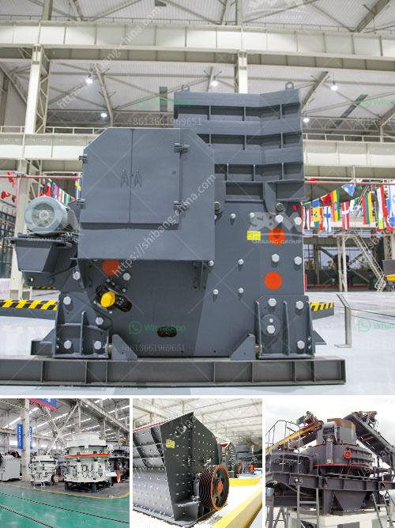

<h3>دليل تصميم كسارة مخروط بتنسيق PDF</h3>
تصميم كسارة مخروط هو عملية مهمة في صناعة التعدين والبناء، حيث يتم استخدام الكسارة المخروطية لسحق المواد الخام وتحويلها إلى قطع صغيرة. ولضمان أداء الكسارة المثالي، هناك دليل تصميم يمكن أن يوجه المهندسين في عملية التصميم والتركيب.

الخطوة الأولى في تصميم الكسارة المخروطية هي تحديد المواد التي سوف يتم سحقها. يجب معرفة صلابة المواد وقوة الشد اللازمة لكسرها بشكل فعال. يتم ذلك عن طريق إجراء اختبارات على عينات صغيرة من المواد المطلوبة للتحليل وتحديد معلمات العمل اللازمة.

بعد تحديد خواص المواد، يجب تصميم الكسارة المخروطية وفقًا لمتطلبات الإنتاج المحددة. يجب أن يتم تحديد حجم التغذية المطلوب والاستخراج المطلوب للمنتج النهائي. يتم ذلك عن طريق تحليل قدرة الكسارة وفعالية الإنتاج، واختيار الأجزاء والمواد المناسبة لضمان تحقيق الأداء المثلى.

ثم، يتم تصميم الهيكل الداخلي للكسارة المخروطية. يجب أن يكون الهيكل متينًا وقادرًا على تحمل الضغوط الشديدة التي تحدث خلال عملية السحق. يتم تحسين التوزيع الداخلي للمواد لضمان سرعة وتوحيد سحق المواد.

بعد ذلك، يجب تحديد النظام الهيدروليكي اللازم لتشغيل الكسارة المخروطية. يتم استخدام النظام الهيدروليكي لضبط وتغيير حجم فتحة الخروج وضبط التغذية والحماية من أيضاحة غير مرغوب فيها. يتكون النظام الهيدروليكي من مجموعة من الأجزاء المعقدة مثل المضخات والصمامات والأسطوانات المهمة لضمان عمل الكسارة بكفاءة وسهولة الاستخدام.

أخيرًا، يجب وضع التعليمات والتوجيهات الخاصة بتشغيل وصيانة الكسارة المخروطية في دليل التصميم. يجب أن يتضمن الدليل كافة المعلومات اللازمة للمشغلين وفرق الصيانة للعمل بشكل صحيح وآمن. يجب توفير تعليمات للفحص الدوري وتشحيم الأجزاء واستبدال الأجزاء المهمة للحفاظ على أداء الكسارة المخروطية.

في النهاية، يعد دليل تصميم الكسارة المخروطية بتنسيق PDF أداة قيمة لكل من المهندسين والمشغلين لفهم تصميم الكسارة والحصول على أفضل أداء ممكن. يساهم التصميم الجيد في تحقيق الكفاءة والإنتاجية العالية في عملية السحق.
<h3>Contact us</h3><ul><li><strong>Whatsapp:&nbsp;<a href="https://wa.me/8613661969651">+8613661969651</a></strong></li><li><a href="https://swt.shibang-china.com/?git&amp;zhl&amp;دليل تصميم كسارة مخروط بتنسيق PDF"><strong>Online Service(chat now)</strong></a></li></ul><h3>Related</h3><ul><li><a href='حجم طحن البنتونيت.md'>حجم طحن البنتونيت</a></li><li><a href='آلات تكسير الحصى.md'>آلات تكسير الحصى</a></li><li><a href='كسارات الحجر الرئيسية.md'>كسارات الحجر الرئيسية</a></li><li><a href='مطاحن الحجر للبيع في كينيا.md'>مطاحن الحجر للبيع في كينيا</a></li><li><a href='مصنع سحق في ماليزيا.md'>مصنع سحق في ماليزيا</a></li></ul>