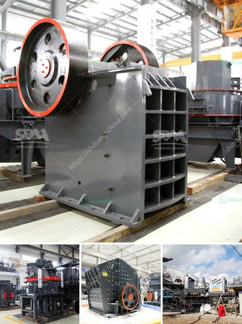

<h3>دليل مطحنة الكرة الرطبة بتنسيق PDF</h3>
مطحنة الكرة الرطبة هي أداة تستخدم لطحن المواد في صناعة تعدين الألغام والبناء والكيمياء والصناعات الأخرى. يتم استخدام هذه المطاحن لطحن المواد الخام إلى حجم الجسيمات المطلوب قبل استخدامها في الإنتاج. في هذه المقالة سنقوم بتوضيح بعض الأمور التي يجب مراعاتها عند استخدام مطحنة الكرة الرطبة.

أحد العوامل الرئيسية التي يجب مراعاتها عند استخدام مطحنة الكرة الرطبة هو ملء الكرة ونسبة الأجزاء المائية. يجب أن يكون لديك توازن مناسب بين كمية الكرة والمياه المستخدمة ، حيث يمكن أن يؤثر ضبط هذه العوامل على أداء المطحنة وجودة الطحن النهائية. عندما يكون هناك اكتفاء جيد بين الكرة والماء ، يمكن أن يتم تحسين كفاءة الطحن وتقليل استهلاك الطاقة.

كما يجب أن يتم اختيار المواد المناسبة للكرة المستخدمة في المطحنة. يفضل استخدام الكرات المصنوعة من الفولاذ أو السيراميك ، حيث تتميز بصلابة عالية وقدرة على تحمل التآكل. تلعب هذه الكرات دورًا حاسمًا في عملية الطحن ، حيث تساعد على سحق وطحن المواد الخام بفعالية.

بالإضافة إلى ذلك ، يتوجب تنظيف وصيانة المطحنة بانتظام للحفاظ على أداء أفضل. يتطلب ذلك إزالة الرواسب والأوساخ التي تتراكم داخل المطحنة وتنظيف الأسطح الداخلية والخارجية. من المهم أن يتم إجراء عملية التنظيف بعناية لتجنب أي ضرر للمعدات.

في الختام ، يجب الإشارة إلى أن مطحنة الكرة الرطبة تعتبر أداة هامة في العديد من الصناعات. من خلال اتباع دليل صحيح لاستخدام وصيانة المطحنة ، يمكن تحقيق أداء ممتاز وجودة عالية للطحن. يجب أن تكون لديك العناية اللازمة عند استخدام المطحنة ومراعاة جميع العوامل الضرورية للحفاظ على أداء المطحنة وطول عمرها.
<h3>Contact us</h3><ul><li><strong>Whatsapp:&nbsp;<a href="https://wa.me/8613661969651">+8613661969651</a></strong></li><li><a href="https://swt.shibang-china.com/?git&amp;zhl&amp;دليل مطحنة الكرة الرطبة بتنسيق PDF"><strong>Online Service(chat now)</strong></a></li></ul><h3>Related</h3><ul><li><a href='كسارة مخروط في أمريكا.md'>كسارة مخروط في أمريكا</a></li><li><a href='مصنع غسيل الذهب المتنقل.md'>مصنع غسيل الذهب المتنقل</a></li><li><a href='مطحنة أسمنت صغيرة مستعملة في الإمارات.md'>مطحنة أسمنت صغيرة مستعملة في الإمارات</a></li><li><a href='عملية تلبيس خام المنغنيز.md'>عملية تلبيس خام المنغنيز</a></li><li><a href='عملية تصنيع كسارة الطين.md'>عملية تصنيع كسارة الطين</a></li></ul>