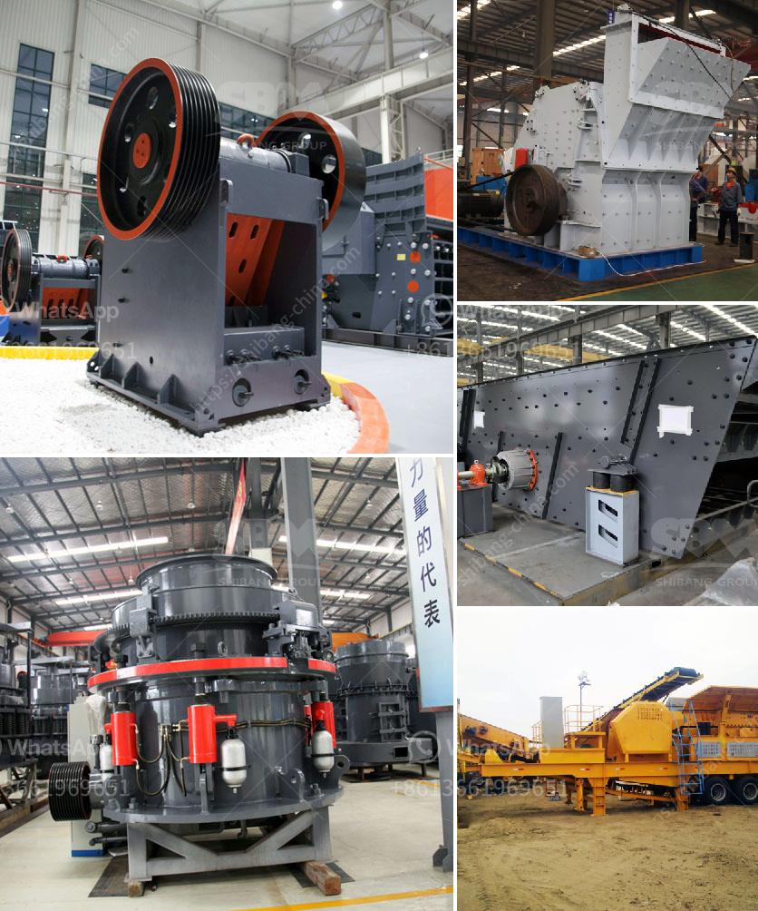

<h3>رسم بياني لعملية غسيل الرمال</h3>
عملية غسيل الرمال هي عملية تنقية وتنظيف الرمال المستخدمة في عدة صناعات مختلفة مثل صناعة البناء والبترول والتعدين. رسم بياني لعملية غسيل الرمال يمكن أن يساعد في توضيح وتفسير هذه العملية بشكل أفضل وتحسين فهمها للطرفين المهتمين.

يتألف رسم بياني لعملية غسيل الرمال عادةً من محاور الزمن والكمية أو النسبة المئوية. يتم استخدام الرسم البياني لتسليط الضوء على التغيرات التي تحدث في الكمية المستخدمة من الرمال خلال عملية الغسيل على مر الزمن. يمكن استخدامه أيضًا لإظهار التغيرات في تكوين الرمال المطلوبة خلال العملية.

على سبيل المثال، يمكن أن يظهر الرسم البياني مراحل عملية غسيل الرمال بشكل بسيط ومباشر. يمكن أن يعرض الرسم البياني المرحلة الأولى للغسيل وهي عملية إزالة الشوائب الكبيرة والغرين من الرمال، ويمكن تمثيل هذه المرحلة على الرسم البياني بزيادة ملحوظة في الكمية المستخدمة من الرمال.

ثم، يمكن أن يعرض الرسم البياني المرحلة الثانية للغسيل، وهي عملية إزالة الشوائب الدقيقة والرواسب العضوية من الرمال. يمكن تمثيل هذه المرحلة على الرسم البياني عن طريق زيادة قليلة في الكمية المستخدمة من الرمال بعد إزالة الشوائب الكبيرة.

المرحلة النهائية للعملية هي تجفيف الرمال وإعادة تدويرها للاستخدام القادم. يمكن أن يعرض الرسم البياني تناقص الكمية المستخدمة من الرمال بشكل تدريجي خلال هذه المرحلة حتى تصل إلى الحد المطلوب من الرمال للاستعمال المستقبلي.

باستخدام الرسم البياني، يمكن للمهندسين والعاملين في هذه الصناعات فهم العملية بشكل أفضل وتحسين كفاءتها. يمكن استخدام الرسم البياني أيضًا لتحليل أي مشاكل أو تغيرات غير مرغوب فيها خلال عملية الغسيل.

باختصار، الرسم البياني لعملية غسيل الرمال هو أداة قوية ومفيدة في فهم وتحسين هذه العملية. يمكن استخدامه للتوضيح والتفسير وتحليل التغييرات التي تحدث خلال العملية، مما يساعد في تطوير عمليات صناعة البناء والبترول والتعدين.
<h3>Contact us</h3><ul><li><strong>Whatsapp:&nbsp;<a href="https://wa.me/8613661969651">+8613661969651</a></strong></li><li><a href="https://swt.shibang-china.com/?git&amp;zhl&amp;رسم بياني لعملية غسيل الرمال"><strong>Online Service(chat now)</strong></a></li></ul><h3>Related</h3><ul><li><a href='آلة كسارة حجر تاتا في نيروبي.md'>آلة كسارة حجر تاتا في نيروبي</a></li><li><a href='مصنع عملية التصنيع في جنوب أفريقيا.md'>مصنع عملية التصنيع في جنوب أفريقيا</a></li><li><a href='مصنع الكرة لمصنع الكالسيت.md'>مصنع الكرة لمصنع الكالسيت</a></li><li><a href='عملية تصنيع هيدروتون الحصى الطيني.md'>عملية تصنيع هيدروتون الحصى الطيني</a></li><li><a href='آلة قطع الحجر المستخدمة من اليابان.md'>آلة قطع الحجر المستخدمة من اليابان</a></li></ul>