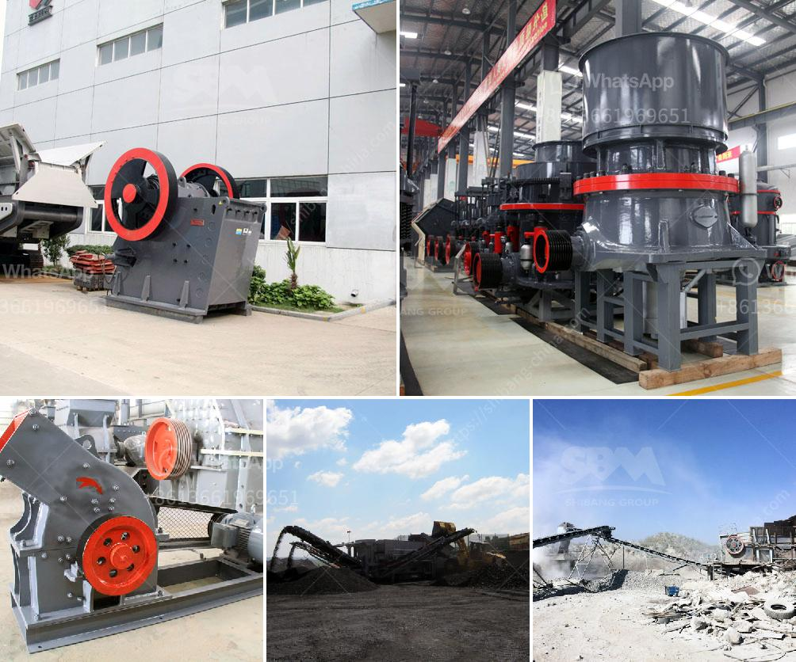

<h3>رسم تخطيطي لسحق وطحن البلاتين</h3>
يعتبر البلاتين واحدًا من أهم المعادن الثمينة والنادرة المستخدمة في العديد من التطبيقات الصناعية والإلكترونية. يتم استخراج البلاتين من السحاحات المعدنية ويتطلب عملية معقدة لاستخلاصه من المواد الخام، وتشمل هذه العملية عدة خطوات مهمة، مثل سحق وطحن البلاتين المستخرج. 

يهدف الرسم التخطيطي لسحق وطحن البلاتين إلى تصوير جميع الخطوات اللازمة للتخلص من الفقاعات ولتصنيع المنتج النهائي بأعلى جودة ممكنة. تتضمن العملية عدة مراحل هي:

1. السحق: تبدأ العملية بتكسير وسحق البلاتين الخام إلى قطع صغيرة باستخدام كسارات أو طواحين الفك الكبيرة. تهدف هذه العملية إلى تحويل صخور البلاتين إلى حجم أكبر يسهل معالجته في الخطوات التالية.

2. الطحن: بعد السحق، يتم نقل الصخور إلى طواحين الكرات أو طواحين الأسطوانات لطحنها إلى مسحوق ناعم. يمكن أن يتم طحن البلاتين بواسطة الطحانة الرطبة أو الطحانة الجافة، حسب الاحتياجات والظروف المحددة للعملية.

3. التصنيف: بعد الطحن، يتم تصنيف المسحوق المطحون وفقًا لحجم الجسيمات باستخدام أجهزة التصنيف مثل الهزازات أو الشاشات الاهتزازية. ويتم تجميع الجسيمات من حجم معين في كل تجمع للتأكد من توفر مسحوق البلاتين المطلوب للمراحل اللاحقة.

4. تنظيف الفقاعات: في بعض الحالات، قد تتكون فقاعات هوائية في عملية السحق والطحن. لذلك يتم استخدام مواد تعامل معها مثل الجيلاتين أو مواد التعويم للتخلص من هذه الفقاعات وتحقيق تصفية أفضل للبلاتين المطلوب.

5. التجفيف: بعد الطحن وتنظيف الفقاعات، يتم نقل المسحوق إلى أفران التجفيف لإزالة أي رطوبة باقية فيه. يتم تسخين المسحوق عند درجات حرارة محددة لضمان إزالة الرطوبة بشكل كامل دون أن يتعرض المنتج لأي تلف.

6. التعبئة والتغليف: في المرحلة الأخيرة، يتم تعبئة وتغليف المنتج النهائي في عبوات مناسبة للحفاظ على جودته وسلامته. يجب أن يتم تخزين ونقل المنتج بعناية شديدة نظرًا لقيمته العالية وحساسيته.

بهذه الطريقة، يتم الحصول على مسحوق البلاتين بجودة عالية واستفادة أقصى من خامات البلاتين. يتم استخدام هذا المسحوق في العديد من الصناعات، مثل صناعة الأدوات العلمية والإلكترونية والنسيجية وهندسة أنظمة النقل وعديد من التطبيقات الصناعية الأخرى.
<h3>Contact us</h3><ul><li><strong>Whatsapp:&nbsp;<a href="https://wa.me/8613661969651">+8613661969651</a></strong></li><li><a href="https://swt.shibang-china.com/?git&amp;zhl&amp;رسم تخطيطي لسحق وطحن البلاتين"><strong>Online Service(chat now)</strong></a></li></ul><h3>Related</h3><ul><li><a href='موردين مطاحن الكرة في جنوب أفريقيا.md'>موردين مطاحن الكرة في جنوب أفريقيا</a></li><li><a href='معدات التعدين في جنوب أفريقيا.md'>معدات التعدين في جنوب أفريقيا</a></li><li><a href='كسارة تأثير VSI.md'>كسارة تأثير VSI</a></li><li><a href='كسارة حجرية للبيع.md'>كسارة حجرية للبيع</a></li><li><a href='معدات فحص الصخور.md'>معدات فحص الصخور</a></li></ul>