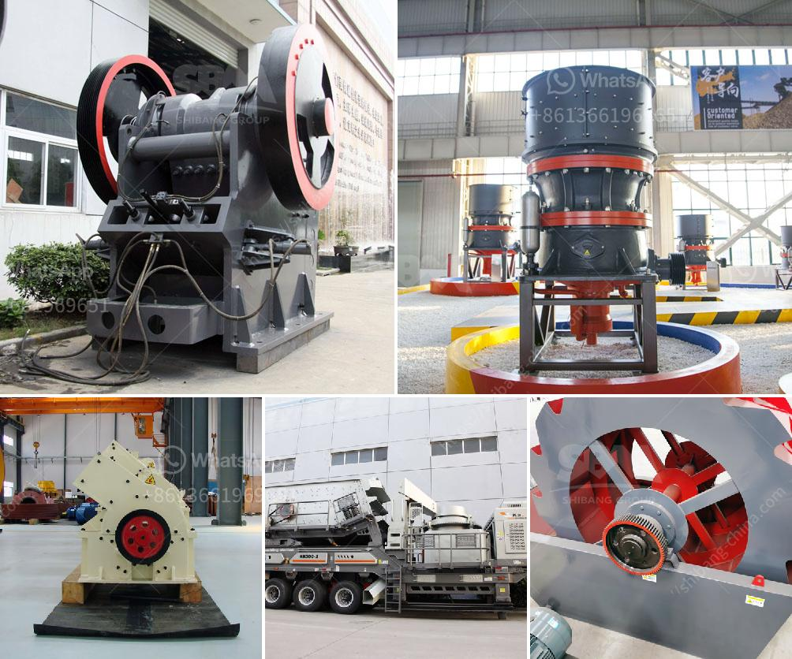

<h3>رسم تخطيطي لعملية إنتاج الأسمنت</h3>
عملية إنتاج الأسمنت هي عملية معقدة تتكون من عدة خطوات متتالية تهدف إلى تحويل المواد الخام إلى الأسمنت النهائي. في هذه المقالة، ستتحدث عن رسم تخطيطي لعملية إنتاج الأسمنت وسلسلة الخطوات التي يتم اتباعها.

أولاً، يتم جمع المواد الخام المستخدمة في صناعة الأسمنت مثل الطين والحجر الجيري والسيليكا والبوكسايت (الألومينا) من المناجم. يجب أن يكون لهذه المواد الخام تركيبة معينة وفقًا للمواصفات الدولية.

الخطوة التالية هي سحق المواد الخام المجمعة في الكسارات للحصول على حبيبات صغيرة. يتم استخدام المطاحن الكروية أو المطاحن الأخرى لتقليل حجم الجسيمات وتحويلها إلى بودرة ناعمة.

ثم تمر المواد الخام المسحوقة إلى الفرن الدوار حيث يتم تسخينها بدرجات حرارة عالية. خلال عملية التسخين، يتم إزالة الرطوبة الموجودة في المواد الخام وتتفاعل تلك المكونات الكيميائية لتكوين ما يسمى الكلنكر.

بعد ذلك، يتم تبريد الكلنكر باستخدام نظام التبريد الجوي أو الزيتي حتى يكون جاهزًا للطحن. يتم تكسير الكلنكر إلى مسحوق ناعم في مطحنة الأسمنت ويضاف إليها مواد مضافة مثل الجبس لضبط تغذية الزمن.

تتم عملية تعبئة الأسمنت في أكياس أو صهاريج للتخزين والتوزيع. يتم تخزين الأسمنت في المستودعات المغلقة لحمايته من الرطوبة والتأثيرات الجوية الأخرى ومن ثم يتم توزيعه إلى المصانع والمشاريع الإنشائية.

هذا هو عرض مبسط لعملية إنتاج الأسمنت ورسم تخطيطي لها. يجب أن يتم اتباع معايير الجودة والسلامة أثناء كل خطوة في هذه العملية لضمان منتج نهائي عالي الجودة وآمن للاستخدام. كما يمكن تكييف هذه العملية لاستخدام تقنيات مختلفة حسب المتطلبات المحددة لكل مصنع.
<h3>Contact us</h3><ul><li><strong>Whatsapp:&nbsp;<a href="https://wa.me/8613661969651">+8613661969651</a></strong></li><li><a href="https://swt.shibang-china.com/?git&amp;zhl&amp;رسم تخطيطي لعملية إنتاج الأسمنت"><strong>Online Service(chat now)</strong></a></li></ul><h3>Related</h3><ul><li><a href='أسعار مصنع كسارة الحجر.md'>أسعار مصنع كسارة الحجر</a></li><li><a href='موردين لمصانع سحق ld slag في الهند.md'>موردين لمصانع سحق ld slag في الهند</a></li><li><a href='إغلاق محطة الكسارة.md'>إغلاق محطة الكسارة</a></li><li><a href='عملية صنع كسارة رخام الكوارتز.md'>عملية صنع كسارة رخام الكوارتز</a></li><li><a href='مورد مصنع تكسير الحجر في الفلبين.md'>مورد مصنع تكسير الحجر في الفلبين</a></li></ul>