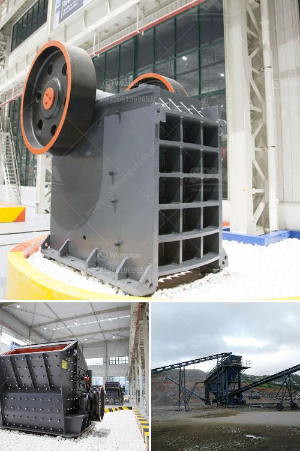

<h3>رسم توضيحي لآلة الطحن</h3>
تعتبر آلة الطحن أحد الأدوات الهامة في صناعة السلع والمنتجات، حيث تُستخدم لطحن وتحويل الحبوب والمواد الأخرى إلى مسحوق ناعم. يسهم الرسم التوضيحي في توضيح عملية الطحن وتوفير فهم أفضل لكل من العاملين والمهتمين في هذا المجال.

يتكون رسم توضيحي لآلة الطحن من عدة أجزاء رئيسية. يتواجد في قاعدة الآلة جسم الطحن الرئيسي، وهو عبارة عن غلاف يحتوي على محرك كهربائي يعمل على تشغيل الجهاز. يُعتبر هذا الجسم مكان تجميع المعدات والأدوات الضرورية لعملية الطحن.

في الجزء العلوي من الجسم، يوجدمحور أفقي يُعرف بـالمغزل يتصل بجسم الطحن الرئيسي. يعمل المغزل على دوران شفرة الطحن وطحن المادة الخام. يمكن تعديل سرعة دوران المغزل وزاويته لتحقيق منتج نهائي مطابق للمواصفات المطلوبة.

بجانب المغزل، يوجد مخزن المواد الخام، وهو الأداة التي تحتوي على المواد السائبة المراد طحنها. يمكن أن يكون المخزن بحجم مختلف حسب حاجة العملية. يتم تغذية المخزن بواسطة نظام النقل المثبت في الجهاز.

عند تشغيل الجهاز، يتحرك المخزن وينقل المواد الخام تحت شفرة الطحن. يتم طحن المواد الخام بين المحور الدوار والشفرة الثابتة المثبتة في جسم الطحن. بمجرد طحن المادة، تتحرك إلى الشفرة الموجودة في جزء آخر من الجهاز لأخذ المسحوق النهائي.

يعتبر رسم توضيحي لآلة الطحن أداة مهمة لشرح وفهم عملية الطحن. يُمكن استخدامه في دليل الاستخدام أو التعليمات الفنية المرفقة مع الآلة. يساعد الرسم في تحديد المكونات الأساسية وعملية التجميع والاستخدام السليم للآلة.

في الختام، يُعد الرسم التوضيحي لآلة الطحن أداة هامة لتوضيح عملية الطحن وعناصر الآلة المختلفة. يُمكن استخدامه في الدليل الفني للآلة أو في أغراض التعليم والتدريب. يتيح هذا الرسم فهمًا أفضل للمستخدمين ويساهم في تحقيق الكفاءة والجودة في عملية الطحن.
<h3>Contact us</h3><ul><li><strong>Whatsapp:&nbsp;<a href="https://wa.me/8613661969651">+8613661969651</a></strong></li><li><a href="https://swt.shibang-china.com/?git&amp;zhl&amp;رسم توضيحي لآلة الطحن"><strong>Online Service(chat now)</strong></a></li></ul><h3>Related</h3><ul><li><a href='معدات زراعية للبيع بأسعار مناسبة.md'>معدات زراعية للبيع بأسعار مناسبة</a></li><li><a href='آلة طحن الطين الصيني.md'>آلة طحن الطين الصيني</a></li><li><a href='سعر كسارة الزحف المتنقلة.md'>سعر كسارة الزحف المتنقلة</a></li><li><a href='كيفية عمل مصنع سحق الحجر.md'>كيفية عمل مصنع سحق الحجر</a></li><li><a href='مورد آلة صنع الرمل.md'>مورد آلة صنع الرمل</a></li></ul>