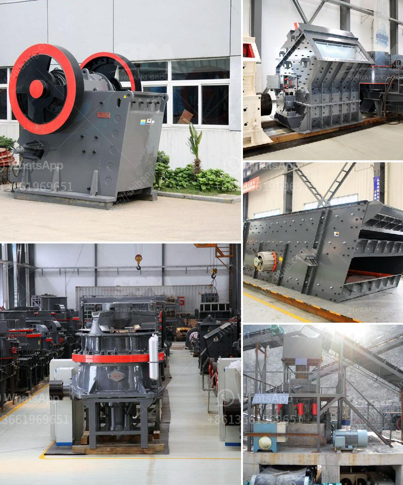

<h3>رسم لآلات غسل الرمل كسارة مطحنة</h3>
تعتبر آلات غسل الرمل كسارة مطحنة أدوات أساسية في صناعة التعدين والبناء. تستخدم هذه الآلات لغسل وفصل الأتربة والشوائب عن الرمل، مما يسهم في تحسين جودة الرمل وزيادة قيمته الاقتصادية.

يعتمد رسم لآلات غسل الرمل كسارة مطحنة على مبدأ الثقالة والتيار المائي. وتتكون الآلات من حوض غسل يتم تزويده بماء يتناثر فوق الرمل الموجود في الحوض. تتم دفع الرواسب والأتربة المترسبة في الحوض بواسطة الماء بعيدًا عن الرمل، ويتم جمعها في حاويات خاصة للتخلص منها لاحقًا.

قد يكون رسم لآلات غسل الرمل كسارة مطحنة عبارة عن ناقل للرمل تتحرك عليه الحصى لمراحل متعددة من الغسل والفصل. يتم تزويد الناقل بسير متحرك يسهل تحريك الحصى في الحوض، ويتم تنظيف الرمل أثناء تحركه بفعل الجاذبية وتيار الماء. وتتم هذه المراحل بطريقة ميكانيكية معينة تضمن تنظيف الرمل بالشكل المطلوب.

من فوائد استخدام آلة غسل الرمل كسارة مطحنة هو الحصول على رمل نظيف وخالٍ من الشوائب، مما يؤدي إلى تحسين جودة المواد الخام والمنتج النهائي. يستخدم الرمل النظيف في العديد من التطبيقات مثل صناعة الخرسانة والزجاج والسيراميك والركائز البلاستيكية وغيرها. كما أن آلات غسل الرمل تساهم في توفير الماء، حيث يمكن إعادة استخدام الماء المستخدم في عملية الغسل وتوجيهه للدورة الثانوية لاستخدامه مجددًا في نفس العملية.

لا يمكن الإغفال عن أهمية مراعاة العوامل البيئية والصحية أثناء استخدام آلات غسل الرمل كسارة مطحنة. يجب توفير أنظمة فعالة لاحتواء ومعالجة الأتربة والشوائب المترسبة في الحوض، وذلك للحفاظ على نظافة وصحة البيئة. قد تتطلب الآلات أيضًا عمليات صيانة وعناية دورية لضمان استمرارية العملية وجودة الإنتاج.

في الختام، تشكل آلات غسل الرمل كسارة مطحنة جزءًا مهمًا من صناعة التعدين والبناء. تعمل هذه الآلات على تنظيف الرمل وفصل الأتربة والشوائب عنه، مما يؤدي إلى تحسين جودة المواد الخام وزيادة قيمتها الاقتصادية. إن استخدام هذه الآلات بشكل صحيح ومراعاة العوامل البيئية يساهم في التنمية الاقتصادية المستدامة والحفاظ على البيئة النظيفة.
<h3>Contact us</h3><ul><li><strong>Whatsapp:&nbsp;<a href="https://wa.me/8613661969651">+8613661969651</a></strong></li><li><a href="https://swt.shibang-china.com/?git&amp;zhl&amp;رسم لآلات غسل الرمل كسارة مطحنة"><strong>Online Service(chat now)</strong></a></li></ul><h3>Related</h3><ul><li><a href='كسارة صخور محمولة للذهب.md'>كسارة صخور محمولة للذهب</a></li><li><a href='معالجة الحجر الجيري على نطاق صغير.md'>معالجة الحجر الجيري على نطاق صغير</a></li><li><a href='مصانع معالجة الخام الصينية.md'>مصانع معالجة الخام الصينية</a></li><li><a href='آلة غسيل الفحم طن.md'>آلة غسيل الفحم طن</a></li><li><a href='مصنع لطحن الأسمنت في الهند.md'>مصنع لطحن الأسمنت في الهند</a></li></ul>