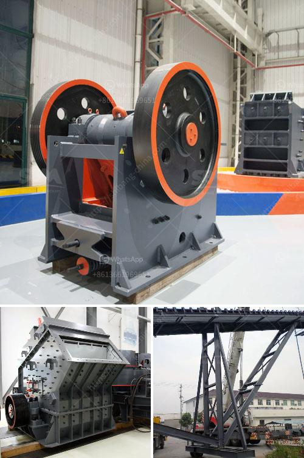

<h3>رسم مصنع غسيل الفحم</h3>
يعتبر مصنع غسيل الفحم أحد المنشآت الهامة في صناعة التعدين، حيث يتم من خلاله تحضير الفحم الخام قبل تسويقه للمستهلكين. ولكي يتم ضمان الجودة العالية للفحم المستخدم في مختلف الصناعات، يتطلب الامتثال للعمليات التقنية الدقيقة في مصنع غسيل الفحم.

يبدأ العمل في مصنع غسيل الفحم بعملية الفرز، حيث يتم وضع الفحم الخام في آلة الفرز التي تقوم بفصل الفحم عن الأتربة والشوائب الأخرى. يتم تصنيف الفحم حسب حجمه ونسبة الكبريت فيه، حيث يتم فرز الفحم الناعم عن الفحم الخشن والفحم ذو النسبة العالية من الكبريت.

بعد عملية الفرز، يتم نقل الفحم النظيف إلى مرحلة الغسيل. يتم استخدام عدة أنواع من المعدات في هذه المرحلة، مثل الهزازات والأشعة السينية، والمغناطيسية، والطباشيرية، والهوائية، والجاذبية. هذه المعدات تتعاون معًا لإزالة الأتربة والمواد الأخرى من الفحم، وتحقيق التنقية المطلوبة.

عملية الغسيل تتضمن تيار الماء القوي والكهرومغناطيسية وقوة الجاذبية لإزالة الشوائب والأتربة. يتم نقل الفحم عبر السيور الناقلة إلى محطة التجفيف حيث يتم تجفيف الفحم بواسطة الهواء الساخن قبل تعبئته وتخزينه.

بالإضافة إلى ذلك، يتم إجراء عملية تركيب المعدات والصيانة الدورية لضمان تشغيل المصنع بكفاءة عالية وبأعلى معايير الأمان والجودة. تُعد فنيو الصيانة جزءًا هامًا في عملية رسم مصنع غسيل الفحم.

بشكل عام، رسم مصنع غسيل الفحم يعتبر عملية معقدة ومتعددة الخطوات، تتطلب الدقة والكفاءة في التنفيذ. فتوفير الموظفين المهرة والمعدات الحديثة والتكنولوجيا المتقدمة هي مفتاح النجاح في هذا المجال.

إن رسم مصنع غسيل الفحم يعكس الحاجة الملحة لتلبية الطلب المتزايد على الفحم المنقى. وبفضل تقنيات التنقية المطورة، يتم الحصول على فحم عالي الجودة ومنخفض الانبعاثات الضارة بالبيئة. يساهم مصنع غسيل الفحم في تحقيق الاستدامة البيئية وتطوير صناعة التعدين.
<h3>Contact us</h3><ul><li><strong>Whatsapp:&nbsp;<a href="https://wa.me/8613661969651">+8613661969651</a></strong></li><li><a href="https://swt.shibang-china.com/?git&amp;zhl&amp;رسم مصنع غسيل الفحم"><strong>Online Service(chat now)</strong></a></li></ul><h3>Related</h3><ul><li><a href='تسعير حزام الناقل في ماليزيا.md'>تسعير حزام الناقل في ماليزيا</a></li><li><a href='كسارة التعدين في تنزانيا.md'>كسارة التعدين في تنزانيا</a></li><li><a href='كسارة الذهب في جنوب أفريقيا.md'>كسارة الذهب في جنوب أفريقيا</a></li><li><a href='شركة تصنيع كسارة الطحن في راجكوت، الهند.md'>شركة تصنيع كسارة الطحن في راجكوت، الهند</a></li><li><a href='بيع كسارة الحجر للبيع.md'>بيع كسارة الحجر للبيع</a></li></ul>