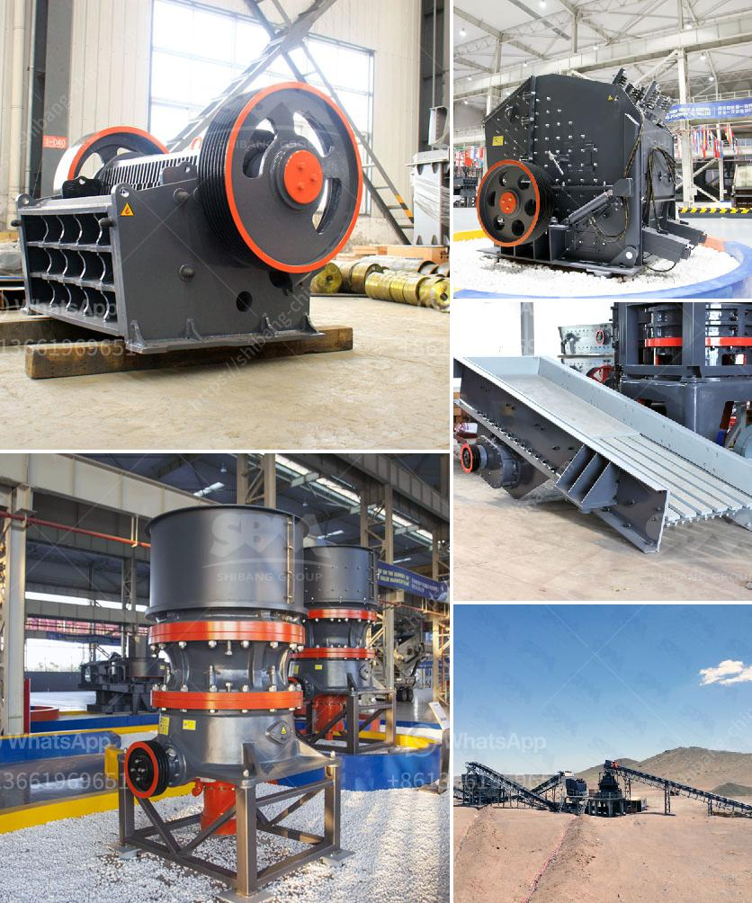

<h3>رسم مطحنة رايموند</h3>
تعتبر مطحنة رايموند واحدة من الأدوات المهمة في صناعة الطحن، وهي تستخدم في طحن مجموعة متنوعة من المواد الخام. تتميز مطاحن رايموند بأداءها العالي وفعاليتها في عملية الطحن.

تتألف مطحنة رايموند من العديد من الأجزاء المهمة، مثل الجزء الرئيسي والمحرك الرئيسي والمحلقة ووحدة التحكم الكهربائية ونظام التفريغ والبندول العمودي والمروحة وما إلى ذلك. تعمل هذه الأجزاء بالتناغم معًا لضمان تشغيل سلس وفعالية عالية.

تتميز مطاحن رايموند بقدرتها على طحن المواد بشكل متناسق ودقيق. يتم تغذية المواد الخام إلى المطحنة من خلال المحرك الرئيسي باستخدام الخلاط، ثم تمر المواد عبر الجزء الرئيسي الذي يحتوي على الأسطوانة والحلقة الدوارة. يتم طحن المواد عن طريق الاحتكاك والصدمة بين الأسطوانة والحلقة الدوارة، مما يؤدي إلى تفتيت المواد إلى قطع صغيرة.

توفر مطاحن رايموند نتائج ممتازة في الطحن. فهي قادرة على طحن مواد مختلفة مثل الفحم والباريت والجبس والفحم الحجري والكوارتز والطين والحجر الجيري وغيرها. كما أن الحجم النهائي للمواد المطحونة يمكن ضبطه بدقة باستخدام وحدة التحكم الكهربائية لتلبية احتياجات العملاء المختلفة.

تعتبر مطاحن رايموند اختيارًا رائعًا للعديد من الصناعات مثل البناء والتعدين والكيماويات وصناعة المواد اللاصقة والغذاء والصيدلة وغيرها. فهي تساهم بشكل كبير في عمليات الإنتاج وتحسين كفاءة العمل.

باختصار، تعتبر مطاحن رايموند أدوات ضرورية في صناعة الطحن وتوفر أداءً عاليًا وفعالية في عملية الطحن. إنها تستخدم لطحن مجموعة متنوعة من المواد الخام وتوفر نتائج ممتازة في الطحن. يمكن أن تلبي مطاحن رايموند احتياجات العديد من الصناعات المختلفة وتساهم في تحسين عمليات الإنتاج.
<h3>Contact us</h3><ul><li><strong>Whatsapp:&nbsp;<a href="https://wa.me/8613661969651">+8613661969651</a></strong></li><li><a href="https://swt.shibang-china.com/?git&amp;zhl&amp;رسم مطحنة رايموند"><strong>Online Service(chat now)</strong></a></li></ul><h3>Related</h3><ul><li><a href='مطحنة أسطوانية لطحن المعادن في سالم.md'>مطحنة أسطوانية لطحن المعادن في سالم</a></li><li><a href='مطحنة أسطوانية لمرادآباد.md'>مطحنة أسطوانية لمرادآباد</a></li><li><a href='إنتاج مطحنة الأسمنت في أفريقيا.md'>إنتاج مطحنة الأسمنت في أفريقيا</a></li><li><a href='كسارة الحجر للبيع في الإمارات.md'>كسارة الحجر للبيع في الإمارات</a></li><li><a href='آلة طحن صناعية في نيجيريا.md'>آلة طحن صناعية في نيجيريا</a></li></ul>