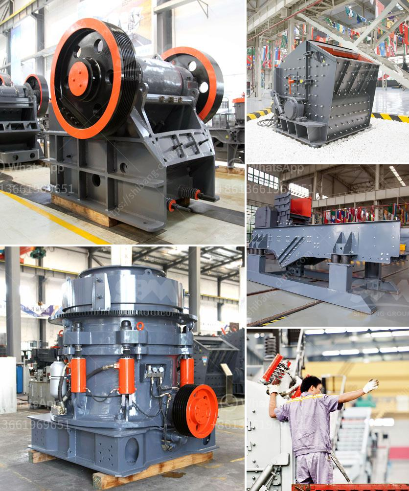

<h3>رمل صناعي للبناء</h3>
رمل البناء الاصطناعي هو نوع من المواد التي تستخدم في صناعة البناء وتصنع بشكل اصطناعي من خلال عمليات تكسير وطحن الصخور الطبيعية. يُستخدم رمل البناء الاصطناعي كبديل للرمل الطبيعي في العديد من التطبيقات البنائية، وذلك بسبب مجموعة من الفوائد التي يوفرها.

أحد الفوائد الرئيسية لاستخدام رمل البناء الاصطناعي هو تأثيره الايجابي على البيئة. يتم استخدام الكميات الهائلة من الرمل الطبيعي في صناعة البناء، مما يؤدي إلى نقص حاد في موارد الرمال الطبيعية. ومع ذلك، يتم استغلال الصخور الطبيعية بشكل فعال لإنتاج رمل البناء الاصطناعي، مما يقلل من الضغط على المصادر الطبيعية ويحمي البيئة.

بالإضافة إلى ذلك، يتميز رمل البناء الاصطناعي بالتجانس والتوحيد في جودته، مقارنةً بالرمل الطبيعي الذي يكون قد تأثر بعوامل كثيرة مثل المياه والتربة. وبتكوينه من الصخور المكسرة والمطحونة بشكل دقيق، يتم التحكم بشكل أفضل في حجم حبيبات الرمل وتوزيعها، هذا يجعله أكثر توحيدًا وموحدًا في الخصائص الميكانيكية والكيميائية.

تتمتع مواد البناء المصنوعة من رمل البناء الاصطناعي بقوة عالية ومتانة، مما يجعلها مثالية للاستخدام في التشييد والبناء. يحتوي رمل البناء الاصطناعي على تركيبة ثابتة ومتناسبة من المعادن والمركبات الكيميائية، وبالتالي يمكنه تحمل الضغوط والاهتزازات المختلفة.

بصفة عامة، يشتهر رمل البناء الاصطناعي بقوته العالية وخفة وزنه، وهذا يعني أنه يمكن استخدامه في العديد من التطبيقات البنائية بشكل فعال. فهو يستخدم في صناعة الخرسانة، وتعبئة المستحضرات الخرسانية، وتركيب الأساسات، وصناعة الأعمدة المسلحة، والمزيد من التطبيقات الأخرى.

من ناحية أخرى، يجب الإشارة إلى أن استخدام رمل البناء الاصطناعي يحتاج إلى عمليات إنتاج متقدمة ومواد خام ذات جودة عالية. ومع ذلك، تستحق هذه الجهود لأن رمل البناء الاصطناعي يقدم العديد من المزايا البيئية والتقنية في صناعة البناء.

بشكل عام، رمل البناء الاصطناعي هو اختيار مواتٍ في صناعة البناء، حيث يوفر مزايا بيئية وتقنية، بالإضافة إلى قوة ومتانة عالية. يمكن استخدامه بديلاً عن الرمل الطبيعي في العديد من المشروعات البنائية المختلفة، ويرجى أن يواصل تطوره وتحسينه في المستقبل.
<h3>Contact us</h3><ul><li><strong>Whatsapp:&nbsp;<a href="https://wa.me/8613661969651">+8613661969651</a></strong></li><li><a href="https://swt.shibang-china.com/?git&amp;zhl&amp;رمل صناعي للبناء"><strong>Online Service(chat now)</strong></a></li></ul><h3>Related</h3><ul><li><a href='حدود اهتزاز مطحنة الكرة.md'>حدود اهتزاز مطحنة الكرة</a></li><li><a href='موردين طاحونة الفحم.md'>موردين طاحونة الفحم</a></li><li><a href='بيع كسارة تصنيع.md'>بيع كسارة تصنيع</a></li><li><a href='نموذج لآلة التكسير.md'>نموذج لآلة التكسير</a></li><li><a href='كسارة تأثير كبيرة بسعة ١٠٠٠ طن في الساعة.md'>كسارة تأثير كبيرة بسعة ١٠٠٠ طن في الساعة</a></li></ul>