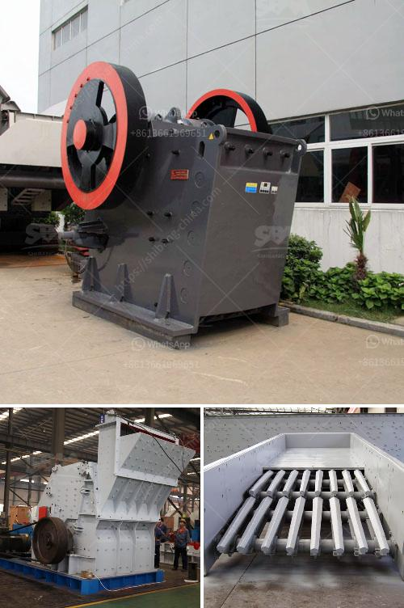

<h3>رمل وحجر الكسارة في كينيا</h3>
تعتبر صناعة رمل وحجر الكسارة من الصناعات الهامة في كينيا، حيث تلعب دورًا حيويًا في قطاع البناء والتشييد. يتم استخدام رمل وحجر الكسارة في العديد من المشاريع البنائية، بدءًا من بناء المباني السكنية والتجارية، وصولاً إلى بناء الطرق والجسور.

يتم استخراج رمل وحجر الكسارة من محاجر موجودة في مختلف أنحاء البلاد، مثل نيروبي ومومباسا وناكورو وكيرينياغا. تتم عملية الاستخراج بواسطة آلات الكسارة والحفارات الكبيرة التي تقوم بسحق الصخور الكبيرة إلى قطع صغيرة من الحجم المطلوب. يتم بعد ذلك تصنيف الحصى والرمل حسب الحجم والجودة المطلوبة.

تستخدم مواد البناء المشتقة من رمل وحجر الكسارة في البناء بشكل واسع ومتنوع. فمثلاً، يتم استخدامها في صناعة الخرسانة والأسفلت المستخدمة لعملية البناء. كما يتم استخدامها أيضًا في بناء الأسوار والجدران والرصف وأعمال التعبيد.

ومن الفوائد الرئيسية لاستخدام رمل وحجر الكسارة أنها توفر موارد طبيعية متجددة للبناء. فهذه الموارد تتجدد بشكل مستمر، بينما يتعذر استخراج المواد من الأنهار والمصادر الطبيعية الأخرى بنفس السرعة. يسهم استخدام رمل وحجر الكسارة في الحفاظ على البيئة والمحافظة على المساحات الطبيعية.

مع ذلك، تواجه صناعة رمل وحجر الكسارة في كينيا بعض التحديات. فمن أبرز هذه التحديات هو انخفاض جودة المنتج الناتج، مما يؤدي إلى تأثير سلبي على جودة البناء ومتانة الهياكل القائمة. وتعود أسباب انخفاض الجودة إلى التقنيات المستخدمة وعمليات الفحص والفرز. لذا، فإنه من الضروري تحسين هذه العمليات وتطوير التقنيات المستخدمة.

وفي الختام، صناعة رمل وحجر الكسارة في كينيا تعد من الصناعات الحيوية التي تلعب دورًا هامًا في قطاع البناء والتشييد. يستخدم رمل وحجر الكسارة في العديد من المشاريع البنائية المختلفة، وتسهم في توفير موارد بناء متجددة والحفاظ على البيئة. ومع تحسين وتطوير عمليات إنتاجها وجودتها، ستظل هذه الصناعة تلعب دورًا محوريًا في تطوير البنية التحتية في كينيا.
<h3>Contact us</h3><ul><li><strong>Whatsapp:&nbsp;<a href="https://wa.me/8613661969651">+8613661969651</a></strong></li><li><a href="https://swt.shibang-china.com/?git&amp;zhl&amp;رمل وحجر الكسارة في كينيا"><strong>Online Service(chat now)</strong></a></li></ul><h3>Related</h3><ul><li><a href='استخدام كسارة فكية صغيرة للخرسانة.md'>استخدام كسارة فكية صغيرة للخرسانة</a></li><li><a href='آلة التكسير للبيع في نيجيريا.md'>آلة التكسير للبيع في نيجيريا</a></li><li><a href='معالجة تكسير البازلت.md'>معالجة تكسير البازلت</a></li><li><a href='مطحنة الكرة للذهب في إندونيسيا.md'>مطحنة الكرة للذهب في إندونيسيا</a></li><li><a href='مصنعي آلات تكسير حجر المحجر.md'>مصنعي آلات تكسير حجر المحجر</a></li></ul>