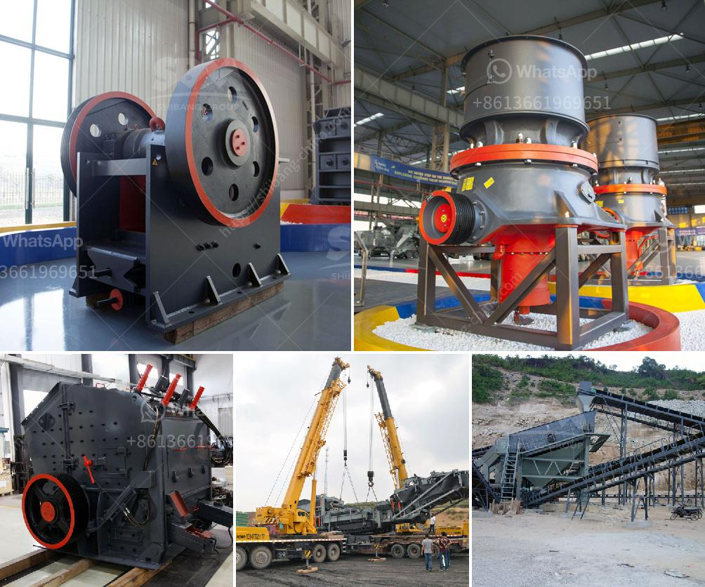

<h3>ريموند مطحنة في كولينز</h3>
تعد ريموند مطحنة واحدة من أبرز المعالم التاريخية في منطقة كولينز. تقع في ولاية ميتشيغان الأمريكية، وتم تأسيسها في عام 1842 من قبل الرحالة جورج ذاودور، الذي اكتشف وجود مصفاة مائية بجانب نهر مانوه. لقد تم تحويل هذه المصفاة إلى مطحنة لخلط وطحن الحبوب، وسرعان ما أصبحت رمزًا للنمو الاقتصادي والتجاري في المنطقة.

تعد ريموند مطحنة أحد أهم الآثار الصناعية الأمريكية وتمتلك قيمة تاريخية كبيرة. حققت المطحنة نجاحًا كبيرًا في صناعة الطحين والمنتجات البقولية، وأصبحت واحدة من أكبر شركات الطحين في المنطقة. بفضل فريق عمل محترف والتكنولوجيا المتقدمة، تم توسيع نشاط المطحنة ليشمل أيضًا صناعة الأعلاف الحيوانية والمنتجات الطازجة، مما ساهم في تعزيز الاقتصاد المحلي.

المطحنة تجذب الآلاف من الزوار سنويًا بفضل مناظرها الجميلة وطابعها التاريخي. تحتفظ المطحنة بأجزاء من المعدات الأصلية التي استخدمتها منذ بدايتها، مما يعطي تجربة زيارة فريدة من نوعها. يمكن للزوار استكشاف الدور المختلفة في المطحنة مثل قاعات الطحن والتعبئة، والمصاعد وغرف التخزين، مما يعطي فكرة عن عملية إنتاج الأغذية في القرن التاسع عشر.

بالإضافة إلى الجولات السياحية، تعتبر ريموند مطحنة مركزًا للأنشطة المجتمعية في المنطقة. تستضيف الموقع العديد من الفعاليات الثقافية والترفيهية مثل مهرجان الطحين السنوي ومعارض الفن والحرف اليدوية. تعمل المطحنة أيضًا على تعزيز التوغل في المجتمع المحلي من خلال برامج تعليمية وجولات للطلاب وورش عمل للأسر.

يعتبر الحفاظ على ريموند مطحنة تحدٍ في وجه المزايدات العقارية والتطور الحضري. قد تتعرض المبنى لخطر الهدم للاستفادة من الأراضي التي يقع عليها. ولكن منظمات المجتمع المحلية تعمل جاهدة للحفاظ على هذه الهندسة المعمارية الثمينة وغرضها الأصلي.

على مر السنين، أصبحت ريموند مطحنة تجسيدًا للتاريخ والتجارة في كولينز. إنه لا يزال يعمل كآلة تذكير بأهمية الصناعة في تحقيق التقدم الاقتصادي والاجتماعي. وبالرغم من التحديات التي تواجهها، يجد الزوار وسكان المنطقة في هذه المطحنة موروثًا ثقافيًا لا يقدر بثمن يستحق الحماية والاحترام.
<h3>Contact us</h3><ul><li><strong>Whatsapp:&nbsp;<a href="https://wa.me/8613661969651">+8613661969651</a></strong></li><li><a href="https://swt.shibang-china.com/?git&amp;zhl&amp;ريموند مطحنة في كولينز"><strong>Online Service(chat now)</strong></a></li></ul><h3>Related</h3><ul><li><a href='كسارة الحديد الخام الفاصلة.md'>كسارة الحديد الخام الفاصلة</a></li><li><a href='أسعار الشاشات الاهتزازية.md'>أسعار الشاشات الاهتزازية</a></li><li><a href='كسارة محمولة للحطام.md'>كسارة محمولة للحطام</a></li><li><a href='مورد كسارة الفك.md'>مورد كسارة الفك</a></li><li><a href='معدات تعدين في اليابان.md'>معدات تعدين في اليابان</a></li></ul>