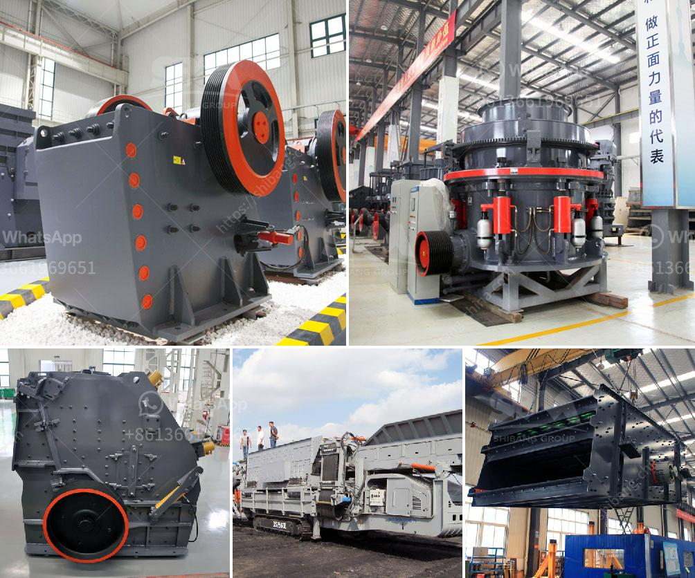

<h3>سؤال حول عملية الطحن بالكرات</h3>
عملية الطحن بالكرات هي عملية تستخدم في صناعة الأسمنت وعملية تكسير المواد الصلبة الأخرى مثل الخامات المعدنية والخامات الكيميائية. تهدف هذه العملية إلى تحويل المواد الخام إلى مسحوق ناعم من خلال الاحتكاك بين الكرات والمواد الخام.

تتألف عملية الطحن من ثلاث مراحل رئيسية: التحميل والطحن والفرز. في مرحلة التحميل، يتم إضافة الكرات المعدنية إلى الطاحونة. يتم اختيار حجم الكرات بعناية حسب نوع المادة التي يتم طحنها وحسب الحجم النهائي المرغوب فيه للمنتج.

يتم تشغيل الطاحونة لفترة معينة بهدف طحن المادة الخام. يتم تحريك الكرات في الداخل وتصادمها لتحطيم المادة الخام إلى حجم أصغر. يعتبر حجم الكرات وسرعة الطحن عوامل حاسمة في تحقيق إنتاجية عملية الطحن.

بعد الطحن، يتم فصل المواد الجاهزة عن الكرات وذلك بفصل الكرات عن طريق سلسلة من الفصل الميكانيكي والتصنيف الحجمي. يتم جمع المواد الجاهزة في معدات التعبئة والتغليف للتحضير للتصدير أو الاستخدام المحلي.

تعتبر عملية الطحن بالكرات ذات أهمية حاسمة في عملية الإنتاج، حيث تؤثر على نوعية وكفاءة المنتج النهائي. تحتاج عملية الطحن إلى مراقبة دقيقة وصيانة منتظمة للمعدات لضمان حصول العملية على أفضل نتائج.

علاوة على ذلك، يجب الأخذ في الاعتبار استخدام الطاقة بشكل فعال في عملية الطحن بالكرات. تتطلب عملية الطحن كمية كبيرة من الطاقة، ويمكن تحقيق توفير الطاقة عن طريق استخدام مواد خام ذات جودة أعلى والتحكم في حجم الكرات والسرعة.

في الختام، عملية الطحن بالكرات هي عملية أساسية في صناعة الأسمنت والعديد من الصناعات الأخرى. تحقق هذه العملية تحويل المواد الخام إلى مسحوق ناعم يمكن استخدامه في عمليات إنتاج مختلفة. عند تنفيذها بشكل صحيح وإجراء الصيانة اللازمة، يمكن لعملية الطحن بالكرات أن تحسن جودة المنتج النهائي وتضمن كفاءة العملية.
<h3>Contact us</h3><ul><li><strong>Whatsapp:&nbsp;<a href="https://wa.me/8613661969651">+8613661969651</a></strong></li><li><a href="https://swt.shibang-china.com/?git&amp;zhl&amp;سؤال حول عملية الطحن بالكرات"><strong>Online Service(chat now)</strong></a></li></ul><h3>Related</h3><ul><li><a href='سعر مطحنة الكسارة سعر الحجر.md'>سعر مطحنة الكسارة سعر الحجر</a></li><li><a href='المعدات المطلوبة لتعدين الذهب على نطاق واسع.md'>المعدات المطلوبة لتعدين الذهب على نطاق واسع</a></li><li><a href='مصنع الإسمنت الصغير المصنوع في الصين.md'>مصنع الإسمنت الصغير المصنوع في الصين</a></li><li><a href='سعر كسارة الهامر للطن الواحد في الساعة.md'>سعر كسارة الهامر للطن الواحد في الساعة</a></li><li><a href='كسارة VSI لسحق الرمل.md'>كسارة VSI لسحق الرمل</a></li></ul>