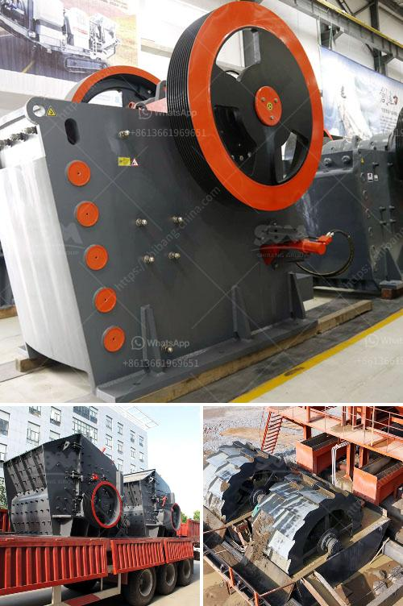

<h3>سحق 100 طن في الساعة</h3>
سحق 100 طن في الساعة أمر يعتبر مهمًا ومثيرًا في صناعة التعدين والبناء. يشير هذا الرقم إلى القدرة على سحق 100 طن من المواد في غضون ساعة واحدة. هذا العمل يتطلب آلات قوية وفعالة تستخدم في عمليات تكسير الصخور والمواد الأخرى.

يتم تحقيق هذا الأداء العالي من خلال استخدام كسارات الفك وكسارات الصدم المتميزة. تعد كسارات الفك من الأدوات الرئيسية في هذا العمل ، حيث يتم استخدامها لسحق الصخور الكبيرة إلى قطع صغيرة تسهل المعالجة اللاحقة. تتميز هذه الكسارات بعروض فم كبيرة تساعد في عملية التغذية السريعة والفعالة في الجهاز. وتوفر الأنواع الحديثة من كسارات الفك ضبط سهل لحجم الانتاج المشروع وسيولة تشغيلية فائقة.

بالإضافة إلى كسارات الفك ، فإن كسارات الصدم هي أيضًا أداة فعالة في سحق 100 طن في الساعة. تستخدم لسحق المواد من حجم أصغر ، وتعتمد على تأثير القوة العالية لكسر الصخور. تتميز كسارات الصدم بسهولة التشغيل والصيانة ، وعمر الخدمة الطويل ، والأداء العالي. تتمتع بتصميم متين وهيكل متين يمكنها التعامل مع المواد الصلبة والتحمل والاجهاد الشديد.

من الجدير بال mُلاحظة أنه لتحقيق هذه القدرة العالية ، يجب أن يتم استخدام معدات وآلات جيدة الصنع وذات جودة عالية. يجب أن تكون الآلات قادرة على ضبط القوة والسرعة والتوقيت المثالي لتحقيق الأداء الأمثل. تتطلب عمليات سحق هذه القوة والتحكم الدقيق لمواصفات العملاء. من المهم أيضًا توفر قطع الغيار ذات الجودة العالية للآلات ، حيث أن الاستخدام المستمر يتطلب تغيير وصيانة منتظمة لضمان الأداء الأمثل.

اختيار المعدات المناسبة والتخطيط الجيد لعملية السحق المستدامة هما العاملان الأساسيان لتحقيق سحق 100 طن في الساعة بشكل فعال وموثوق. يجب أيضًا على المشغلين والفنيين المسؤولين عن عملية السحق أن يكونوا ذوي خبرة وماهرين في تشغيل وصيانة الآلات. الالتزام بأعلى معايير السلامة والجودة أمر حاسم أيضًا لضمان نتائج ناجحة وآمنة.

في النهاية ، سحق 100 طن في الساعة يعد تحديًا تقنيًا وتشغيليًا رئيسيًا في صناعة التعدين والبناء. يتطلب إدارة وتشغيل فعالين واستخدام آلات قوية وذات جودة عالية للتعامل مع حجم المواد الكبيرة وتحقيق الأداء الأمثل. تحقيق سحق 100 طن في الساعة يمكن أن يجلب الكثير من الفوائد والنجاح للمشاريع والشركات في هذه الصناعة الحيوية.
<h3>Contact us</h3><ul><li><strong>Whatsapp:&nbsp;<a href="https://wa.me/8613661969651">+8613661969651</a></strong></li><li><a href="https://swt.shibang-china.com/?git&amp;zhl&amp;سحق 100 طن في الساعة"><strong>Online Service(chat now)</strong></a></li></ul><h3>Related</h3><ul><li><a href='مصنعي معدات تعدين الذهب في الدنمارك.md'>مصنعي معدات تعدين الذهب في الدنمارك</a></li><li><a href='كسارة عمودية.md'>كسارة عمودية</a></li><li><a href='مصنع معالجة الحجر الفلدسباري.md'>مصنع معالجة الحجر الفلدسباري</a></li><li><a href='مصنع تكسير المعادن.md'>مصنع تكسير المعادن</a></li><li><a href='شركة تصنيع مطحنة ريموند في جنوب أفريقيا.md'>شركة تصنيع مطحنة ريموند في جنوب أفريقيا</a></li></ul>