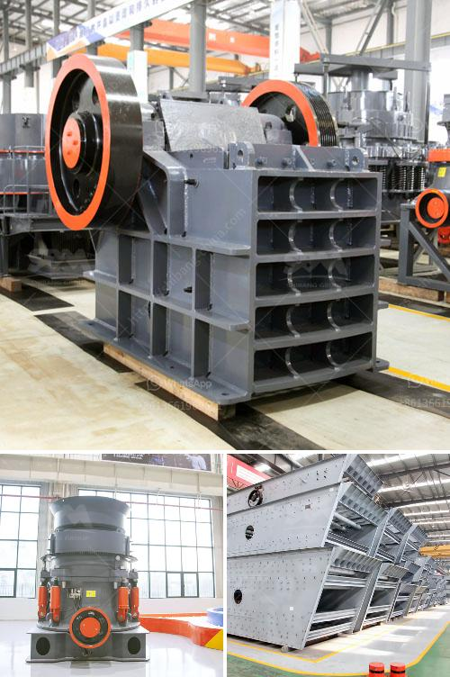

<h3>سحق الجرانيت إلى مسحوق</h3>
قد يعتبر الجرانيت من أكثر الأحجار الطبيعية شيوعًا واستخدامًا في العديد من التطبيقات المختلفة. فهو يتميز بقوته وصلابته العالية ، ومقاومته للتآكل ، وجماليته الجميلة. ومع ذلك ، في بعض الأحيان ، يكون هناك حاجة إلى تحويل الجرانيت من صخرة كبيرة إلى حجم صغير أو حتى إلى مسحوق ناعم.

يتم سحق الجرانيت إلى مسحوق بواسطة معدات سحق خاصة تستخدم لهذا الغرض. تعتبر طرق سحق الجرانيت إلى مسحوق متنوعة وتختلف باختلاف الغرض من عملية السحق والتطبيق المستهدف للمسحوق.

يمكن استخدام الكسارات المخروطية أو الكسارات الفكية لتحويل الجرانيت إلى حجم صغير مناسب. تعمل هذه الكسارات عن طريق تطبيق قوة ضغط على الصخور لسحقها. يتم تشغيل الكسّارات الفكية بواسطة محرك يطبّق قوة ضغط على الجرانيت ، بينما تتم تشغيل الكسّارات المخروطية بمساعدة محور يدور بشكل مستمر لسحق الصخرة.

بعد سحق الجرانيت إلى حجم صغير ، يمكن استخدام مطحون الجرانيت في العديد من التطبيقات المختلفة. يمكن استخدامه في صناعة الرخام الاصطناعي أو البلاط أو الأسمنت أو حتى في صناعة الدهانات والأصباغ. يمكن استخدام المسحوق لجعل المنتجات الإبداعية الفنية مثل اللوحات والتماثيل.

يحتاج إلى ذكر أنه يجب اتخاذ بعض الاحتياطات أثناء عملية سحق الجرانيت إلى مسحوق. يجب استخدام المعدات الواقية للعمالة ، مثل الأقنعة الواقية والقفازات ، لحماية العمال من الغبار والرواسب الخطرة التي تتطاير أثناء عملية السحق. يجب أيضًا اتباع إرشادات السلامة المهنية والحفاظ على البيئة أثناء هذه العملية.

يمكن القول أن سحق الجرانيت إلى مسحوق هو عملية مهمة لتحويل هذا الصخر الطبيعي القوي إلى استخدامات متنوعة. إنه عملية تتطلب المعدات اللازمة واتخاذ تدابير السلامة المناسبة. ومع ذلك ، فإن النتيجة النهائية هي الحصول على مسحوق جرانيت ناعم يمكن استخدامه في العديد من التطبيقات المختلفة وتعطي منتجات جمالية وعملية في النهاية.
<h3>Contact us</h3><ul><li><strong>Whatsapp:&nbsp;<a href="https://wa.me/8613661969651">+8613661969651</a></strong></li><li><a href="https://swt.shibang-china.com/?git&amp;zhl&amp;سحق الجرانيت إلى مسحوق"><strong>Online Service(chat now)</strong></a></li></ul><h3>Related</h3><ul><li><a href='موردين آلة طحن الجبس.md'>موردين آلة طحن الجبس</a></li><li><a href='كسارة الحجر في بيرو.md'>كسارة الحجر في بيرو</a></li><li><a href='آلة كسارة الحجر الصينية.md'>آلة كسارة الحجر الصينية</a></li><li><a href='تكلفة مصنع الإسمنت الصغير بسعة 2000 طن يوميًا.md'>تكلفة مصنع الإسمنت الصغير بسعة 2000 طن يوميًا</a></li><li><a href='صيغة بسيطة لناقل الحزام.md'>صيغة بسيطة لناقل الحزام</a></li></ul>