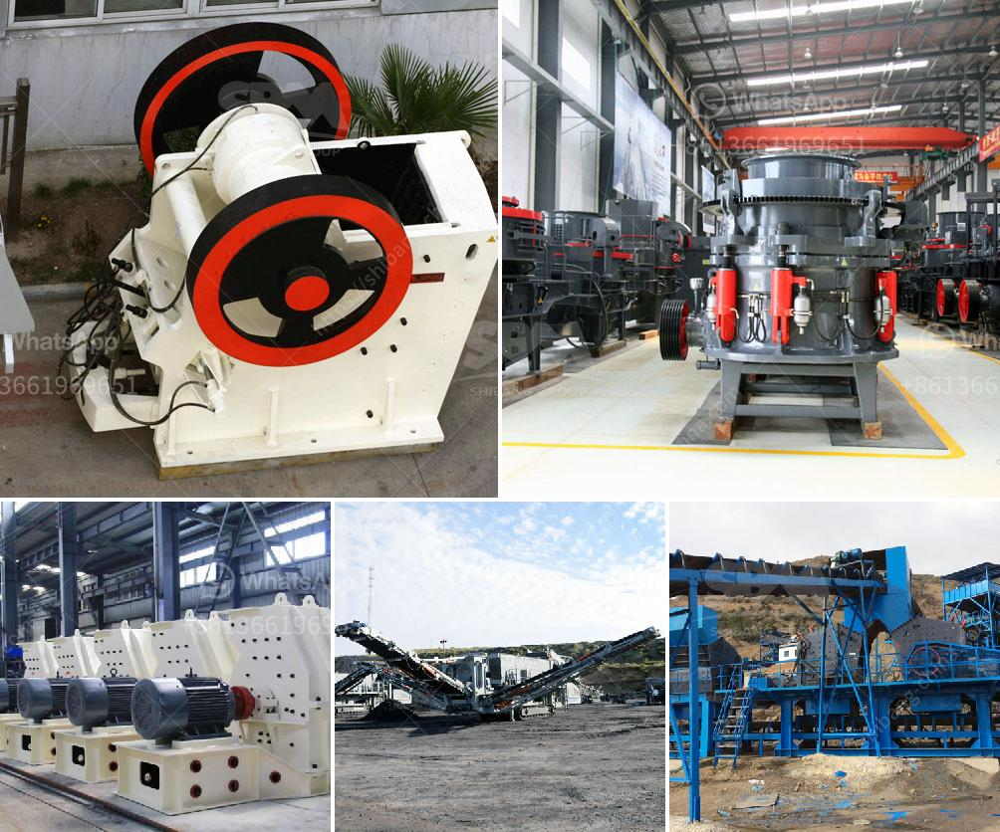

<h3>سحق الحجر الأسود تايلاند</h3>
يعد الحجر الأسود في تايلاند من أهم المعالم السياحية في البلاد، حيث يقصده آلاف السياح سنوياً. يُعرف المكان أيضًا باسم "واط المايا"، وهو حجر طبيعي من الجرانيت الأسود يقع على بُعد حوالي 40 كيلومترًا إلى الشمال من مدينة تايلاند الساحلية باتايا.

تعود أهمية الحجر الأسود إلى معتقداته الدينية والثقافية. يعتبر الحجر المقدس لدى العديد من السكان المحليين في تايلاند، ويؤمنون بأن هذا الحجر يحمل الحظ الطيب ويجلب الرخاء والسلام.

ومع ذلك، فإن هذا الحجر ليس مجرد مكان ديني للعبادة، بل هو مكاناً طبيعيًا جميلًا يقدم مناظر رائعة وفريدة من نوعها. يحيط الحجر الأسود بالجبال الخضراء الجميلة والشلالات المتدفقة، مما يجعل الزيارة إليه تجربة لا تنسى.

لعشاق الصخور ومحبي الطبيعة، يمكن الاستمتاع بالتنزه والتسلق في هذه المنطقة الجبلية. ويمكنكم التجول حول الحجر الأسود والتعرف على الأساطير المحيطة به وتاريخه. ويُعتبر صعود قمة الحجر الأسود واحدًا من أكثر الأمور شهرة بين الزوار، فهنالك رحلات ترتفع بشكل تدريجي وآمن تتيح لك رؤية المناظر الخلابة من الأعلى.

إضافة إلى ذلك، يعتبر الحجر الأسود مكانًا لممارسة اليوجا والتأمل، حيث يُعتقد أنه يحمل طاقة إيجابية ويعزز الروحانية. لذلك فإن العديد من السياح يزورون هذا المكان الهادئ للاسترخاء وإعادة التواصل مع أنفسهم.

لاشك أن سحق الحجر الأسود في تايلاند هو اختيار مثالي للسياح الذين يبحثون عن تجربة مميزة ومغامرة في طبيعة خلابة. سواء كنت ترغب في استكشاف المنطقة وتاريخها أو ممارسة الأنشطة البدنية مثل التسلق أو اليوغا، فإن هذا المكان سيكون إضافة رائعة لرحلتك في تايلاند. كما أن متعة المكان لا تزال تنتظر الزوار الذين يسعون لاستكشاف جمال هذا الحجر الطبيعي الأسود والاستمتاع بأجواء الهدوء والسكينة هناك.
<h3>Contact us</h3><ul><li><strong>Whatsapp:&nbsp;<a href="https://wa.me/8613661969651">+8613661969651</a></strong></li><li><a href="https://swt.shibang-china.com/?git&amp;zhl&amp;سحق الحجر الأسود تايلاند"><strong>Online Service(chat now)</strong></a></li></ul><h3>Related</h3><ul><li><a href='شراء كسارة حجر في الإمارات.md'>شراء كسارة حجر في الإمارات</a></li><li><a href='شركة تبيع كسارة الحجر في كينيا.md'>شركة تبيع كسارة الحجر في كينيا</a></li><li><a href='كسارة الحجر Kyc.md'>كسارة الحجر Kyc</a></li><li><a href='سير ناقل في دبي.md'>سير ناقل في دبي</a></li><li><a href='معدات تعدين النحاس.md'>معدات تعدين النحاس</a></li></ul>