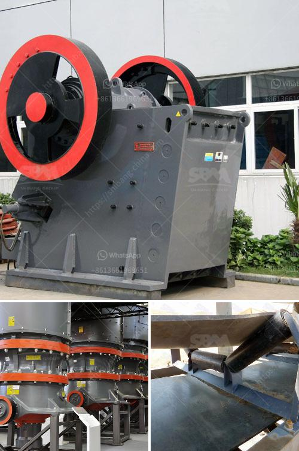

<h3>سحق الخرسانة والحديد</h3>
سحق الخرسانة والحديد هو عملية مهمة في صناعة البناء وإعادة التدوير. تستخدم هذه العملية لتحويل الخرسانة والحديد المستخدمة أو المتضررة إلى حجارة صغيرة قابلة لإعادة الاستخدام في مشاريع جديدة.

تعتبر عملية سحق الخرسانة مفيدة بشكل خاص في إعادة استخدام الخرسانة المتضررة أو المتهالكة. فعندما يتم سحق الخرسانة، يمكن استخدامها كحصى أو ركام في مشاريع الطرق أو الرصف أو البناء الجديد. تعمل هذه العملية على تقليل الهدر وتوفير التكاليف، كما أنها تساهم في حماية البيئة من تفريغ النفايات في المواقع السطحية.

من ناحية أخرى، سحق الحديد يساهم في إعادة تدوير الموارد الطبيعية. فعند تكسير الحديد، يمكن استخدامه كمادة خام جديدة في صناعة الصلب أو في مشاريع البناء الأخرى التي تتطلب معدن الحديد. يمكن أن يوفر سحق الحديد أيضًا التكاليف المرتبطة بتعدين وإنتاج المعدن الجديد.

عملية سحق الخرسانة والحديد تشمل استخدام معدات متخصصة مثل الكسارات والمطارق الهدم. تتم هذه العملية عادة في مواقع الهدم أو مواقع المشاريع الكبيرة. وتشتمل عملية السحق على تجميع ونقل المواد المكسورة إلى مكان تخزين مؤقت حتى يتم استخدامها. يجب أن يتم سحق الخرسانة والحديد بشكل مناسب وفقًا للمواصفات المطلوبة لضمان جودة المنتج النهائي.

في الختام، يمكن القول إن سحق الخرسانة والحديد له فوائد كبيرة في إعادة التدوير والاستدامة. يقلل هذا العمل من تكاليف البناء ويحمي البيئة من تراكم النفايات. بالإضافة إلى ذلك، يساهم في إعادة تدوير الموارد الطبيعية وتجنب استخدام المزيد من المواد الخام. من المهم تطوير استخدام أكثر فعالية لهذه العملية وتحسين تقنيات السحق لتحقيق نتائج أفضل وأكثر استدامة.
<h3>Contact us</h3><ul><li><strong>Whatsapp:&nbsp;<a href="https://wa.me/8613661969651">+8613661969651</a></strong></li><li><a href="https://swt.shibang-china.com/?git&amp;zhl&amp;سحق الخرسانة والحديد"><strong>Online Service(chat now)</strong></a></li></ul><h3>Related</h3><ul><li><a href='مصانع الكسارات للبيع.md'>مصانع الكسارات للبيع</a></li><li><a href='سعر مصنع التكسير.md'>سعر مصنع التكسير</a></li><li><a href='أسعار آلات تكسير الحجر في زيمبابوي.md'>أسعار آلات تكسير الحجر في زيمبابوي</a></li><li><a href='كسارات تأثير ثانوية.md'>كسارات تأثير ثانوية</a></li><li><a href='جهاز كسر الصخور في جنوب أفريقيا.md'>جهاز كسر الصخور في جنوب أفريقيا</a></li></ul>