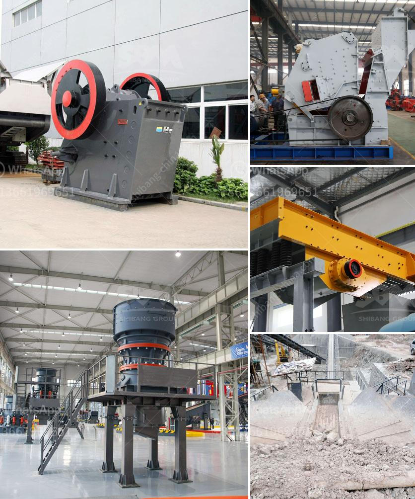

<h3>سحق الكلي ٢٠٠ طن في الساعة بمرحلتين</h3>
سحق الكلي هو عملية تستخدم في تكسير الأحجار الكبيرة وتحويلها إلى أحجام أصغر، وتستخدم عادة في صناعة البناء والتشييد والتعدين. يتم تحقيق هذه العملية عن طريق استخدام آلة تسمى كسارة الكلي.

تعتبر الكسارة المستخدمة في سحق الكلي 200 طن في الساعة من الفئة الكبيرة والمتطورة. ومع ذلك، تتطلب عملية سحق الكلي عمليات متعددة تتم عبر مرحلتين رئيسيتين.

في المرحلة الأولى، تقوم الكسارة بتجهيز الكلي وإزالة الشوائب الكبيرة منها بطريقة مبدئية. يتم تغذية الكلي إلى الكسارة من خلال المغذي الاهتزازي، ومن ثم يتم توجيهها نحو فتحة الشفط حيث يتم الضغط على الأحجار ضد الجسم الثابت. تتحرك الفك المتحرك بشكل دوري لتسحق الأحجار إلى أحجام أصغر.

في المرحلة الثانية، تستخدم الكسارة الانتقائية المخروطية لسحق الأحجار المكسورة في المرحلة الأولى إلى أحجام أصغر بعد ذلك. تعمل الكسارة الانتقائية بنفس المبدأ، ولكنها تستخدم قاعدة أعلى لتوصيل الأحجار المكسورة من جانب.

تتميز الكسارة المستخدمة في سحق الكلي 200 طن في الساعة بعدة ميزات. فعلى سبيل المثال، تأتي مجهزة بنظام تحكم هيدروليكي يعمل بسلاسة، مما يسمح بتعديل سرعة الكسر وحجم الإخراج حسب الحاجة. كما تحتوي على نظام تحكم يعمل باللمس، مما يسهل استخدامها وضبطها بشكل فعال.

بالإضافة إلى ذلك، فإن الكسارة الثابتة قادرة على سحق الأحجار بسرعة كبيرة حتى 200 طن في الساعة. وهذا يعني أنها يمكنها سحق كميات كبيرة من الكلي في وقت قصير، مما يزيد من كفاءة العمل ويقلل من التكاليف والوقت المستغرقين في إعادة تكسير الأحجار.

باختصار، سحق الكلي 200 طن في الساعة يُنفذ عادة عبر مرحلتين. يتم تحقيق هذه العملية بواسطة الكسارة الثابتة والكسارة الانتقائية المخروطية. يجمع هذا النوع من الكسارة بين الكفاءة والقوة، مما يجعلها خيارًا مثاليًا لصناعة البناء والتشييد والتعدين.
<h3>Contact us</h3><ul><li><strong>Whatsapp:&nbsp;<a href="https://wa.me/8613661969651">+8613661969651</a></strong></li><li><a href="https://swt.shibang-china.com/?git&amp;zhl&amp;سحق الكلي ٢٠٠ طن في الساعة بمرحلتين"><strong>Online Service(chat now)</strong></a></li></ul><h3>Related</h3><ul><li><a href='تحجيم مطاحن الكرة.md'>تحجيم مطاحن الكرة</a></li><li><a href='آلة طحن دقيقة في الصين.md'>آلة طحن دقيقة في الصين</a></li><li><a href='كسارة الحجر في الكاميرون.md'>كسارة الحجر في الكاميرون</a></li><li><a href='مواصفات خام الكروم.md'>مواصفات خام الكروم</a></li><li><a href='من مصنع تصنيع البوكسيت في الصين.md'>من مصنع تصنيع البوكسيت في الصين</a></li></ul>