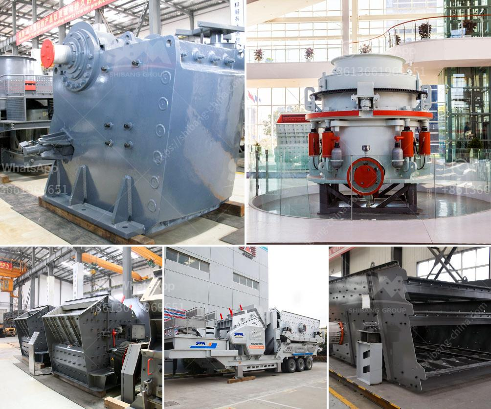

<h3>سحق النفايات الخرسانية والحديد</h3>
تعد مشكلة التخلص من النفايات البناء والهدم من بين أهم المشكلات البيئية التي تواجهها المدن الحديثة. ومع النمو العمراني وزيادة عدد المشاريع الإنشائية، تتراكم النفايات الخرسانية والحديد بشكل هائل مما يؤدي إلى تلوث البيئة واستنزاف الموارد الطبيعية.

من أجل معالجة هذه المشكلة، تم تطوير تقنية سحق النفايات الخرسانية والحديد التي تهدف إلى إعادة تدوير واستخدام هذه المواد. يتضمن هذا العملية تجميع النفايات وتقطيعها إلى حجم صغير ثم سحقها باستخدام كسارات متخصصة. ينتج عنها حبيبات صغيرة من الخرسانة وقضبان صغيرة من الحديد يمكن إعادة استخدامها في مشاريع البناء الجديدة.

تتمتع تقنية سحق النفايات الخرسانية والحديد بعدة فوائد. أولاً، تقلل هذه التقنية من الحاجة إلى استخدام المواد الأولية الطبيعية مثل الرمل والحصى والحديد الخام. وهذا يؤدي إلى توفير الموارد الطبيعية والحد من التعديات على البيئة. ثانياً، يتم تقليل تكاليف البناء والهدم بشكل كبير لأنه لم يعد هناك حاجة لشراء كميات كبيرة من المواد الجديدة. بالإضافة إلى ذلك، فإن إعادة استخدام النفايات الخرسانية والحديد يقلل من حجم النفايات الذي يتم نقله إلى مواقع التخلص من النفايات.

علاوة على ذلك، يعد سحق النفايات الخرسانية والحديد مساهمة فعالة في مجال حماية البيئة. حيث يقلل هذا الإجراء من انبعاثات الغازات الضارة، مثل ثاني أكسيد الكربون، التي تنتج عن تصنيع المواد الجديدة. وبالتالي، تقلل هذه العملية من تأثيرات التغير المناخي وتحسن جودة الهواء في المجتمعات المحيطة بمواقع التكسير.

في الختام، يُعد سحق النفايات الخرسانية والحديد تقنية هامة لمعالجة مشكلة تخلص النفايات في صناعة البناء. يسهم في حفظ الموارد الطبيعية، وتقليل التلوث، وتحسين جودة الهواء. يتعين علينا دعم استخدام هذه التقنية وتطوير المنظومة القائمة عليها لزيادة الوعي بأهمية إعادة تدوير واستخدام المواد البنائية المعاد تصنيعها.
<h3>Contact us</h3><ul><li><strong>Whatsapp:&nbsp;<a href="https://wa.me/8613661969651">+8613661969651</a></strong></li><li><a href="https://swt.shibang-china.com/?git&amp;zhl&amp;سحق النفايات الخرسانية والحديد"><strong>Online Service(chat now)</strong></a></li></ul><h3>Related</h3><ul><li><a href='موردين لفات الناقل في جنوب أفريقيا.md'>موردين لفات الناقل في جنوب أفريقيا</a></li><li><a href='مورد لكسارة.md'>مورد لكسارة</a></li><li><a href='تقرير جدوى المشروع حول كسارة الحجر.md'>تقرير جدوى المشروع حول كسارة الحجر</a></li><li><a href='مطحنة رايموند للبيع مستعملة.md'>مطحنة رايموند للبيع مستعملة</a></li><li><a href='كم تكلف كسارات الصخور.md'>كم تكلف كسارات الصخور</a></li></ul>