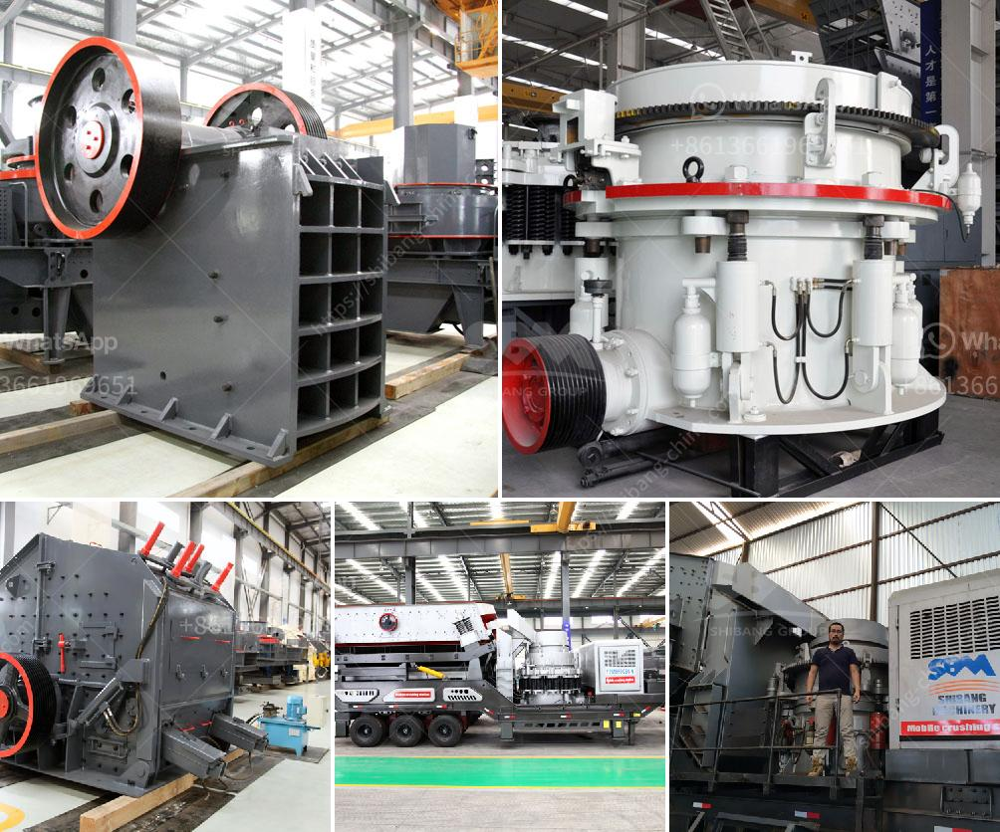

<h3>سحق مصنع لخام الحديد</h3>
يعتبر سحق مصنع لخام الحديد إحدى العمليات الرئيسية في صناعة الحديد، حيث يقوم بتحويل الخام الخشن إلى حجم أصغر يمكن استخدامه في صناعة الفولاذ. يتم ذلك باستخدام الكسارات والطواحين الضخمة التي تقوم بسحق الحجارة الكبيرة إلى قطع صغيرة من الحديد.

تختلف عملية سحق خام الحديد من منجم إلى آخر، حيث تعتمد على خصائص الخام ومتطلبات الإنتاج. تستخدم أجهزة الكسر الأساسية مثل الكسارات الفكية والكسارات المخروطية لتكسير الحجارة الكبيرة بالحجم المناسب. يتم تنقية الحجارة المكسورة بواسطة الفرز والغربلة، حيث يتم تصنيف حجم الجسيمات وفقًا للحجم والشكل.

تعتبر عملية سحق مصنع خام الحديد ضرورية للحصول على حجم الجسيم المطلوب الذي يمكن أن يتم معالجته بواسطة المعدات اللاحقة الأخرى في صناعة الحديد. وبالتالي، فإن كفاءة عملية السحق تؤثر مباشرة في كفاءة وجودة إنتاج الفولاذ. عملية سحق مثالية هي تلك التي تعطي نتائج جيدة في الحصول على جسيمات معينة الحجم دون إهدار الكثير من الطاقة.

بالإضافة إلى ذلك، يجب أن تؤخذ في الاعتبار أيضًا عوامل السلامة والبيئة في عملية سحق خام الحديد. يجب أن تتبع المصانع إجراءات وتقنيات السلامة المناسبة لحماية عمال المصنع والحفاظ على سلامتهم. كما يجب مراعاة تأثيرات العملية على البيئة، والعمل على تطبيق الأفضليات البيئية في عمليات الإنتاج.

باختصار، يعد سحق مصنع لخام الحديد عملية أساسية في تحضير الحديد للاستخدام في صناعة الفولاذ. تعتمد جودة وفعالية هذه العملية على استخدام تقنيات ومعدات سحق مثلى، بالإضافة إلى أخذ السلامة والبيئة في الاعتبار. إن الاستثمار في تطوير وتحسين عمليات السحق يمكن أن يسهم في زيادة إنتاجية وربحية صناعة الحديد والفولاذ.
<h3>Contact us</h3><ul><li><strong>Whatsapp:&nbsp;<a href="https://wa.me/8613661969651">+8613661969651</a></strong></li><li><a href="https://swt.shibang-china.com/?git&amp;zhl&amp;سحق مصنع لخام الحديد"><strong>Online Service(chat now)</strong></a></li></ul><h3>Related</h3><ul><li><a href='آلة كسارة الباريت.md'>آلة كسارة الباريت</a></li><li><a href='سعر كسارة مخروطية هيدروليكية.md'>سعر كسارة مخروطية هيدروليكية</a></li><li><a href='شركة تصنيع ختم الذهب في الصين.md'>شركة تصنيع ختم الذهب في الصين</a></li><li><a href='كسارة الكرة النحاس آلة كسارة النحاس.md'>كسارة الكرة النحاس آلة كسارة النحاس</a></li><li><a href='عملية تعدين الذهب.md'>عملية تعدين الذهب</a></li></ul>