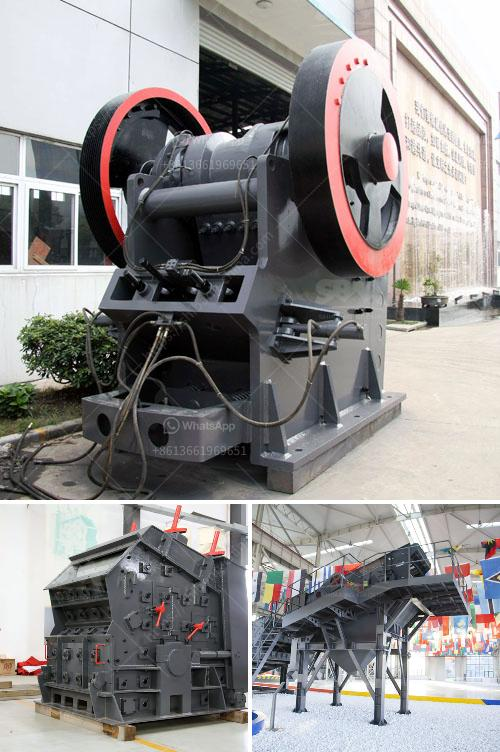

<h3>سحق وفحص خام المنجنيز</h3>
يُعدّ خام المنجنيز أحد المكونات الأساسية في صناعة الفولاذ، حيث يتم استخراجه وتجهيزه ليتم استخدامه في عمليات التصنيع. يتم الحصول على خام المنجنيز من الصخور الجيولوجية التي تحتوي على المعدن، وعملية سحق وفحص هذا الخام تعد خطوة حاسمة للحصول على جودة عالية من المنجنيز.

تتم عملية سحق خام المنجنيز عادةً لتفتيته إلى قطع صغيرة بحجم يتراوح بين 20-100 ملم. يُستخدم الكسّارات الفكية والكسّارات الصدمية في عملية السحق، حيث تعمل على تحطيم الصخور بطرق مختلفة، مما يؤدي إلى تفتيت الخام إلى قطع صغيرة قابلة للنقل والمعالجة اللاحقة.

بعد عملية السحق، يتم نقل الخام إلى مصانع الفحص لإزالة الشوائب والشوائب منه. تُستخدم عادةً أجهزة الفصل المغناطيسي والعوامل الكيميائية للتخلص من الشوائب، حيث تتفاعل الشوائب المعدنية غير المرغوب فيها مع هذه العوامل وتتم جَفْف وفصلها عن الخام النقي.

تُعد عملية الفحص النهائية هي الخطوة التي تؤدي إلى تحديد جودة الخام ومطابقتها للمعايير المطلوبة في صناعة الفولاذ. يتم فحص الخام باستخدام الأدوات الأوتوماتيكية والآلات الحديثة للتحقق من تركيبته الكيميائية وتحديد نسبة المنجنيز الموجودة فيه. كما أنه يتم فحص الخام أيضًا للتأكد من خلوه من أي شوائب أخرى قد تؤثر في عملية التصنيع.

تكمن أهمية سحق وفحص خام المنجنيز في الحصول على خام ذو جودة عالية يمكن استخدامه في صناعة الفولاذ. فقد تكون جودة الخام المستخدمة محددة بشكل كبير في جودة الفولاذ الناتج، حيث يؤثر ارتفاع نسبة المنجنيز في الخام على صلابة ومتانة الفولاذ الناتج، وبالتالي فإن عمليات سحق وفحص الخام تلعب دورًا مهمًا في تحسين جودة المنتج النهائي.

تتطلب عمليات سحق وفحص خام المنجنيز فهمًا عميقًا لخصائص المعدن والتكنولوجيا المستخدمة في هذه العمليات. يتم تنفيذها بواسطة فرق متخصصة ذات خبرة في استخراج وتجهيز المعادن الصناعية. من خلال استخدام التقنيات والمعدات الحديثة، يتم ضمان أن خام المنغنيز سوف يتم معالجته بطريقة فعالة وسريعة.

باختصار، يُعدّ سحق وفحص خام المنجنيز خطوتين حاسمتين في إعداد الخام لاستخدامه في صناعة الفولاذ. تساهم هذه العمليات في تفتيت الخام وتنقيته من الشوائب، وبالتالي تعزز جودة الفولاذ الناتج وتزيد من قيمته في السوق.
<h3>Contact us</h3><ul><li><strong>Whatsapp:&nbsp;<a href="https://wa.me/8613661969651">+8613661969651</a></strong></li><li><a href="https://swt.shibang-china.com/?git&amp;zhl&amp;سحق وفحص خام المنجنيز"><strong>Online Service(chat now)</strong></a></li></ul><h3>Related</h3><ul><li><a href='إجراءات تصحيحية لسيور النقل.md'>إجراءات تصحيحية لسيور النقل</a></li><li><a href='شركة تصنيع معدات كسارة الحجر في ألمانيا.md'>شركة تصنيع معدات كسارة الحجر في ألمانيا</a></li><li><a href='كيفية صنع مسحوق التلك.md'>كيفية صنع مسحوق التلك</a></li><li><a href='سحق وفحص روستنبرج.md'>سحق وفحص روستنبرج</a></li><li><a href='مطحنة الكرة لمسحوق الكوارتز في تاميل نادو.md'>مطحنة الكرة لمسحوق الكوارتز في تاميل نادو</a></li></ul>