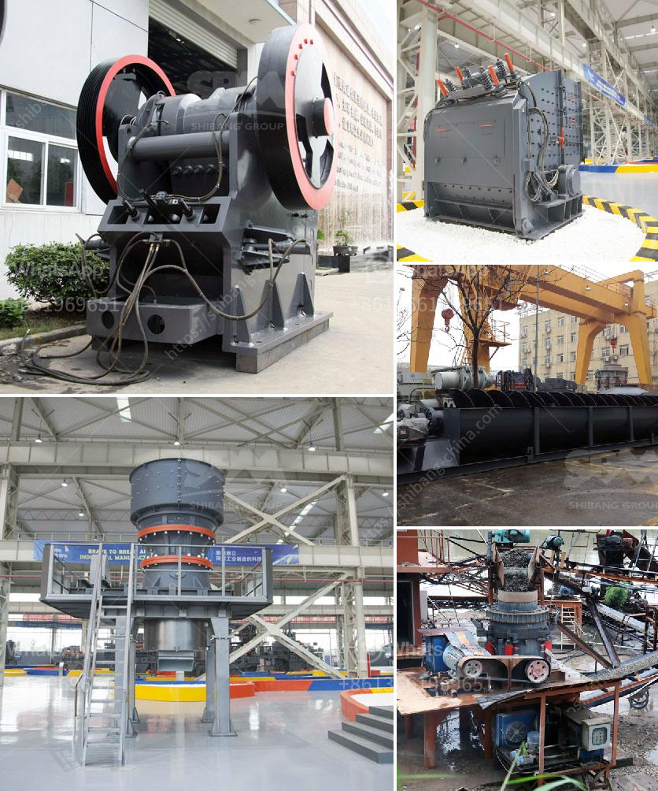

<h3>سحق وفحص روستنبرج</h3>
يُعدّ سحق وفحص روستنبرج من أبرز وأحدث التقنيات المستخدمة في صناعة التعدين والبناء. فهو يسهم في تقليل التكاليف وزيادة الكفاءة في عمليات التكسير والفحص للمواد الصلبة. يُعتبر روستنبرج منصة تصميم وتصنيع المعدات، ولديه خبرة استثنائية في مجال السحق والفحص للصخور والمعادن.

تتكون عملية سحق وفحص روستنبرج من مراحل متعددة تهدف إلى تقسيم المواد الخام إلى أجزاء صغيرة متجانسة وفقاً لحجم وشكل محدد، ثم فحصها للتأكد من جودتها وصلاحيتها للاستخدام المستقبلي. وتستخدم هذه العملية في صناعات مثل التعدين، والبناء، وعمليات طحن الأسمنت.

تعتمد عملية السحق على تكسير المواد الخام بواسطة قوة الضغط أو الصدمة. يتم استخدام المعدات المتخصصة مثل آلات الكسر الفكية والكسارات المخروطية لتطبيق قوة الضغط، بينما يتم استخدام الكسارات الصدمية وكسارات الأسطوانات لتطبيق قوة الصدمة. توفر روستنبرج مجموعة متنوعة من هذه المعدات المتقدمة التي تساهم في تحسين أداء عمليات السحق.

بعد عملية السحق، يتم إرسال المواد الخام إلى مرحلة الفحص. ويتم ذلك من خلال تمرير المواد عبر شبكات أو أسطوانات مثقبة بأحجام مختلفة. يتم فصل المواد حسب حجمها واحتياجات العملية الإنتاجية. وفي هذه المرحلة، تشارك روستنبرج بتقديم أفضل الآلات والمعدات لتحسين جودة الفحص وزيادة إنتاجية العملية بشكل عام.

يعمل نظام روستنبرج على تحسين كفاءة العمليات وتقليل تكاليف التشغيل. فالمعدات المستخدمة مصممة لتلبية متطلبات الأداء العالي والاستدامة البيئية. كما تتميز بتقنيات الأتمتة المتقدمة التي تسهم في تحسين سرعة الإنتاج ودقة الفحص.

يمكن القول إن سحق وفحص روستنبرج يعد تقنية حديثة وفعالة في صناعة التعدين والبناء. فهو يساهم في زيادة إنتاجية الشركات وتحسين جودة المواد النهائية. وبفضل خبرة روستنبرج الاستثنائية وتكنولوجيتها المتقدمة، فإنها مستمرة في تحسين وتطوير عمليات السحق والفحص لتلبية احتياجات الصناعة المتزايدة.
<h3>Contact us</h3><ul><li><strong>Whatsapp:&nbsp;<a href="https://wa.me/8613661969651">+8613661969651</a></strong></li><li><a href="https://swt.shibang-china.com/?git&amp;zhl&amp;سحق وفحص روستنبرج"><strong>Online Service(chat now)</strong></a></li></ul><h3>Related</h3><ul><li><a href='سعر كسارة الح.md'>سعر كسارة الح</a></li><li><a href='كسارة الفك 400 ×.md'>كسارة الفك 400 ×</a></li><li><a href='عمليات كسارة وغسل الحجر.md'>عمليات كسارة وغسل الحجر</a></li><li><a href='آلة معالجة البازلت.md'>آلة معالجة البازلت</a></li><li><a href='أرض متاحة لمحجر الحجر.md'>أرض متاحة لمحجر الحجر</a></li></ul>