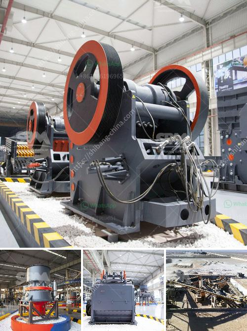

<h3>سعات مطحنة الأسطوانة العمودية</h3>
تُستخدم مطاحن الأسطوانة العمودية في صناعات مختلفة مثل صناعة المواد الكيميائية والصناعات الغذائية وصناعة الأسمنت. هذه المطاحن تتميز بفعالية عالية وقدرة على طحن المواد الخام بشكل دقيق وسرعة. 

تصميم الأسطوانة العمودية يتألف من جسم مدور يضم بعض الأسطوانات العمودية المسطحة المرتبة بالتوالي وتدور بشكل مستقل. تعمل الأسطوانات على طحن المواد الخام بفضل الاحتكاك المستمر بينها وبين الجسم. يتم ضبط سرعة دوران الأسطوانات والضغط الذي يتم تطبيقه على المواد الخام بواسطة نظام التحكم لضمان حفظ درجة الطحن المطلوبة.

إحدى المزايا الرئيسية لمطاحن الأسطوانة العمودية هي قدرتها على طحن المواد الخام بشكل دقيق وفعال. تستخدم هذه المطاحن عادة لطحن المواد الصلبة والصلبة المتوسطة، مثل الفحم والكلنكر والخامات المعدنية. يتم الحصول على مسحوق نهائي ذو حجم جسيمات صُغرى بفضل قدرة الأسطوانة على طحن المواد بشكل دقيق وفقًا للتعديلات اللازمة.

تعد مطاحن الأسطوانة العمودية أيضًا ملائمة لأعمال التثبيت والتركيب، حيث تحتل مساحة أقل بالمقارنة مع مطاحن أخرى مثل مطاحن الكرة، وبالتالي تزيد من كفاءة استغلال المساحة في المصانع. كما تعتبر هذه المطاحن صامتة وتتميز بخطورة منخفضة للغاية، مما يجعلها أكثر أمانًا للعمل بها.

وبالنسبة لقدرة تلك المطاحن، تترواح بين 200 و 400 طن في الساعة تقريبًا، وذلك يعتمد على الحجم والنوعية الدقيقة للمطحنة. يجب اختيار حجم المطحنة بناءًا على حاجة الإنتاج ومتطلبات العملية.

في الختام، يمكن القول إن مطاحن الأسطوانة العمودية هي تقنية حديثة ومتقدمة لطحن المواد الصلبة بشكل دقيق وفعال. تزود الصناعات المختلفة بحلول طحن متكاملة وفعالة، كما توفر أداءًا مستقرًا وتجارب تشغيل عالية الجودة.
<h3>Contact us</h3><ul><li><strong>Whatsapp:&nbsp;<a href="https://wa.me/8613661969651">+8613661969651</a></strong></li><li><a href="https://swt.shibang-china.com/?git&amp;zhl&amp;سعات مطحنة الأسطوانة العمودية"><strong>Online Service(chat now)</strong></a></li></ul><h3>Related</h3><ul><li><a href='سعر كسارة الحجر في جنوب أفريقيا.md'>سعر كسارة الحجر في جنوب أفريقيا</a></li><li><a href='أسعار آلات تكسير الحجر في زيمبابوي.md'>أسعار آلات تكسير الحجر في زيمبابوي</a></li><li><a href='كسارة الذهب في جنوب أفريقيا.md'>كسارة الذهب في جنوب أفريقيا</a></li><li><a href='قائمة مصنع كسارة الحجر في بنجلاديش.md'>قائمة مصنع كسارة الحجر في بنجلاديش</a></li><li><a href='مطحنة طحن الكرةستخدم لطحن الكرات.md'>مطحنة طحن الكرةستخدم لطحن الكرات</a></li></ul>